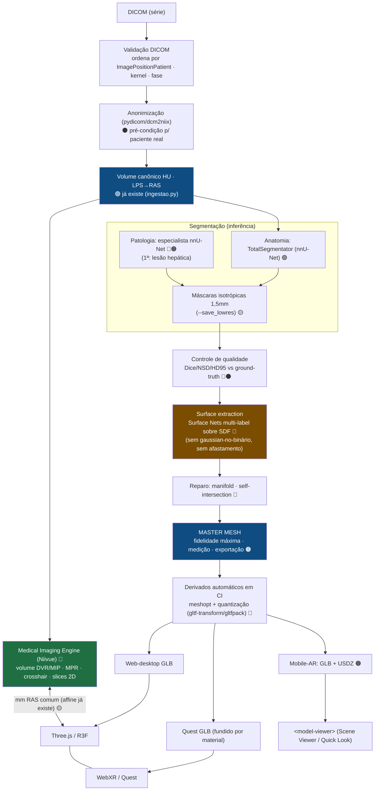

# VRmed — Dossiê de arquitetura: exame médico → modelo 3D patient-specific de alta fidelidade → Web/AR/VR

> **Read-only.** Nenhum código foi alterado. Pesquisa técnica, científica, competitiva e arquitetural
> (estado da arte 2026), com fontes, ancorada no código real do VRmed e nas duas auditorias anteriores.
> Cada afirmação marcada **FATO** (documentado, com URL na seção) · **INFERÊNCIA** · **RECOMENDAÇÃO**.
> Data: 2026-09-04.

**Legenda:** 🟢 já existe no VRmed · 🟡 dá pra fazer com a stack atual · 🔵 integrar open source ·
🟠 desenvolver · 🔴 pesquisa/alto risco · ⚫ clínico/regulatório.

---

## Resumo executivo

**A pergunta que orienta tudo** — *como transformar um exame DICOM real numa representação 3D patient-specific de altíssima fidelidade e entregá-la em Web, AR (celular) e VR (Quest), sem perder a relação espacial entre slices → 3D → AR → VR?* — tem uma resposta que a pesquisa deixou clara: **o VRmed não precisa trocar de stack; precisa consertar a etapa onde a qualidade morre, medir o que produz, e derivar (nunca degradar).**

Cinco conclusões que mudam a estratégia:

1. **O gargalo de fidelidade é a montante, não a jusante.** A compressão (Draco), a decimação (QEM por estrutura) e o render estão *bem resolvidos*. A perda de 13–19% de volume/relevo nasce em **duas etapas específicas**: (a) a malha é gerada na grade **anisotrópica** herdada (a reamostragem isotrópica só é *avisada*, nunca aplicada) e (b) a **dupla suavização** — `gaussian_filter` sobre a máscara **binária** somado ao Taubin — que apaga relevo real e parede fina. *Consertar surface extraction + isotropia rende mais que qualquer outra mudança.*

2. **Marching Cubes sobre máscara borrada não é o melhor método em 2026.** A recomendação técnica é migrar para **Surface Nets** (`vtkSurfaceNets3D`) — suaviza o terraceamento *sem* encolhimento global, produz **paredes compartilhadas multi-label** (elimina o hack de afastamento −0,15 mm e o z-fighting), gera **~30–50% menos triângulos** para a mesma forma (GLB menor → mais FPS no Quest) e é ~7× mais rápido que Flying Edges. Onde não quiser nova dependência, o meio-termo 🟡 é suavizar sobre a **SDF** (distance transform), não sobre o binário.

3. **"Master mesh → derivados" é a arquitetura correta — e o VRmed a viola hoje.** Existe um único GLB já decimado que serve de *entrega* **e** de *referência* (o pior dos dois mundos). O certo: uma **MASTER mesh** de fidelidade máxima (a única régua para medir erro e para medição/exportação) e derivados por classe de dispositivo (Web/Quest/Mobile-AR) gerados automaticamente em CI (meshopt + quantização). Regra: **nunca degradar a master para ganhar FPS; sempre derivar.**

4. **A entrega multiplataforma é um problema de _derivados_, não de _stack_.** O mesmo master vira **GLB** (Android/WebXR/Quest) **+ USDZ** (iPhone/Quick Look — o iOS não tem WebXR AR nem em 2026), orquestrados por `<model-viewer>`. Volume + 2D↔3D entram por um **Medical Imaging Engine ao lado do Three.js** (**Niivue**, que lê o `ct.nii.gz` que já geramos), sincronizados por um sistema de coordenadas **comum em mm RAS que já existe** (a affine calculada na ingestão). O Three.js **não** é substituído.

5. **O moat não é o visualizador — é medida validada + dados próprios.** HeartFlow e Cleerly provam que o fosso durável em imagem médica é uma **medida proprietária validada e reembolsada**, não o 3D. Os dois únicos moats reais para o VRmed são **(F) dataset proprietário anonimizado** e **(C) medida patient-specific validada** — ambos apoiados em **(A) fidelidade auditável**. Web-first, AR, VR e 2D↔3D são *table stakes* (higiene competitiva), não fosso. **pt-BR/LATAM** é o moat barato de *distribuição* que compra os 2–4 anos para construir o clínico.

**O trimestre de maior alavancagem** (medir → consertar → linkar): **Fase 0 (benchmark/validação)** → **Fase 1 (alta fidelidade: Surface Nets + master/derivados)** → **Fase 2 (2D↔3D com Niivue)**. Nenhuma delas troca a stack; todas usam dependências já presentes ou de baixo atrito.

**Primeira patologia recomendada:** **lesão/tumor hepático** — CT-nativa (zero mudança na ingestão), o fígado já é segmentado (contexto grátis), a lesão é volumétrica o bastante para **sobreviver à malha atual**, e há pesos/datasets públicos (LiTS/MSD). O **nódulo pulmonar** vem em segundo, *depois* do upgrade de malha de alta fidelidade (nódulos pequenos morrem no pipeline atual), aproveitando LUNA16/LIDC (licenças comercial-safe) e a subtask `lung_nodules` do TotalSegmentator.

---

## Sumário

**Pesquisa (frentes):**
3. Pipeline: mapa de perda de informação · 4. DICOM e pré-processamento · 5–6. Segmentação SOTA + patologia ·
7. Surface reconstruction (crítico) · 8+14. Master mesh + LOD + performance · 9+10. Volume rendering + 2D↔3D ·
11–12. AR no celular · 13. VR/Quest · 15+16+22. Benchmark + experimentos · 17. Datasets · 18. Competidores ·
19–20. Moat + digital twin.

**Síntese:** 21. Arquitetura final recomendada · 23. Roadmap revisado · 24. Respostas objetivas (A–T) · 25. Tabelas.

---

## 3. Reconstrução conceitual do pipeline + mapa de perda de informação

O caminho do VRmed é **TC → NIfTI(HU) → máscaras (nnU-Net) → malha nomeada (GLB) → Quest/WebXR**, orquestrado por dois scripts (`scripts/preparar-caso.py` faz ingestão+segmentação+QA; `scripts/tc-para-vrmed.py` faz máscara→malha→cor→GLB) sobre a biblioteca `scripts/clinica/`. É um pipeline **surface-first, one-shot, sem ground-truth**: cada etapa joga fora informação que a etapa seguinte não consegue recuperar, e o relatório mede a perda **só contra a própria máscara** — nunca contra a anatomia real. Abaixo, cada etapa nos 10 itens pedidos, com fontes.

Legenda: 🟢 já existe · 🟡 dá pra fazer com a stack atual · 🔵 integrar open source · 🟠 desenvolver · 🔴 pesquisa/alto risco · ⚫ clínico/regulatório. Cada afirmação marcada **FATO** (com URL) · **INFERÊNCIA** · **RECOMENDAÇÃO**.

---

### Etapa 1 — Leitura/interpretação DICOM (HU, ordenação, rescale)

1. **Melhor método hoje:** ler série com GDCM/SimpleITK ou `dcm2niix`, ordenar por `ImagePositionPatient` (não por nome de arquivo), aplicar `RescaleSlope`/`RescaleIntercept` para HU. **FATO** — é o comportamento de referência da própria SimpleITK ([docs ImageSeriesReader](https://simpleitk.readthedocs.io/en/master/link_DicomSeriesReader_docs.html)).
2. **O que o VRmed usa:** exatamente isso — `ingestao.py:33-74` (`_serie_dicom`): `GetGDCMSeriesFileNames` ordena por posição, `Execute()` aplica rescale→HU, e o espaçamento vem de `img.GetSpacing()` e não de `np.diag(affine)` (`ingestao.py:6-8`). Escolhe automaticamente a série com mais fatias (`ingestao.py:41`). **FATO** (código lido).
3. **Problema do método atual:** a escolha "série com mais fatias" pode pegar a série errada em exames com reformatação secundária ou fase tardia com muitas fatias; multi-fase 3D é rejeitado (`ingestao.py:150`) em vez de deixar escolher a fase. Não lê `ConvolutionKernel`/`Window` — o kernel de reconstrução (ex.: ósseo vs. mole) muda o ruído e a nitidez de borda, e isso não entra no relatório. **INFERÊNCIA**.
4. **Alternativa a testar:** expor `--serie` já existe (`ingestao.py:44`); adicionar registro de `ConvolutionKernel`/`0018,1210` no relatório é 🟡 trivial (uma tag a mais no dict `meta`).
5. **Info perdida:** nenhuma nesta etapa — é a única praticamente **lossless** do pipeline (HU preservado, posição real preservada).
6. **Reversível?** Sim (não modifica pixels).
7. **Como medir o erro:** o próprio `_checagem` (`ingestao.py:177-198`) compara shape/zooms/affine/HU contra referência com `atol` — bom teste de regressão. **FATO**.
8/9/10. **Impacto visual/precisão/performance:** nulo se a série certa for escolhida; catastrófico se for a errada (mas aí falha cedo, não silenciosamente).

---

### Etapa 2 — Orientação (LPS→RAS→glTF) e correção geométrica

1. **Melhor método hoje:** manter a matriz afim completa (direção + espaçamento + origem) e transformar por matriz, nunca assumir eixos diagonais; corrigir *gantry tilt* reamostrando para grade ortogonal **antes** de gerar geometria. **FATO** — reformatação isotrópica é o padrão para evitar *stair-step* em planos reformatados ([Deep Slice Interpolation, arXiv 2506.09953](https://arxiv.org/html/2606.09953v1)).
2. **O que o VRmed usa:** duas rotações puras (det +1, sem espelhar): LPS→RAS `np.diag([-1,-1,1])` (`ingestao.py:26`, `165-169`) e RAS→glTF `(x,y,z)→(x,z,-y)` (`malha.py:31`), com escala mm→m (`malha.py:32`). O afim é aplicado por multiplicação de matriz em `malha_de_volume` (`malha.py:144`). **FATO**.
3. **Problema do método atual:** `tc-para-vrmed.py` **assume afim diagonal** — em gantry oblíquo a ingestão só **avisa** ("reamostrar antes da malha", `ingestao.py:113-118`), **nunca corrige**. Se o usuário ignorar o aviso e não reamostrar, a malha sai cisalhada. **FATO** (código: o aviso existe, a correção não).
4. **Alternativa a testar:** reamostrar para grade ortogonal RAS isotrópica no oblíquo detectado (🟡 SimpleITK `Resample` já está na stack). Fazer isso resolveria também a Etapa 3.
5. **Info perdida:** zero na conversão de eixos (rotação exata); no oblíquo não-corrigido, perde-se **fidelidade geométrica inteira** (distorção de forma), não só detalhe.
6. **Reversível?** As rotações sim (ortogonais). A distorção do oblíquo ignorado, não.
7. **Como medir o erro:** verificar `direcao_ras` ≈ identidade (`ingestao.py:114`); o teste de regressão compara affine (`ingestao.py:195`). **FATO**.
8/9/10. **Visual/precisão/performance:** invisível quando o exame é axial reto (99% dos casos torácicos); performance nula.

---

### Etapa 3 — Normalização de intensidade e **resampling** (a maior omissão silenciosa)

1. **Melhor método hoje:** para reconstrução de superfície e para reduzir *partial volume effect*, **reamostrar para voxel isotrópico** (idealmente ≤1 mm) antes de extrair geometria — voxels menores e isotrópicos reduzem o efeito de volume parcial que "apaga estruturas pequenas". **FATO** ([Isotropic Resolution, articl.net](https://articl.net/diagnostic-radiology/isotropic-resolution-in-radiology); [Medical Volume Reconstruction, arXiv 1802.07710](https://arxiv.org/pdf/1802.07710)). Voxel anisotrópico (in-plane sub-mm, *through-plane* 2–5 mm) "introduz artefatos de escada em vistas coronais/sagitais e prejudica pipelines que assumem amostragem quase isotrópica". **FATO** ([arXiv 2506.09953](https://arxiv.org/html/2606.09953v1)).
2. **O que o VRmed usa:** normalização = clip HU para `int16` com `np.clip(-32768, 32767)` (`ingestao.py:126`) — inócuo (HU real quase nunca sai dessa faixa). **Resampling isotrópico: NUNCA aplicado.** A ingestão só **avisa** se fatia > 3 mm ("o modelo sai em degraus", `ESPESSURA_MAX_MM=3.0`, `ingestao.py:25`, `93-97`) e se o passo entre fatias é irregular (`ingestao.py:98-103`). Quem reamostra é a **segmentação**, internamente, para 1,5 mm (Etapa 4). A malha é gerada na grade nativa da máscara (`tc-para-vrmed.py:142`, `malha.py:140`). **FATO**.
3. **Problema do método atual:** a malha herda o *through-plane* nativo. Numa TC de 2–3 mm de fatia (comum fora de protocolo cardíaco fino), o marching cubes trabalha sobre voxels retangulares alongados → **escada** que a suavização depois tenta esconder (e ao escondê-la, apaga relevo real — ver Etapa 6). A máscara volta da segmentação já reamostrada a 1,5 mm (Etapa 4), então a malha nem sequer usa o in-plane sub-mm original quando ele existe. **INFERÊNCIA forte** (código + teoria de partial volume).
4. **Alternativa a testar:** reamostrar `ct.nii.gz` para isotrópico (ex.: 1,0 mm B-spline) **na ingestão**, e segmentar/malhar sobre essa grade. 🟡 SimpleITK `ResampleImageFilter` já está na stack; custo é só disco/RAM. Cuidado: reamostrar HU com B-spline pode gerar *overshoot* em bordas de alto contraste (ar/osso) — usar ordem ≤3 e reavaliar HU depois.
5. **Info perdida:** resolução *through-plane* que **não existia** não pode ser criada — mas hoje se perde também o **in-plane fino** ao aceitar a grade de máscara de 1,5 mm. Detalhe sub-1,5 mm (paredes finas, pequenos vasos) é irrecuperável a jusante.
6. **Reversível?** Não. Resampling é interpolação com perda; e a decisão de *não* reamostrar propaga a anisotropia por todo o resto.
7. **Como medir o erro:** comparar malha gerada em grade nativa vs. malha em grade isotrópica pela **distância de Hausdorff / RMS de superfície** (🟡 `trimesh`/PyMeshLab); medir área de face que fica em degraus. **RECOMENDAÇÃO**.
8. **Impacto visual:** alto em exames grossos — escada visível mesmo depois do Taubin.
9. **Impacto na precisão:** alto — partial volume + anisotropia distorcem volume e forma de estruturas < ~2× a fatia.
10. **Impacto na performance:** reamostrar para 1 mm isotrópico multiplica voxels (mais RAM/tempo de segmentação e MC), mas **não** afeta o runtime no Quest (a malha final continua limitada por triângulos). ✅ trade-off favorável.

---

### Etapa 4 — Segmentação (TotalSegmentator / nnU-Net pré-treinado)

1. **Melhor método hoje:** nnU-Net continua o baseline forte; TotalSegmentator é o estado-da-arte prático para 100+ estruturas em TC. O modelo v1 relatou **Dice 0,943** no conjunto de teste com anormalidades. **FATO** ([Radiology: AI 2023, ryai.230024](https://pubs.rsna.org/doi/abs/10.1148/ryai.230024); [arXiv 2208.05868](https://arxiv.org/abs/2208.05868)). O v2 roda o modelo padrão a **1,5 mm** e o `--fast` a **3 mm**; câmaras cardíacas viraram subtarefa `heartchambers_highres` treinada em resolução sub-milimétrica. **FATO** ([GitHub StanfordMIMI/TotalSegmentatorV2](https://github.com/StanfordMIMI/TotalSegmentatorV2)).
2. **O que o VRmed usa:** `segmentacao.py:77-142` — TotalSegmentator v2, tarefa `total` + presets (`torax`/`cardiaco`/`abdomen`, `segmentacao.py:22-71`), `roi_subset` só na `total`, `heartchambers_highres` sob licença acadêmica (`segmentacao.py:96-101`). Usa `higher_order_resampling_LEGACY=True` e `robust_crop=True` (`segmentacao.py:122-128`). Só inferência, nunca treino. **FATO**.
3. **Problema do método atual:** (a) a máscara volta a **1,5 mm** — teto de resolução para todo o resto do pipeline, independentemente de a TC ser 0,5 mm; (b) `higher_order_resampling_LEGACY=True` é uma correção real (o padrão vizinho-mais-próximo repetia 38 de 123 fatias, comentário `segmentacao.py:123-124`) mas ainda é reamostragem com perda; (c) **VRmed não mede Dice/NSD/HD95 do resultado** — não há validação contra ground-truth em lugar nenhum (confirmado: sem `pydicom`, sem métrica de segmentação; `metricas.py` só mede volume/bbox/componentes da própria máscara). O número "13–19% de perda" documentado é **máscara→malha**, não segmentação→verdade. **FATO** (código) + **INFERÊNCIA**.
4. **Alternativa a testar:** rodar a inferência sobre a CT **isotrópica de 1 mm** (Etapa 3) e comparar com a de 1,5 mm; para o coração, sempre usar `heartchambers_highres` (sub-mm). 🟡 já suportado. Validação: rodar um caso público com ground-truth (ex.: TotalSegmentator dataset, [Zenodo](https://zenodo.org/records/10047292)) e reportar Dice/NSD — 🔵/🟡.
5. **Info perdida:** binarização — a probabilidade contínua do nnU-Net (softmax) é jogada fora ao virar máscara 0/1; toda a incerteza do modelo some. Estruturas fora do treino não existem. **FATO** (binarização é intrínseca ao fluxo de máscara).
6. **Reversível?** Não. Binarização + reamostragem interna são destrutivas.
7. **Como medir o erro:** Dice / NSD (Normalized Surface Distance) / HD95 contra ground-truth em casos rotulados; para casos sem rótulo, checar `componentes`/`fracao_maior_componente` (`metricas.py:46-47`) como *proxy* de sanidade. **FATO/RECOMENDAÇÃO**.
8. **Impacto visual:** médio — erro de rótulo vira superfície faltando ou "vazando" para vizinho.
9. **Impacto na precisão:** **o maior determinante de precisão do produto** — nenhuma etapa posterior corrige um rótulo errado; o pintar por HU (Etapa 9) até mascara isso com cor plausível.
10. **Impacto na performance:** offline (CLI CUDA), não afeta o Quest.

---

### Etapa 5 — Pós-processamento da máscara (ilhas, buracos, contato, suavização pré-MC)

1. **Melhor método hoje:** remover componentes espúrios pequenos, preencher buracos, e — para superfície suave a partir de binário — aplicar suavização **antes** do isosurface (ou usar SurfaceNets que já suaviza). **FATO** (SurfaceNets foi introduzido justamente para gerar superfícies suaves de segmentações binárias; [ResearchGate — MC vs SurfaceNets](https://www.researchgate.net/figure/Generated-mesh-using-Marching-Cubes-left-and-SurfaceNets-smoothing-gradient-right_fig2_225603027)).
2. **O que o VRmed usa:** `limpar()` (`malha.py:84-98`): remove ilhas < 30 mm³ via `ndimage.label`+`bincount`, exceto classes multi-componente (`pulmonary_vein`, `CLASSES_MULTIPLAS`, `malha.py:45`), e `binary_fill_holes`. `encostar()` (`malha.py:101-105`) dilata 1 voxel os vasos que entram no coração. Depois, `gaussian_filter` na máscara com σ = max(0,6 mm, 0,5×maior voxel) (`malha.py:137-141`), com `mode='constant'` e pad de 1 voxel para fechar tampa plana onde o FOV corta. **FATO**.
3. **Problema do método atual:** (a) `binary_fill_holes` fecha **todo** buraco interno — em estrutura que legitimamente tem lúmen/cavidade (traqueia, vaso oco) isso preenche o vazio real; (b) σ proporcional é uma boa correção (o σ fixo de 1,3 mm antigo "apagava 17% da área e 5× o relevo do coração", `malha.py:6-7`) mas suavizar o **binário** ainda arredonda cantos verdadeiros; (c) `encostar()` **cria** contato que pode não existir (dilatação = +1 voxel de material inventado só para evitar gap visual). **FATO** (comportamentos no código).
4. **Alternativa a testar:** suavizar sobre o **campo de distância assinado (SDF)** da máscara em vez do binário (preserva melhor a topologia e o volume); 🟡 `scipy.ndimage.distance_transform_edt` já disponível. Ou pular a suavização do binário e migrar para SurfaceNets (Etapa 7), que dispensa a gaussiana. `fill_holes` só em 2D por eixo ou condicionado a tamanho do buraco.
5. **Info perdida:** ilhas < 30 mm³ (pode ser vaso fino real, não só ruído); cavidades reais (fill_holes); relevo fino < σ.
6. **Reversível?** Não.
7. **Como medir o erro:** volume antes/depois de `limpar` (já dá pra logar); comparar campo suavizado com o binário original por IoU. **RECOMENDAÇÃO**.
8. **Impacto visual:** médio — cantos arredondados, superfícies "sabonete".
9. **Impacto na precisão:** médio — fill_holes e encostar alteram volume/topologia mensuráveis.
10. **Impacto na performance:** desprezível (offline).

---

### Etapa 6 — Surface extraction (marching cubes)

1. **Melhor método hoje:** para binário/segmentação, **SurfaceNets ou Dual Contouring** produzem superfícies mais suaves e triângulos de melhor qualidade que marching cubes, que "segue as bordas afiadas do voxel gerando escadas e terraços". **FATO** ([arXiv 1802.07710 — MC gera escada/terraço](https://arxiv.org/pdf/1802.07710); [ResearchGate MC vs SurfaceNets](https://www.researchgate.net/figure/Mesh-generated-by-Marching-Cubes-left-and-SurfaceNet-right-on-a-greyscale-image-of-an_fig3_225603027)). VTK `vtkFlyingEdges3D` é um MC muito mais rápido e paralelo, mesma topologia. **FATO** ([VTK/Kitware Flying Edges](https://www.kitware.com/flyingedges/)).
2. **O que o VRmed usa:** `skimage.measure.marching_cubes(campo, level=0.5)` sobre o campo gaussiano (`malha.py:142`), pad desfeito (`malha.py:143`), depois aplica o afim. Nível 0,5 sem erosão (o nível 0,56 antigo "erodia até 16% do volume dos vasos", `malha.py:9-11`). **FATO**.
3. **Problema do método atual:** MC clássico gera escada intrínseca (por isso precisa da gaussiana antes e do Taubin depois — dois band-aids empilhados que, juntos, custam relevo). O `level=0.5` sobre um campo **já suavizado** desloca a isosuperfície de forma dependente de σ. **FATO/INFERÊNCIA**.
4. **Alternativa a testar:** 🔵 **SurfaceNets** ([`PyMCubes`/`surfacenets` ou VTK `vtkSurfaceNets3D`](https://www.kitware.com/really-fast-isocontouring/)) elimina a necessidade da gaussiana e do afastamento, com superfície mais suave nativamente e menos triângulos para a mesma qualidade — ganho direto no orçamento de VR. Ou 🟡 trocar por `vtkFlyingEdges3D` (mesma topologia, mais rápido) mantendo o resto.
5. **Info perdida:** posição exata da isosuperfície (MC interpola linear na aresta); topologia fina pode fundir/quebrar dependendo do level.
6. **Reversível?** Não (rasteriza campo→triângulos).
7. **Como medir o erro:** Hausdorff/RMS entre malha e isosuperfície de referência em alta resolução; `perda_volume_pct` (já calculado, `tc-para-vrmed.py:185`). **FATO** (o VRmed já mede volume; falta medir distância de superfície).
8. **Impacto visual:** alto — é aqui que nasce a escada.
9. **Impacto na precisão:** médio — deslocamento de borda por level+σ.
10. **Impacto na performance:** MC do skimage é single-thread (lento offline); SurfaceNets/FlyingEdges seriam mais rápidos. No Quest, o que importa é a contagem de triângulos resultante — SurfaceNets tende a entregar menos triângulos pela mesma forma.

---

### Etapa 7 — Smoothing (Taubin) + afastamento

1. **Melhor método hoje:** **Taubin (λ/μ)** é a escolha correta: resolve o encolhimento do Laplaciano clássico ("Laplaciano encolhe e não preserva feições; Taubin preserva volume e feições com a alternância de sinal"). **FATO** ([ResearchGate — Laplacian vs Taubin](https://www.researchgate.net/figure/Laplacian-vs-Taubin-smoothing-FIR-Filters-based-on-the-linear-isotropic-Laplacian_fig4_228957417); [trimesh.smoothing docs](https://trimesh.org/trimesh.smoothing.html)).
2. **O que o VRmed usa:** `trimesh.smoothing.filter_taubin(malha, lamb=0.5, nu=0.53, iterations=4)` (`malha.py:150`), com comentário correto de que `nu` positivo no trimesh é o *unshrink* e iterações pares garantem shrink+inflate emparelhados (`malha.py:147-150`). Depois `fix_normals(multibody=True)` (`malha.py:153`) e afastamento de −0,15 mm pela normal **só** em `heart_*` (`afastamento_de`, `malha.py:59-63`, `154-155`) para evitar z-fighting entre câmara e miocárdio. **FATO**. Escolha tecnicamente sólida.
3. **Problema do método atual:** o Taubin vem **empilhado** sobre a gaussiana da Etapa 5 — duas suavizações em série; a combinação pode borrar relevo genuíno (o comentário histórico dos 5× do coração mostra que já morderam demais uma vez). O afastamento −0,15 mm é um *hack* geométrico específico das câmaras, não uma solução de raiz para z-fighting (o certo seria material com `polygonOffset`/depth bias no viewer). **INFERÊNCIA**.
4. **Alternativa a testar:** se migrar para SurfaceNets (Etapa 6), remover a gaussiana e reduzir iterações de Taubin (menos suavização total, mais relevo). Resolver z-fighting no render (🟡 `polygonOffset` em three.js) e zerar o afastamento.
5. **Info perdida:** relevo de alta frequência (sulcos, pequenas protuberâncias) proporcional a λ×iterações; −0,15 mm de "carne" nas câmaras.
6. **Reversível?** Não.
7. **Como medir o erro:** RMS de superfície malha-suavizada vs. malha-bruta; `volume_malha_ml` vs `volume_mascara_ml` (já no relatório). **FATO**.
8. **Impacto visual:** médio (melhora aparência, mas em excesso vira "sabonete").
9. **Impacto na precisão:** baixo-médio (Taubin preserva volume razoavelmente; a gaussiana anterior é a que mais tira).
10. **Impacto na performance:** offline; no Quest, superfície mais lisa = menos necessidade de triângulos → levemente positivo.

---

### Etapa 8 — Remeshing / reparo (topologia, normais, watertight)

1. **Melhor método hoje:** remeshing isotrópico (triângulos regulares) melhora decimação e sombreamento; reparo watertight via voxel remesh (ex.: OpenVDB/`trimesh.repair`) quando a malha precisa ser sólida. **FATO** (prática padrão; [PyMeshLab isotropic remeshing](https://pymeshlab.readthedocs.io/)).
2. **O que o VRmed usa:** **não há remeshing real.** O "reparo" é: `process=True` no construtor `trimesh.Trimesh` (funde vértices/remove faces degeneradas, `malha.py:145`), `fix_normals(multibody=True)` (`malha.py:153`) e `binary_fill_holes` lá na máscara (Etapa 5). `watertight` é só **medido e reportado** (`tc-para-vrmed.py:195`), nunca forçado. **FATO**.
3. **Problema do método atual:** malha pode sair **não-watertight** (relatado, não corrigido) → volume calculado por `malha.volume` fica não confiável exatamente nas malhas que mais precisam de número confiável; triângulos de qualidade irregular (herdados do MC) prejudicam a decimação seguinte.
4. **Alternativa a testar:** 🟡 remesh isotrópico leve antes de decimar (PyMeshLab, novo dep) — ou aceitar que SurfaceNets já entrega triângulos melhores e pular. Forçar watertight só quando `volume_ml` for usado como número.
5. **Info perdida:** nenhuma nova (é reparo); mas a **falta** de reparo deixa buracos passarem.
6. **Reversível?** N/A.
7. **Como medir o erro:** `is_watertight` (já feito), contagem de faces degeneradas, razão de aspecto de triângulos. **FATO**.
8/9/10. **Visual:** baixo. **Precisão:** médio (volume não-watertight). **Performance:** offline.

---

### Etapa 9 — Simplificação/decimação (QEM) + cor por vértice

1. **Melhor método hoje:** decimação por **Quadric Error Metrics (QEM)** com orçamento por estrutura é o padrão; nunca decimação global cega (que dizima estruturas pequenas). **FATO** (QEM = Garland-Heckbert, base do `fast_simplification`/MeshLab).
2. **O que o VRmed usa:** `decimar()` (`malha.py:159-170`) chama `fast_simplification.simplify` (QEM) com `target_count` por estrutura; o orçamento é repartido proporcionalmente ao tamanho bruto, com **piso de 3k triângulos** por estrutura e teto total de 150k para VR (`tc-para-vrmed.py:42-56`, `PISO_TRIS=3000`, `--max-tris 150000`). **Proíbe explicitamente** o `--simplify` do gltf-transform (`tc-para-vrmed.py:12`, `220`; CLAUDE.md). A cor é por vértice (`pintar`, `malha.py:232-270`): cor didática linearizada modulada pelo HU real amostrado 1–2 mm sob/sobre a superfície + oclusão por ocupação de vizinhança. **FATO**. Arquitetura de orçamento **bem pensada**.
3. **Problema do método atual:** decimar para 3k pisos em estrutura pequena "já distorce o volume" — o próprio código admite e por isso só emite aviso de perda para estruturas ≥ 10 mL (`tc-para-vrmed.py:199-201`). A cor por vértice **acopla resolução de cor à resolução geométrica**: onde há poucos triângulos (após decimar), a variação de HU pintada fica grosseira — perde-se textura de superfície que uma textura (UV) preservaria independentemente da malha.
4. **Alternativa a testar:** 🟠 assar a cor/HU numa **textura** (UV + baking) em vez de vértice → cor de alta resolução sobre malha leve; combina com Draco+**KTX2** (Etapa 10). Requer UV unwrap (novo passo). Para volume confiável em estrutura pequena, reportar volume da **máscara** (já medido) em vez do da malha decimada.
5. **Info perdida:** detalhe geométrico proporcional à razão de decimação; resolução de cor amarrada aos vértices.
6. **Reversível?** Não.
7. **Como medir o erro:** `perda_volume_pct` por estrutura (já no relatório, `tc-para-vrmed.py:193`) — os **13–19%** documentados vivem aqui + Etapas 6/7; complementar com Hausdorff malha-decimada vs malha-cheia. **FATO**.
8. **Impacto visual:** médio-alto em estruturas pequenas espremidas no piso de 3k.
9. **Impacto na precisão:** médio (volume da malha decimada ≠ volume real).
10. **Impacto na performance:** **este é o gate de VR** — 150k tris é o teto para Quest 2; a repartição proporcional é o que mantém o app rodável. ✅.

---

### Etapa 10 — Compressão (Draco) e transporte GLB

1. **Melhor método hoje:** **Draco** para geometria (quantização de posição, ~14 bits padrão) + **KTX2/Basis** para texturas + **meshopt** como alternativa/complemento. Erro de posição do Draco ≈ `extent / 2^bits` (ex.: bounding box de 300 m a 11 bits ⇒ ~15 cm). **FATO** ([Cesium — Draco](https://cesium.com/blog/2018/04/09/draco-compression/); [glTF-Transform KHRDracoMeshCompression](https://gltf-transform.dev/modules/extensions/classes/KHRDracoMeshCompression)).
2. **O que o VRmed usa:** **só Draco**, aplicado **manualmente** depois (`npx gltf-transform draco`, `tc-para-vrmed.py:12`, `220`). Sem KTX2 (não há texturas — cor é por vértice) e **sem meshopt** (confirmado no estado atual: só GLB+Draco, sem KTX2/meshopt). **FATO**.
3. **Problema do método atual:** (a) passo **manual e fora do script** — fácil esquecer, e o GLB "sem-draco" é o que às vezes vai parar no viewer; (b) quantização de posição a 14 bits sobre uma bbox de ~30 cm (tórax) ⇒ erro ~30 cm/2¹⁴ ≈ **0,018 mm**, desprezível — mas **cor por vértice** (`COLOR_0`) quantizada é mais sensível: bandas de cor visíveis se `-qc` for baixo. **INFERÊNCIA** (cálculo direto da fórmula da fonte).
4. **Alternativa a testar:** 🟡 integrar o Draco ao próprio script (chamar `gltf-transform` via subprocess ou usar o encoder Python) para não depender do passo manual; escolher `-qp 14 -qn 10 -qc 8` conscientemente e documentar. Se migrar cor→textura (Etapa 9), adicionar **KTX2** 🟡.
5. **Info perdida:** precisão de posição/normal/cor conforme os bits de quantização — controlável e, para geometria, negligenciável nesta escala.
6. **Reversível?** Não (quantização é lossy), mas o erro é limitado e conhecido.
7. **Como medir o erro:** RMS de posição pré/pós-Draco = `extent/2^qp`; inspeção visual de banding de cor. **FATO**.
8. **Impacto visual:** baixo se `-qc ≥ 8`; banding se menor.
9. **Impacto na precisão:** desprezível na geometria nesta escala.
10. **Impacto na performance:** **alto e positivo** — Draco reduz geometria em ~95% em muitos casos ([Cesium](https://cesium.com/blog/2018/04/09/draco-compression/)) → download e carga muito menores no Quest. ✅.

---

### Etapa 11 — Renderização (three.js / R3F / WebXR)

1. **Melhor método hoje:** para anatomia, malha PBR + oclusão pré-cozida é o pragmático em VR standalone; **volume rendering** direto (raymarching de textura 3D) dá o dado bruto sem perda de segmentação, mas é caro para Quest. Vínculo 2D(slice)↔3D é padrão em ferramentas de referência (Complete Anatomy, 3D Slicer). **FATO/INFERÊNCIA**.
2. **O que o VRmed usa:** Next.js 16 + R3F 9.6 + three 0.184 + drei + @react-three/xr; **só GLB** com Draco local; oclusão cozida no vértice ("custo zero no Quest", `malha.py:262-267`); **sem viewer 2D de slices, sem volume rendering, sem vínculo 2D↔3D; WebXR immersive-vr apenas** (estado confirmado). **FATO**.
3. **Problema do método atual:** o usuário vê **apenas a interpretação** (superfície segmentada+suavizada+decimada) — nunca o pixel de HU original. Sem slice 2D não há como conferir onde a malha diverge da imagem; a perda das Etapas 3–9 fica **invisível e não auditável pelo usuário final**. **INFERÊNCIA forte**.
4. **Alternativa a testar:** 🟡 viewer 2D de slices (o `ct.nii.gz` já existe; um `<canvas>` com os planos axial/coronal/sagital é barato) com marcador de posição vinculado ao 3D; 🔴 volume rendering WebGL2/WebGPU só como modo desktop (caro em VR). O slice 2D é o maior ganho de credibilidade por menor esforço.
5. **Info perdida:** nenhuma nova no render — mas é a etapa onde a **ausência do dado original** se consuma para o usuário.
6. **Reversível?** N/A (é consumo).
7. **Como medir o erro:** sobrepor malha reprojetada no slice e medir concordância de borda (o QA `qa.py` já sobrepõe máscara na CT em PNG — falta levar isso ao viewer). **FATO**.
8/9/10. **Visual:** é o produto. **Precisão:** a percebida depende de haver referência (slice) ao lado. **Performance:** 150k tris + Draco + oclusão cozida = escolhas certas para Quest 2.

---

## MAPA DE PERDA DE INFORMAÇÃO (pipeline inteiro)

| # | Etapa | Arquivo:linha | Tipo de perda | Reversível? | Como medir | Magnitude (fonte) |
|---|---|---|---|:---:|---|---|
| 1 | Leitura DICOM→HU | `ingestao.py:33-74` | ~nenhuma (lossless) | ✅ | teste de regressão `ingestao.py:177` | ~0% **FATO** |
| 2 | Orientação LPS→RAS→glTF | `ingestao.py:165`,`malha.py:31` | nenhuma (rotação exata); **total** se oblíquo ignorado | ✅ / ❌ | `direcao_ras`≈I | 0% axial; alto no oblíquo não-corrigido **FATO** |
| 3 | **Resampling isotrópico NÃO feito + máscara volta a 1,5 mm** | `ingestao.py:93`,`segmentacao.py:122` | resolução/partial volume; escada herdada | ❌ | Hausdorff nativo×isotrópico | **alta** em fatia>1,5 mm **FATO+INFERÊNCIA** |
| 4 | **Segmentação (binarização, sem validação Dice)** | `segmentacao.py:117` | rótulo binário; softmax descartado; sem ground-truth | ❌ | Dice/NSD/HD95 (não medidos) | v1 Dice 0,943 no geral **FATO**; erro local desconhecido no VRmed |
| 5 | Pós-proc. máscara (fill_holes, gaussiana, encostar) | `malha.py:84-105`,`139` | ilhas<30 mm³, cavidades reais, relevo<σ; material inventado | ❌ | IoU binário×suavizado | média **FATO** |
| 6 | Marching cubes (level 0,5) | `malha.py:142` | escada/terraço, borda deslocada por σ | ❌ | Hausdorff, `perda_volume_pct` | média-alta **FATO** |
| 7 | Taubin + afastamento −0,15 mm | `malha.py:150-155` | relevo de alta freq.; −0,15 mm nas câmaras | ❌ | RMS bruto×suavizado, Δvolume | baixa-média (Taubin preserva volume) **FATO** |
| 8 | Reparo (sem remeshing; watertight só medido) | `malha.py:145-153` | buracos não fechados; triângulos ruins | N/A | `is_watertight` (medido) | baixa **FATO** |
| 9 | **Decimação QEM + cor amarrada ao vértice** | `malha.py:159-170`,`232` | detalhe por razão de decimação; cor de baixa resolução | ❌ | `perda_volume_pct` por estrutura | **13–19% volume/relevo** (relatado) **FATO** |
| 10 | Draco (manual, fora do script) | `tc-para-vrmed.py:220` | quantização posição/normal/cor | ❌ (limitado) | `extent/2^bits` | geometria ~0,02 mm; cor conforme `-qc` **FATO** |
| 11 | Render (sem 2D, sem volume, sem vínculo) | app R3F/XR | usuário só vê a interpretação | N/A | sobrepor malha no slice | perda torna-se invisível/não-auditável **INFERÊNCIA** |

---

## Resposta objetiva: **onde o VRmed perde qualidade hoje?** (priorizado pelas maiores perdas)

1. **Resolução travada em 1,5 mm + anisotropia não corrigida (Etapas 3–4) — a maior perda.** A máscara volta da segmentação a 1,5 mm e a malha nasce nessa grade; o in-plane sub-milimétrico da TC (quando existe) e todo detalhe abaixo de 1,5 mm são descartados antes de qualquer geometria. Voxel anisotrópico gera a escada que as Etapas 5–7 depois tentam esconder — e ao escondê-la, apagam relevo real. **RECOMENDAÇÃO 🟡:** reamostrar `ct.nii.gz` para ~1 mm isotrópico na ingestão e segmentar/malhar sobre ela; usar sempre `heartchambers_highres` no coração. Custo só offline (RAM/tempo), zero no Quest. **FATO+INFERÊNCIA** ([partial volume/isotropia](https://articl.net/diagnostic-radiology/isotropic-resolution-in-radiology), [staircase anisotrópico](https://arxiv.org/html/2606.09953v1)).

2. **Nenhuma validação de segmentação (Etapa 4) — a perda que ninguém mede.** O produto inteiro repousa sobre a máscara do TotalSegmentator, mas o VRmed nunca calcula Dice/NSD/HD95 contra ground-truth; o "13–19%" documentado é máscara→malha, não segmentação→verdade. Um rótulo errado vira superfície plausível e o pintar por HU **disfarça** o erro. **RECOMENDAÇÃO 🟡/🔵:** rodar casos públicos rotulados ([TotalSegmentator dataset, Zenodo](https://zenodo.org/records/10047292)) e reportar Dice/NSD por estrutura no relatório. ⚫ pré-requisito para qualquer alegação de precisão. **FATO** ([v1 Dice 0,943 no geral](https://pubs.rsna.org/doi/abs/10.1148/ryai.230024)).

3. **Escada + dupla suavização na extração de superfície (Etapas 5–7).** Gaussiana no binário **+** Taubin empilhados existem porque o marching cubes gera escada; juntos custam relevo. **RECOMENDAÇÃO 🔵:** trocar MC por **SurfaceNets** (superfície suave nativa de binário, triângulos melhores, menos suavização e menos triângulos para a mesma forma → sobra orçamento de VR), eliminando a gaussiana e o afastamento −0,15 mm (z-fighting resolve-se no render com `polygonOffset`). **FATO** ([SurfaceNets p/ binário](https://www.researchgate.net/figure/Mesh-generated-by-Marching-Cubes-left-and-SurfaceNet-right-on-a-greyscale-image-of-an_fig3_225603027); [MC gera escada](https://arxiv.org/pdf/1802.07710)).

4. **Cor amarrada ao vértice + decimação (Etapa 9).** A resolução da cor por HU cai junto com a geometria decimada, e o piso de 3k distorce estruturas pequenas. **RECOMENDAÇÃO 🟠:** assar HU/cor em textura (UV baking) + KTX2 — cor de alta resolução sobre malha leve. Maior esforço; fazer depois de 1–3.

5. **O usuário nunca vê o dado original (Etapa 11).** Sem slice 2D nem vínculo 2D↔3D, toda a perda acima é invisível e não-auditável. **RECOMENDAÇÃO 🟡:** viewer 2D dos planos do `ct.nii.gz` (já existe em disco) com marcador vinculado ao 3D — maior ganho de credibilidade clínica pelo menor esforço na stack atual.

**Pontos fortes que NÃO são perda (não mexer):** ingestão HU/ordenação por posição (Etapa 1) é lossless e testada; Taubin com λ/μ e iterações pares (Etapa 7) é a escolha correta; decimação QEM por-estrutura com orçamento e piso, proibindo `--simplify` global (Etapa 9), é arquitetura acertada para VR; Draco (Etapa 10) é ganho quase gratuito. O gargalo de **qualidade** está a montante (resolução/validação), não a jusante (compressão/render).

## B — DICOM, pré-processamento e reamostragem isotrópica

> Legenda de classificação: 🟢 já existe no VRmed · 🟡 dá pra fazer com a stack atual · 🔵 integrar open source · 🟠 desenvolver · 🔴 pesquisa/alto risco · ⚫ clínico/regulatório. Cada afirmação marcada como **FATO** (documentado, com URL), **INFERÊNCIA** (deduzido) ou **RECOMENDAÇÃO**.

Esta seção ataca a **etapa 1 do pipeline** (`scripts/clinica/ingestao.py`) e a interface dela com `segmentacao.py` e `malha.py`. O `ingestao.py` hoje lê DICOM/NRRD/NIfTI via SimpleITK/GDCM, converte para HU, ordena por `ImagePositionPatient`, valida e grava `ct.nii.gz` int16 — mas **só avisa** quando a fatia passa de 3 mm (`ESPESSURA_MAX_MM = 3.0`) e **nunca reamostra** (**FATO**, código lido: `ingestao.py` linhas 25, 80, 93–95 — `sz = max(img.GetSpacing())` dispara aviso de "escadinha" mas não aplica correção). Toda a discussão abaixo existe para responder: *o VRmed deveria continuar só avisando?* A resposta curta é **quase** — com um ajuste cirúrgico no lugar certo.

---

### 4.1 A geometria de uma série DICOM: o que cada tag garante (e onde ela mente)

Antes de reamostrar qualquer coisa, é preciso saber que o "volume" que o SimpleITK devolve é uma **reconstrução** de fatias 2D independentes. As tags que definem a geometria (**FATO** — definições do DICOM PS3.3 / dicionário de dados, resumidas por [NiBabel](https://nipy.org/nibabel/dicom/dicom_orientation.html) e pelo [Clinical AI Field Guide](https://book.clinicalai.guide/chapters/appendix-dicom.html)):

| Tag | ID | O que é | Armadilha para o pipeline |
|---|---|---|---|
| `ImagePositionPatient` (IPP) | (0020,0032) | Coordenada [x,y,z] LPS do **centro do voxel superior-esquerdo** de cada fatia | Única fonte confiável para ordenar e medir o passo real em z. `InstanceNumber` **não** garante ordem espacial. |
| `ImageOrientationPatient` (IOP) | (0020,0037) | Cossenos diretores das direções de linha e coluna | Se não for ~[1,0,0,0,1,0], o volume está **oblíquo** (gantry tilt ou aquisição angulada). |
| `PixelSpacing` | (0028,0030) | Tamanho físico do pixel [linha, coluna] em mm (in-plane) | Costuma ser 0,5–0,98 mm em TC de tórax/abdome — quase sempre **muito menor** que o passo em z. |
| `SliceThickness` | (0018,0050) | Espessura nominal do corte colimado | **Não** é o passo entre fatias. Pode haver *overlap* (passo < espessura) ou *gap* (passo > espessura). |
| `SpacingBetweenSlices` | (0018,0088) | Distância entre centros de fatias adjacentes | Opcional e às vezes ausente/errada. O correto é derivar do **delta de IPP** entre fatias consecutivas. |

**Ponto crítico (FATO, código):** o `ingestao.py` já faz a coisa certa — deriva o espaçamento de `img.GetSpacing()` (que o `ImageSeriesReader` do SimpleITK calcula do delta de IPP, não da tag `SpacingBetweenSlices`) e valida o passo real (linhas 7–9 do docstring, 80). Isso evita o bug clássico de confiar em `SliceThickness`.

**Gantry tilt / oblíquo:** quando IOP não é axial puro ou o gantry está inclinado, empilhar fatias como um bloco retangular **cisalha** a anatomia (**FATO** — o problema é reconhecido em literatura de correção de tilt, ex. [patente US 6,229,869](https://image-ppubs.uspto.gov/dirsearch-public/print/downloadPdf/6229869)). O `ingestao.py` **só avisa** de oblíquo, não corrige (**FATO**, base confirmada). Isso é defensável (ver 4.5), mas o aviso precisa ser levado a sério pelo operador.

---

### 4.2 Anisotropia é o problema central — e não é da segmentação, é da malha

O eixo z de uma TC é tipicamente **3–6× mais grosso** que o plano (ex. 0,7 × 0,7 × 3,0 mm). Isso importa em **dois lugares diferentes**, e é essencial separá-los:

1. **Segmentação.** O TotalSegmentator (nnU-Net) **já reamostra internamente** para o spacing em que foi treinado — 1,5 mm no modelo padrão, 3 mm no `--fast`, 6 mm no `--fastest`, sub-milimétrico no `heartchambers_highres` (**FATO** — [GitHub wasserth/TotalSegmentator](https://github.com/wasserth/TotalSegmentator)). O nnU-Net escolhe como *target spacing* a **mediana** dos spacings do treino e reamostra imagem com spline de 3ª ordem; em casos anisotrópicos (max/min de spacing > 3) usa spline in-plane e **vizinho-mais-próximo fora do plano** para suprimir artefatos de contorno entre fatias (**FATO** — [nnU-Net, Isensee et al.](https://arxiv.org/pdf/1809.10486) e [Nature Methods 2020](https://www.nature.com/articles/s41592-020-01008-z)). **Conclusão:** reamostrar o CT em `ingestao.py` para alimentar o TS é **redundante** — o TS vai reamostrar de novo por cima, dobrando a interpolação e a perda.

2. **Malha.** Aqui está o problema real. Por padrão o TS **reamostra a máscara de volta para a grade de entrada** (o input anisotrópico), a menos que se use `--save_lowres` (**FATO** — GitHub acima: `--save_lowres` "preserva na resolução do modelo"). Como `malha.py` roda `marching_cubes` sobre essa máscara, uma máscara em grade 0,7 × 0,7 × 3,0 mm produz **degraus em z** ("escadinha") na superfície 3D — exatamente o que o aviso do `ingestao.py` prevê. O `gaussian_filter` de `malha.py` (sigma = max(0,6 mm; 0,5·maior voxel)) mascara parte disso, mas suaviza **anisotropicamente**: borra mais em z do que no plano, distorcendo estruturas finas.

**INFERÊNCIA:** o gargalo geométrico do VRmed não é a acurácia da segmentação (o TS a normaliza) e sim a **qualidade da superfície da malha**, que herda a anisotropia da grade em que a máscara é rasterizada.

---

### 4.3 Fenômenos físicos que a reamostragem **não** conserta (e que definem o teto de qualidade)

Reamostrar é interpolação: **não cria informação**. Os limites abaixo são físicos e independem de quão fina é a grade de saída.

- **Efeito de volume parcial (PVE).** Objetos sub-fatia têm HU enviesado pela fração ocupada no voxel (**FATO** — [Monnin et al., JACMP 2017](https://pmc.ncbi.nlm.nih.gov/articles/PMC5689876/)). Magnitude concreta: com corte de 130 HU, um cálculo renal simulado de **1,4 mm apareceu com volume 231% do real** (**FATO** — [PLOS One](https://journals.plos.org/plosone/article?id=10.1371%2Fjournal.pone.0334597)). Isso é diretamente relevante ao VRmed, cuja "detecção de patologia" hoje é **limiar de HU** (base confirmada) — sujeita a esse mesmo viés. Vasos e septos finos sofrem o mesmo (**FATO** — [Int J Cardiovasc Imaging](https://link.springer.com/article/10.1007/s10554-016-1007-9)).
- **Ruído e kernel de reconstrução.** Kernels *sharp* (ósseo) definem bordas melhor mas geram muito ruído; kernels *soft* dão HU estável mas borram bordas (**FATO** — [PMC9503667](https://pmc.ncbi.nlm.nih.gov/articles/PMC9503667/)). Há *domain shift* documentado: modelos treinados em *soft* e testados em *sharp* perdem qualidade de segmentação (**FATO**, mesma fonte). O TS foi treinado em mistura de kernels/scanners (1204 TCs heterogêneas — **FATO**, [Wasserthal 2023](https://arxiv.org/abs/2208.05868)), o que o torna razoavelmente robusto, mas não imune.
- **Fases de contraste, artefato metálico, movimento respiratório, diferenças de scanner.** Todos introduzem variação de HU e artefatos que a reamostragem propaga, não remove. Harmonização real exige métodos dedicados (conversão de kernel por CNN/GAN — **FATO**, [PMC11866762](https://www.ncbi.nlm.nih.gov/pmc/articles/PMC11866762/)), fora do escopo/stack atual do VRmed (🔴/🟠).

**RECOMENDAÇÃO (⚫/🟡):** manter o `ingestao.py` como **guardião de qualidade** — os avisos de HU fora de faixa, passo > 3 mm e oblíquo são exatamente o filtro certo. Sugiro **fortalecer** (não silenciar) esses avisos e registrá-los no relatório como *flags* de confiabilidade da malha final, já que o teto de qualidade é físico e o usuário precisa saber quando está olhando uma reconstrução degradada.

---

### 4.4 Reamostragem isotrópica: quanto, quando e com qual interpolador

#### Escolha do spacing-alvo (0,5 / 0,75 / 1,0 / 1,25 / 1,5 mm)

Não há um valor universal; há um trade-off entre detalhe, custo e ruído. Ordens de grandeza (custo escala com o **cubo** do inverso do spacing — **FATO**, geometria):

| Spacing isotrópico | Voxels vs. 1,5 mm | Segmentação (TS) | Malha / estruturas finas | Custo (RAM, tempo, tris) | Quando usar |
|---|---|---|---|---|---|
| **0,5 mm** | ~27× | Acima da resolução treinada do TS padrão → **sem ganho** de Dice, só custo; útil só p/ `heartchambers_highres` sub-mm | Captura vasos/septos finos, mas amplifica ruído e PVE | Proibitivo (marching cubes e simplificação explodem) | Só cardíaco sub-mm dedicado 🔴 |
| **0,75 mm** | ~8× | Marginal sobre 1,0 mm | Bom detalhe de superfície | Alto | TC fina de alta qualidade, alvo pequeno |
| **1,0 mm** | ~3,4× | Padrão-ouro comum de muitos datasets; excelente | Superfície lisa, bom compromisso | Moderado-alto | **Malha de qualidade** quando o input é fino |
| **1,25 mm** | ~1,7× | Muito bom | Bom | Moderado | Meio-termo pragmático |
| **1,5 mm** | 1× (baseline TS) | **Resolução nativa do TS padrão** — Dice máximo sem reamostragem extra | Adequado; degrau residual mínimo por ser isotrópico | Baixo | **Recomendado como padrão do VRmed** |

**FATO quantitativo:** o próprio TotalSegmentator MRI reporta o efeito da resolução — modelo a **1,5 mm alcança Dice 0,943 contra 0,840 no modelo de 3 mm** ("bordas menos precisas" a 3 mm) — [TotalSegmentator MRI, arXiv 2405.19492](https://arxiv.org/pdf/2405.19492) / [resumo EmergentMind](https://www.emergentmind.com/topics/totalsegmentator-mri). Ou seja, o salto de qualidade está entre 3 mm e 1,5 mm; **abaixo de 1,5 mm o retorno decai** para o modelo padrão. Para quantificação diagnóstica fina há literatura recomendando pixel < 0,7 mm (**FATO** — [J Imaging Inform Med, revisão de aorta](https://link.springer.com/article/10.1007/s10278-026-01963-7)), mas isso é para tarefas de medição, não para o modelo de superfície ilustrativo do VRmed. Efeito de espessura/pixel/dose sobre auto-contorno também documentado em [Huang et al., JACMP 2021](https://aapm.onlinelibrary.wiley.com/doi/10.1002/acm2.13207).

#### Quando **NÃO** reamostrar

- **Antes do TotalSegmentator** (o caso do VRmed hoje): **não reamostre** — o TS já faz isso internamente para 1,5 mm; reamostrar antes só adiciona uma passada de interpolação e perda (**INFERÊNCIA**, ancorada no comportamento documentado do nnU-Net acima). O `ingestao.py` está **certo** em não reamostrar para fins de segmentação.
- **Volume já quase-isotrópico** (ex. 1,0 × 1,0 × 1,0 mm): reamostrar não agrega.
- **Volume oblíquo/gantry tilt sem correção:** reamostrar para grade axial sobre dados cisalhados propaga o erro geométrico — corrija a orientação primeiro (usando IOP/IPP) ou rejeite o caso.
- **Fatias muito grossas (> 3 mm):** reamostrar para 1,5 mm **inventa** planos intermediários por interpolação — a "escadinha" vira "rampa borrada", não anatomia real. Aqui o **aviso é melhor que a correção** (o operador deve buscar a série fina). Este é precisamente o comportamento atual do VRmed, e é o **correto**.

#### Qual interpolador (FATO — [SimpleITK ResampleImageFilter](https://simpleitk.org/doxygen/latest/html/classitk_1_1simple_1_1ResampleImageFilter.html))

| Dado | Interpolador | Razão |
|---|---|---|
| **Imagem CT (HU)** | **B-spline (3ª ordem)** ou linear | B-spline dá maior ordem/suavidade; nnU-Net usa spline 3ª ordem no in-plane. Linear é o *default* do SimpleITK e barato. |
| Imagem CT, qualidade máxima | **Windowed-sinc / Lanczos** | Mínimo *aliasing* segundo teoria de amostragem (sinc é ótimo; janela-se para suporte finito) — [ITK WindowedSinc](https://docs.itk.org/projects/doxygen/en/v4.6.0/classitk_1_1WindowedSincInterpolateImageFunction.html), [Lanczos](https://en.wikipedia.org/wiki/Lanczos_resampling). Custo alto; ganho marginal sobre B-spline para este uso. |
| **Máscara / rótulos** | **Vizinho-mais-próximo (NN)** — obrigatório | **Único interpolador que não introduz rótulos novos** (valores intermediários espúrios) em imagens de label (**FATO**, SimpleITK doc). O TS usa ordem 0 (=NN) para máscara (**FATO** — [arXiv 2405.19492](https://arxiv.org/pdf/2405.19492)). |

**Nunca** use linear/B-spline em máscara binária/multi-rótulo: cria voxels de valor 0,5 e rótulos "misturados" nas bordas de estruturas adjacentes. Se for preciso máscara suave para *marching cubes*, o caminho correto é o que o `malha.py` já faz — NN + `gaussian_filter` no float, não interpolação de alta ordem sobre inteiros de rótulo (**INFERÊNCIA**, boa prática confirmada).

---

### 4.5 Recomendação específica para o VRmed

**Diagnóstico:** o `ingestao.py` está **certo em não reamostrar para a segmentação** (o TS resolve). O ponto cego é a **malha**, que herda a anisotropia da grade em que a máscara volta do TS.

**RECOMENDAÇÃO principal (🟡 — stack atual, mudança mínima):** *não* adicionar reamostragem isotrópica em `ingestao.py`. Em vez disso, **consumir a máscara do TS já isotrópica a 1,5 mm** para construir a malha, usando a flag `--save_lowres` do TotalSegmentator (a máscara sai na resolução do modelo, 1,5 mm isotrópico) e alimentando `malha.py` com ela. Vantagens:
- **Isotropia de graça**, sem uma segunda passada de interpolação (o TS já reamostrou para 1,5 mm internamente) — resolve a "escadinha" na origem.
- `marching_cubes` opera em grade cúbica → superfície sem degraus em z; o `gaussian_filter` passa a suavizar isotropicamente.
- Menos voxels que a grade de entrada fina → *marching cubes* e `fast_simplification` mais baratos.
- **Ceiling explícito:** a 1,5 mm perdem-se estruturas < ~3 mm (Nyquist) — aceitável para modelo ilustrativo, **não** para cardíaco fino, onde deve-se preferir `heartchambers_highres` sub-mm. Deixar isso como *flag* no relatório.

**RECOMENDAÇÃO secundária (🟢/🟡 — reforçar o que já existe):** manter e **endurecer** os avisos do `ingestao.py` (passo > 3 mm, oblíquo/gantry tilt, HU fora de faixa) e propagá-los ao relatório final como *score* de confiabilidade da malha. O aviso é a decisão de engenharia correta para dados degradados — reamostrar grossa→fina mascara o problema em vez de resolvê-lo.

**Anti-recomendação (evitar):** adicionar um passo de reamostragem isotrópica genérico em `ingestao.py` "por completude". Seria **redundante** com o TS, dobraria a interpolação, aumentaria custo e não melhoraria nem Dice nem a malha final. Reamostragem isotrópica só se justificaria se o VRmed passasse a construir malha **diretamente do CT** (sem máscara) ou adotasse *volume rendering* — nenhum dos dois existe hoje (base confirmada).

**Correção de oblíquo (🟠 — desenvolver, se surgir demanda):** casos com gantry tilt real exigiriam reorientar o volume via IOP/IPP antes de qualquer processamento. Hoje o VRmed só avisa; formalizar a correção é trabalho novo e de baixa prioridade enquanto os casos forem curados manualmente.

---

**Fontes:** [DICOM/NiBabel orientation](https://nipy.org/nibabel/dicom/dicom_orientation.html) · [Clinical AI DICOM ref](https://book.clinicalai.guide/chapters/appendix-dicom.html) · [nnU-Net arXiv 1809.10486](https://arxiv.org/pdf/1809.10486) · [nnU-Net Nature Methods 2020](https://www.nature.com/articles/s41592-020-01008-z) · [TotalSegmentator GitHub](https://github.com/wasserth/TotalSegmentator) · [TotalSegmentator arXiv 2208.05868](https://arxiv.org/abs/2208.05868) · [TotalSegmentator MRI arXiv 2405.19492](https://arxiv.org/pdf/2405.19492) · [SimpleITK ResampleImageFilter](https://simpleitk.org/doxygen/latest/html/classitk_1_1simple_1_1ResampleImageFilter.html) · [ITK WindowedSinc](https://docs.itk.org/projects/doxygen/en/v4.6.0/classitk_1_1WindowedSincInterpolateImageFunction.html) · [Lanczos](https://en.wikipedia.org/wiki/Lanczos_resampling) · [PVE Monnin JACMP 2017](https://pmc.ncbi.nlm.nih.gov/articles/PMC5689876/) · [PVE PLOS One](https://journals.plos.org/plosone/article?id=10.1371%2Fjournal.pone.0334597) · [Kernel domain shift PMC9503667](https://pmc.ncbi.nlm.nih.gov/articles/PMC9503667/) · [Huang JACMP 2021](https://aapm.onlinelibrary.wiley.com/doi/10.1002/acm2.13207) · [Revisão aorta J Imaging Inform Med](https://link.springer.com/article/10.1007/s10278-026-01963-7)

## 5. Segmentação: modelos SOTA comparados e arquitetura ideal do VRmed

### 5.1 De onde o VRmed parte (baseline honesto)

**FATO** — Hoje o `segmentacao.py` roda **TotalSegmentator v2** em modo *inferência apenas* (nnU-Net v2 pré-treinado), com presets `torax/cardiaco/abdomen` e `roi_subset`, mais `heartchambers_highres` sob licença. Não há MONAI, nnU-Net chamado diretamente, VTK, nem GPU-servidor; `torch` entra só como dependência transitiva do TS. Isso significa, na prática, que o VRmed **já implementa a arquitetura (A) — "TotalSegmentator para tudo" — só que restrita à anatomia**. (Verdade de base das auditorias.)

**FATO** — Detecção de patologia hoje = **limiar de HU** pintando textura de um modelo ilustrativo (posição aproximada). Não é segmentação por IA nem geometria específica do paciente. Este é o buraco real que a Seção 6 precisa fechar.

Duas consequências que amarram tudo o que vem abaixo:
- O pipeline de malha (`malha.py`) suaviza com `gaussian_filter(sigma=max(0.6mm, 0.5·voxel))`, simplifica para ~150k tris e **perde 13–19% de volume/relevo documentados**. Qualquer estrutura patológica **pequena (nódulo de 3–6 mm, fratura fina, aneurisma <4 mm) tende a ser destruída** por esse pipeline antes de virar VR. Isso é um filtro de viabilidade tão importante quanto o Dice do modelo. **INFERÊNCIA**.
- A ingestão (`ingestao.py`) é **CT-cêntrica** (DICOM→HU, RescaleSlope/Intercept). Qualquer modelo que exija **MRI multimodal** (ex.: tumor cerebral/BraTS) implica mudar a ingestão — custo de stack alto. **FATO** (código) + **INFERÊNCIA**.

### 5.2 Tabela comparativa — modelos SOTA de segmentação (2026)

Legenda de números: todos com fonte (URL) na coluna ou no texto; onde não há fonte, marcado como INFERÊNCIA.

| Modelo | Anatomia/Patologia | Modalidade | Auto vs. interativo | Métrica reportada (fonte) | Estruturas pequenas | VRAM / velocidade | Licença | Uso comercial | Integração no VRmed |
|---|---|---|---|---|---|---|---|---|---|
| **TotalSegmentator v2** | 117 estruturas anatômicas; algumas subtasks de tecido/vaso | CT (e versão MRI) | Automático | Dice >0,95 órgãos principais (fígado, rins, pulmões, coração); >0,90 estruturas complexas ([Radiology AI 2023](https://pubs.rsna.org/doi/full/10.1148/ryai.230024)) | Boa p/ órgãos; **fraca p/ lesões** (não é o alvo) | ~6–8 GB; 40–50 s full / 20–30 s fast em GPU ([README](https://github.com/wasserth/TotalSegmentator)) | Apache 2.0 (código) | **Parcial**: bones apendiculares, tissue types, `heartchambers_highres` e `face` **NÃO** podem ser usados comercialmente; o resto sim ([README](https://github.com/wasserth/TotalSegmentator)) | 🟢 já integrado |
| **nnU-Net v2** | Qualquer tarefa (framework auto-configurável) | CT/MRI/etc. | Automático | 1º lugar LiTS (fígado DSC 0,95); BraTS 2020 1º: WT 0,889 / TC 0,851 / ET 0,820 ([nnU-Net, Nat. Methods 2021](https://www.nature.com/articles/s41592-020-01008-z)) | Depende do dataset; SOTA quando há dados | Treino pesado (dias/GPU); inferência ~segundos–min | Apache 2.0 | **Sim** | 🟡 é o motor que o TS já embute; usar direto = treinar especialistas |
| **MONAI / Auto3DSeg / Model Zoo** | Framework + AutoML + bundles | CT/MRI | Automático | Auto3DSeg Dice médio 0,706 no benchmark VISTA ([VISTA3D](https://arxiv.org/abs/2406.05285)) | Boa (ensembles) | Alta no AutoML | Framework Apache 2.0; **bundles têm licença própria caso a caso** ([Model Zoo](https://github.com/Project-MONAI/model-zoo)) | Sim (framework); checar bundle | 🔵 integrar se for treinar/servir |
| **VISTA-3D (NVIDIA/MONAI)** | 127 classes + lesões (nódulo pulmão, tumor fígado/pâncreas/cólon, lesão óssea/rim) | CT | **Ambos** (auto + interativo) | Auto Dice médio **0,711** ≈ nnU-Net 0,718 e Auto3DSeg 0,706 ([arXiv 2406.05285](https://arxiv.org/abs/2406.05285)) | Melhor que TS em lesões; interativo ajuda | Alta (foundation) | Código Apache 2.0; **pesos sob NVIDIA OneWay Noncommercial** ([HF LICENSE](https://huggingface.co/MONAI/vista3d/blob/main/LICENSE)) | **NÃO** comercial sem licença NVIDIA | 🔴 pesos bloqueiam produto comercial |
| **MedSAM2** | Genérico (órgãos, lesões, vídeo) | CT/MRI/US/vídeo | **Interativo** (prompt) | Treinado em 455k pares 3D; reduz custo de anotação **>85%** ([arXiv 2504.03600](https://arxiv.org/abs/2504.03600)) | Boa com prompt; não é automático | Média | Open source (código+pesos) — checar termos por checkpoint | Geralmente sim; verificar | 🔵 **ideal como acelerador de anotação**, não runtime |
| **SAM-Med3D** | Genérico volumétrico | CT/MRI | Interativo (pontos) | BTCV 78,99%→81,86% (1→10 pontos); **lesões ~42–50%** ([openmedlab](https://github.com/openmedlab/SAM-Med3D)) | **Fraco em lesões** mesmo com prompts | Baixa (eficiente) | Apache 2.0 | Sim | 🔵 anotação, não produção |
| **SegVol** | 200+ categorias | CT | Auto + interativo | Vence 19/22 tarefas; +até 37% vs. runner-up ([arXiv 2311.13385](https://arxiv.org/abs/2311.13385)) | Média | Média | **CC BY 4.0** | Sim (com atribuição) | 🔵 alternativa foundation comercialmente viável |

**Nota crítica sobre "foundation model":** VISTA-3D é o mais completo (anatomia+lesões, auto+interativo) e empata com nnU-Net no Dice médio, **mas os pesos são não-comerciais** — bloqueador direto para o VRmed como produto. **FATO** ([LICENSE](https://huggingface.co/MONAI/vista3d/blob/main/LICENSE)). Se o VRmed for comercial, o foundation model automático "grátis" na prática é **SegVol (CC BY 4.0)** ou modelos nnU-Net próprios; MedSAM2/SAM-Med3D servem para **anotar** (human-in-the-loop), não para rodar sozinhos em runtime.

### 5.3 Leitura crítica ancorada no VRmed

- **Números de lesão são modestos e isso é o ponto.** Dice de órgão fica em 0,95; Dice de **tumor hepático** dos vencedores do LiTS ficou em **~0,67** ([LiTS benchmark, Media 2023](https://www.sciencedirect.com/science/article/pii/S1361841522003085)); enhancing tumor no BraTS ~0,82 ([nnU-Net](https://www.nature.com/articles/s41592-020-01008-z)). **RECOMENDAÇÃO:** qualquer patologia no VRmed tem que ser rotulada como **assistiva/ilustrativa, jamais diagnóstica** (ver Seção regulatória) — a incerteza é intrínseca ao estado da arte, não um defeito do VRmed.
- **O gargalo do VRmed não é o Dice, é a malha.** Um Dice 0,90 num nódulo de 5 mm não sobrevive ao `gaussian_filter`+simplificação. **RECOMENDAÇÃO:** priorizar patologias **volumétricas e grandes** (tumor hepático, hemorragia) antes de pequenas (nódulo, aneurisma) — casa com a stack atual sem tocar em `malha.py`. 🟡
- **Interativo ≠ produção.** MedSAM2/SAM-Med3D exigem prompt humano por caso; ótimos para **construir o dataset de treino** de um especialista, ruins como runtime automático de um produto que quer "CT entra, VR sai". 🔵

### 5.4 Decisão de arquitetura de segmentação

**RECOMENDAÇÃO: arquitetura (B) — TotalSegmentator (anatomia) + especialistas nnU-Net por patologia.** Justificativa ancorada:

1. **Reuso máximo, menor impacto na stack (princípio-guia):** o TS **já é** inferência nnU-Net empacotada. Adicionar um especialista de patologia = rodar **mais um modelo nnU-Net v2** na mesma infra de inferência que já existe. Não entra MONAI, VTK, nem GPU-servidor novos. 🟡/🔵
2. **(A) é insuficiente:** o "total" do TS não cobre a maioria das patologias (tumores/lesões não estão no conjunto anatômico principal). Ficar só no TS trava o VRmed na pintura-por-HU atual. **FATO** (escopo do TS).
3. **(C) foundation + especialistas é atraente mas travado por licença:** VISTA-3D (o melhor candidato) tem **pesos não-comerciais**. SegVol (CC BY 4.0) é a exceção viável — **RECOMENDAÇÃO secundária:** usar SegVol como fallback interativo/semiautomático para anatomia rara, sem depender dele no caminho crítico. 🔵
4. **(D) ensemble** melhora Dice em challenge mas **multiplica VRAM/tempo** — desnecessário para um produto de visualização (não é submissão de benchmark). Descartado por custo/benefício. **INFERÊNCIA**.
5. **MedSAM2 entra como camada de anotação** (🔵) para gerar/curar máscaras de treino dos especialistas com >85% menos esforço ([arXiv 2504.03600](https://arxiv.org/abs/2504.03600)) — não como runtime.

**Arquitetura final proposta:** `ingestao → TS v2 (anatomia, já existe) → [para casos com patologia] especialista nnU-Net dedicado, pesos públicos de challenge → união de máscaras → malha.py`. Treinar especialista é o único item 🟠/🔴 (precisa GPU e dados), mas a **inferência** do especialista é 🔵 e cabe na infra atual. Onde já houver pesos públicos permissivos, pular o treino e só inferir.

---

## 6. Patologia: modelo, dataset, dificuldade, valor clínico e viabilidade 3D/AR/VR

### 6.1 Tabela por patologia

| Patologia | Modalidade | Modelo/benchmark (fonte) | Métrica reportada | Licença dados/modelo | Dificuldade | Sobrevive à malha do VRmed? | Valor clínico/VR |
|---|---|---|---|---|---|---|---|
| **Lesão/tumor hepático** | CT (nativa) | nnU-Net / LiTS 2017 ([Media 2023](https://www.sciencedirect.com/science/article/pii/S1361841522003085)) | Fígado DSC ~0,95; **tumor ~0,67** (vencedor) | CC BY-NC-SA (LiTS) — checar; MSD alternativo | Média | **Sim** (lesão volumétrica) | Alto: "tumor dentro do órgão" casa com design protagonista |
| **Hemorragia intracraniana** | CT crânio s/ contraste | RSNA 2019 / PhysioNet ([HemSeg-200](https://arxiv.org/pdf/2405.14559)) | Datasets: RSNA 752.803 slices; PhysioNet 2.814 slices c/ máscara | RSNA c/ termos challenge | Média | **Sim** (blob; HU já detecta parcialmente) | Muito alto (agudo); reaproveita limiar de HU atual |
| **Nódulo pulmonar** | CT (nativa) | LUNA16 ([challenge, Media 2017](https://www.sciencedirect.com/science/article/abs/pii/S1361841517301020)) | CPM 0,929; sens 0,977 @2 FP/scan | LUNA16 público (deriv. LIDC-IDRI) | Média (detecção madura) | **Fraco** (3–6 mm apagado pela suavização) | Alto clínico, baixo payload VR isolado |
| **Aneurisma intracraniano** | CTA (contraste) | ADAM / Mask R-CNN ([Sci Rep 2020](https://www.nature.com/articles/s41598-020-78384-1)) | ADAM melhor sens ~0,67; 83% interno/68% externo | ADAM público | Alta (pequeno + CTA) | **Fraco** (bulge <4 mm) | Alto, mas exige CTA + fix de estruturas pequenas |
| **Fratura de costela** | CT (nativa) | FracNet / RibFrac ([eBioMedicine 2020](https://www.thelancet.com/journals/ebiom/article/PIIS2352-3964(20)30482-5/fulltext)) | Sens 92,9% @5,27 FP; Dice 71,5%; dataset 7.473 fraturas | RibFrac público | Média | **Ruim** (descontinuidade, não volume) | Melhor como *highlight/marcador* que como malha |
| **Tumor cerebral** | **MRI multimodal (T1/T1c/T2/FLAIR)** | nnU-Net / BraTS ([Nat. Methods 2021](https://www.nature.com/articles/s41592-020-01008-z)) | WT 0,889 / TC 0,851 / ET 0,820 (BraTS 2020) | BraTS público | Alta (**muda ingestão p/ MRI**) | Sim (volumétrico) | Alto, mas **maior mudança de stack** |
| **Lesão vascular (geral)** | CTA/CT | TS `lung_vessels` + especialistas | — | varia | Alta | Médio (vasos já dilatados no pipeline) | Médio |
| **Enfisema** | CT (nativa) | Quantificação **LAA-950** (densitometria, não IA) | — (limiar HU clássico) | N/A | **Baixa** | N/A (mapa/volume, não malha) | Médio; overlay de densidade, não estrutura 3D |

*Onde não há número com fonte na célula, é porque a fonte não trouxe o valor específico — não inventei.*

### 6.2 Análise crítica

- **Modalidade é o primeiro filtro.** Tumor cerebral (BraTS) é o benchmark mais maduro em Dice, **mas exige MRI multimodal** — reescrever `ingestao.py` e todo o QA de HU. Fica por último por custo de stack, não por mérito. 🔴 **FATO** (código CT-cêntrico) + [BraTS](https://www.nature.com/articles/s41592-020-01008-z).
- **Tamanho é o segundo filtro.** Nódulo, aneurisma e fratura têm modelos excelentes ([LUNA16 CPM 0,929](https://www.sciencedirect.com/science/article/abs/pii/S1361841517301020); [FracNet Dice 71,5%](https://www.thelancet.com/journals/ebiom/article/PIIS2352-3964(20)30482-5/fulltext)), **mas o pipeline de malha atual os apaga**. Habilitá-los exige antes um caminho de malha de alta resolução sem suavização agressiva (upgrade em `malha.py`). 🟠
- **Enfisema não é problema de segmentação de estrutura** — é densitometria (LAA-950), um mapa de densidade sobre a CT. Não gera malha; seria um *overlay* de cor/volume. Alto valor, mas foge do eixo "estrutura 3D protagonista". 🟡

### 6.3 Primeira patologia e ordem recomendada

**RECOMENDAÇÃO — 1ª patologia do VRmed: lesão/tumor hepático.** Motivos, na ordem de peso:
1. **CT-nativa** — zero mudança em `ingestao.py`. 🟡
2. **Reuso direto do que já existe:** o TS **já segmenta o fígado**; o especialista de lesão entra na mesma infra nnU-Net e a malha ganha contexto órgão+lesão de graça. Menor diff possível na stack. 🟡/🔵
3. **Sobrevive à malha atual** (lesão volumétrica, tipicamente >1 cm) — não precisa mexer em `malha.py`.
4. **Narrativa VR forte:** "tumor dentro do órgão translúcido" é exatamente o design protagonista/limpo do VRmed (norte Complete Anatomy/BioDigital).
5. **Pesos/dados públicos** (LiTS/MSD-Task03). Caveat honesto: **Dice de tumor ~0,67** ([LiTS](https://www.sciencedirect.com/science/article/pii/S1361841522003085)) — obrigatório rotular como assistivo/ilustrativo.

**Ordem seguinte (justificada):**
2. **Hemorragia intracraniana** — CT-nativa, **reaproveita o limiar de HU já existente** (sangue ~50–90 HU) como bootstrap, blob volumétrico que renderiza bem, valor agudo altíssimo, datasets grandes ([RSNA/PhysioNet](https://arxiv.org/pdf/2405.14559)). 🟡
3. **Nódulo pulmonar** — só **depois** de um caminho de malha de alta resolução; modelo maduro ([LUNA16](https://www.sciencedirect.com/science/article/abs/pii/S1361841517301020)), mas hoje o pipeline o destrói. 🟠
4. **Aneurisma intracraniano** — exige CTA + fix de estruturas pequenas; alto valor, alta dificuldade ([ADAM](https://www.nature.com/articles/s41598-020-78384-1)). 🔴
5. **Fratura de costela** — tratar como *marcador/highlight* sobre a malha óssea, não como malha própria ([FracNet](https://www.thelancet.com/journals/ebiom/article/PIIS2352-3964(20)30482-5/fulltext)). 🟠
6. **Tumor cerebral** — por último: melhor benchmark, porém **maior mudança de stack (MRI multimodal)** ([BraTS](https://www.nature.com/articles/s41592-020-01008-z)). 🔴
- **Enfisema** — trilha paralela como *overlay* de densidade (LAA-950), fora da fila de "estrutura 3D". 🟡

**Fontes:**
- TotalSegmentator: [Radiology AI 2023](https://pubs.rsna.org/doi/full/10.1148/ryai.230024) · [arXiv 2208.05868](https://arxiv.org/abs/2208.05868) · [GitHub/README](https://github.com/wasserth/TotalSegmentator) · [TS-MRI Radiology](https://pubs.rsna.org/doi/10.1148/radiol.241613)
- nnU-Net: [Nature Methods 2021](https://www.nature.com/articles/s41592-020-01008-z)
- MONAI/Auto3DSeg/Model Zoo: [Model Zoo](https://github.com/Project-MONAI/model-zoo) · [What's new 1.2](https://docs.monai.io/en/stable/whatsnew_1_2.html)
- VISTA-3D: [arXiv 2406.05285](https://arxiv.org/abs/2406.05285) · [CVPR 2025 PDF](https://openaccess.thecvf.com/content/CVPR2025/papers/He_VISTA3D_A_Unified_Segmentation_Foundation_Model_For_3D_Medical_Imaging_CVPR_2025_paper.pdf) · [HF LICENSE](https://huggingface.co/MONAI/vista3d/blob/main/LICENSE)
- MedSAM2: [arXiv 2504.03600](https://arxiv.org/abs/2504.03600) · [GitHub](https://github.com/bowang-lab/MedSAM2)
- SAM-Med3D: [GitHub openmedlab](https://github.com/openmedlab/SAM-Med3D)
- SegVol: [arXiv 2311.13385](https://arxiv.org/abs/2311.13385) · [NeurIPS 2024](https://proceedings.neurips.cc/paper_files/paper/2024/file/c7c7cf10082e454b9662a686ce6f1b6f-Paper-Conference.pdf)
- LiTS: [Media 2023](https://www.sciencedirect.com/science/article/pii/S1361841522003085)
- LUNA16: [Media 2017](https://www.sciencedirect.com/science/article/abs/pii/S1361841517301020)
- FracNet/RibFrac: [eBioMedicine 2020](https://www.thelancet.com/journals/ebiom/article/PIIS2352-3964(20)30482-5/fulltext)
- Hemorragia: [HemSeg-200 arXiv 2405.14559](https://arxiv.org/pdf/2405.14559)
- Aneurisma: [Sci Rep 2020](https://www.nature.com/articles/s41598-020-78384-1)

## 7. Surface reconstruction — Mask → Master Surface

**Legenda de classificação:** 🟢 já existe no VRmed · 🟡 dá pra fazer com a stack atual · 🔵 integrar open source · 🟠 desenvolver · 🔴 pesquisa/alto risco · ⚫ clínico/regulatório. Cada afirmação vem marcada como **FATO** (documentado, com URL), **INFERÊNCIA** (deduzido) ou **RECOMENDAÇÃO**.

Este é o gargalo real do VRmed: a máscara do TotalSegmentator já existe e é razoável; o modelo que o usuário vê em VR é o que sai *daqui*. Toda perda documentada de 13–19% de volume/relevo (registrada nos próprios relatórios do pipeline) nasce nesta etapa, não na segmentação.

---

### 7.0 O que o VRmed faz hoje (linha de base — leitura de `scripts/clinica/malha.py`)

**FATO** (código, `malha.py:121-156`). O pipeline `malha_de_volume` é, em ordem:

1. `limpar()` na máscara: remove ilhas `< 30 mm³` (`scipy.ndimage.label` + `bincount`) e `binary_fill_holes` — **antes** de extrair.
2. `np.pad(mask, 1)` (tampa plana onde o exame corta a estrutura) → `scipy.ndimage.gaussian_filter(σ = max(0.6 mm, 0.5·maior_voxel) / zooms, mode="constant")` sobre a máscara binária convertida em float.
3. `skimage.measure.marching_cubes(campo, level=0.5)` — Marching Cubes clássico (Lorensen-Cline).
4. `trimesh.smoothing.filter_taubin(lamb=0.5, nu=0.53, iterations=4)`.
5. `malha.fix_normals(multibody=True)`.
6. Afastamento `-0.15 mm` pela normal **só** em `heart_*` (anti z-fighting entre câmara e miocárdio).
7. Depois, `decimar()` → `fast_simplification.simplify(target_count≈150k)` — que é **QEM** (Fast-Quadric-Mesh-Simplification de Sven Forstmann é uma implementação de Quadric Error Metrics de Garland-Heckbert). **INFERÊNCIA** confirmada pelo nome/API da lib.

**Crítica honesta desta linha de base:**

- O `gaussian_filter` sobre a máscara binária **é** um anti-aliasing — a mesma família do `AntiAliasBinaryImageFilter` do ITK, que "espera uma máscara binária e usa level sets para suavizar mantendo a borda dentro de 1 pixel da posição original… desejável rodar antes de extrair um isocontorno". **FATO** — [ITK examples: Smooth Binary Image Before Surface Extraction](https://examples.itk.org/src/filtering/antialias/smoothbinaryimagebeforesurfaceextraction/documentation). Ou seja: a ideia está *certa*, a implementação é que é grosseira.
- O problema não é "ter" o gaussian; é que **borrar a máscara com um kernel isotrópico uniforme de σ ≥ 0,6 mm é um passa-baixa global que come igualmente a parede fina e a superfície lisa**. Num vaso de 2–3 mm de diâmetro, um σ de 0,6–1,0 mm apaga uma fração enorme da seção — é exatamente a origem dos 13–19% que os relatórios já medem. **INFERÊNCIA** (física do passa-baixa gaussiano + o próprio comentário do código admitindo que 1,3 mm "apagava 17% da área e 5× o relevo do coração").
- Marching Cubes clássico do skimage é **serial e sem trimming** — não escala e produz mais triângulos que os métodos duais para a mesma superfície. **FATO** — [Kitware: Really Fast Isocontouring](https://www.kitware.com/really-fast-isocontouring/).
- O hack do afastamento `-0,15 mm` só existe porque cada estrutura é extraída **isoladamente** e depois duas superfícies vizinhas colidem (z-fighting). Um extractor **multi-label** eliminaria a causa (paredes compartilhadas consistentes), não o sintoma. **INFERÊNCIA**.

---

### 7.1 Extração de isosuperfície — comparação com fontes

| Algoritmo | Preserva feature fino/vaso? | Watertight? | Custo | Lib disponível |
|---|---|---|---|---|
| **Marching Cubes** (Lorensen-Cline) | Médio; **terraceamento** em máscara binária; parede fina sobrevive se houver voxel | Sim (com pad/fill) | Base (1×), serial no skimage | `skimage.measure.marching_cubes` 🟢 (uso atual), `vtkMarchingCubes` |
| **Flying Edges** | Igual ao MC (reusa a case table do MC) mas **1–2 ordens de grandeza mais rápido**, paralelo | Sim | **10–100× MC** | `vtkFlyingEdges3D` (VTK/PyVista) 🔵 |
| **Surface Nets** (Gibson / Frisken-Schroeder) | **Melhor**: vértice dentro da célula + caixa de restrição preserva "cracks e thin protrusions"; bordas mais nítidas, sem terraceamento | Sim; **topologia consistente entre rótulos vizinhos** | **~7× mais rápido que Flying Edges** | `vtkSurfaceNets3D` (VTK ≥ 9.3) 🔵 |
| **Dual Contouring** | Preserva feature *aguda* via dados de Hermite (gradiente/QEF) | Pode gerar **não-manifold** | Alto; precisa de gradiente confiável | libigl, implementações avulsas 🟠 |
| **Dual Marching Cubes** | Feature aguda, quad-dominante | Parcial | Alto | avulso 🟠 |
| **Poisson reconstruction** | **Não** — suaviza feature fina, ignora a grade do voxel; feito para **nuvem de pontos com normais**, não para label map | Sim (fecha tudo, inclusive o que não devia) | Alto | Open3D, PoissonRecon 🔴 (ferramenta errada aqui) |
| **Level sets / geodesic active contours** | Preserva se bem parametrizado; caro e sensível | Sim | Muito alto | ITK/SimpleITK (já presente) 🔴 para esta etapa |

**FATOs das fontes:**
- Flying Edges: "uma a duas ordens de grandeza mais rápido que o marching cubes básico", 4 passos, paralelo via `vtkSMPTools`, reusa a case table do MC. [VTK: vtkFlyingEdges3D](https://vtk.org/doc/nightly/html/classvtkFlyingEdges3D.html) e [Schroeder, Maynard, Geveci, LDAV 2015](https://www.kitware.com/really-fast-isocontouring/).
- Surface Nets: coloca o vértice *dentro* da célula (não na aresta), a rede é ajustada iterativamente "garantindo que cada elemento permaneça dentro do cubo original — essa restrição mantém detalhes finos como fendas e protrusões finas presentes nos dados binários". [Frisken et al., JCGT 2022, "SurfaceNets for Multi-Label Segmentations with Preservation of Sharp Boundaries"](https://jcgt.org/published/0011/01/03/paper.pdf) e [vtkSurfaceNets3D](https://vtk.org/doc/nightly/html/classvtkSurfaceNets3D.html) / [Schroeder, Tsalikis, Halle, Frisken, arXiv:2401.14906](https://arxiv.org/abs/2401.14906).
- No 3D Slicer, SurfaceNets dá **~7× de speedup sobre o método padrão (Flying Edges)** e "superfícies mais suaves". [3D Slicer Community: SurfaceNets](https://discourse.slicer.org/t/new-surface-model-generation-method-surfacenets/32430).
- No artigo multi-label, o tempo cai de **15–25 min (MC) para 60–80 s (SurfaceNets)** num caso multi-material. **FATO** — [JCGT 2022](https://jcgt.org/published/0011/01/03/paper.pdf).

**RECOMENDAÇÃO:** para o VRmed (máscaras binárias por estrutura, muitas paredes/vasos finos, precisa watertight, orçamento de VR apertado) o eixo certo é **Surface Nets** (ideal) ou **Flying Edges** (mínimo). Poisson e level sets estão fora — Poisson é para nuvem de pontos, level set é caro e redundante com o que a máscara já dá.

---

### 7.2 Smoothing — comparação com fontes

| Família | Encolhe? | Preserva feature? | Custo | Lib |
|---|---|---|---|---|
| **Laplaciano** | **Sim** (converge ao centroide) | Não; apaga feature | 100–200 iterações | `vtkSmoothPolyDataFilter`, trimesh |
| **Taubin λ/μ** | **Não** (passa-baixa, sinal alterna) | Médio | ~poucas iterações | `trimesh.smoothing.filter_taubin` 🟢, VTK |
| **Windowed-sinc** | **Não** e "preserva features melhor, não encolhe a malha" | Melhor que Taubin puro | **10–20 iterações** (vs 100–200 do Laplaciano) | `vtkWindowedSincPolyDataFilter` / `pyvista.smooth_taubin` 🔵 |
| **HC (Humphrey)** | Quase não | Bom | Médio | avulso 🟠 |
| **Bilateral / feature-preserving** | Não | **Alto** (preserva aresta) | Alto | MeshLab/PyMeshLab 🔵 |
| **Curvature flow (mean-curvature)** | Sim se não normalizado | Médio | Alto | libigl 🟠 |
| **Constrained (Surface Nets)** | **Não — restrito à caixa do voxel** | **Alto** por construção | Baixo (embutido na extração) | `vtkSurfaceNets3D` 🔵 |

**FATOs:**
- Taubin é o λ/μ que "resolve o encolhimento com uma modificação de sinal alternado que converte o Laplaciano num passa-baixa… usando funções sinc janeladas". [Documentação/discussão VTK sobre smoothing](https://vtk.org/doc/nightly/html/classvtkWindowedSincPolyDataFilter.html).
- Windowed-sinc "cria um efeito mais nuançado, preserva features melhor e **não encolhe a malha**"; Laplaciano "elimina mais features e encolhe"; sinc precisa de 10–20 iterações vs 100–200 do `vtkSmoothPolyDataFilter`. [MfxVTK smooth docs](https://mfxvtk.readthedocs.io/en/latest/effects/smooth.html) + [vtkWindowedSincPolyDataFilter](https://vtk.org/doc/nightly/html/classvtkWindowedSincPolyDataFilter.html).
- 3D Slicer usa Flying Edges **+ Taubin** como pipeline padrão. [Slicer Segment editor docs](https://slicer.readthedocs.io/en/latest/user_guide/modules/segmenteditor.html).

**Crítica ao VRmed:** o Taubin em si **não é o problema** — é a escolha correta de smoothing (non-shrinking). O problema é a **dupla suavização**: gaussian na máscara *mais* Taubin na malha. E `nu=0.53` com `lamb=0.5` — o comentário no código admite a inversão de convenção do trimesh (nu positivo = unshrink). Está calibrado, mas é frágil.

---

### 7.3 Remeshing

| Tipo | Preserva vaso fino? | Watertight? | Custo | Lib |
|---|---|---|---|---|
| **Isotrópico (ACVD/CVT)** | Uniforme, não prioriza vaso | Sim (extensão garante) | Médio | `ACVD` (Valette) 🔵, CGAL 🔵 |
| **Curvature-adaptive (ACVD)** | **Sim** — mais vértices onde há curvatura alta (vaso) | Sim | Médio | `ACVD` com flag de curvatura 🔵 |
| **Voxel-based remesh** | Não (reamostra na grade) | Sim | Baixo | OpenVDB, trimesh voxel 🟠 |
| **Quad-dominant** | N/A p/ VR (triângulo é o alvo) | — | Alto | Instant Meshes 🔵 (fora de escopo) |

**FATO:** ACVD (Valette-Chassery, Eurographics 2004) gera clusters tipo Voronoi centroidal, "amostragem muito uniforme e triângulos com boa razão de aspecto"; **adaptatividade por curvatura é possível** e a extensão "garante malhas watertight". [ACVD project page](https://www.creatis.insa-lyon.fr/~valette/public/project/acvd/) · [repo ACVD](https://github.com/valette/ACVD) · [Valette 2004, CGF](https://onlinelibrary.wiley.com/doi/10.1111/j.1467-8659.2004.00769.x).

**INFERÊNCIA:** hoje o VRmed **não faz remeshing** — vai de MC direto pra QEM. A malha do MC tem triângulos de aspecto ruim (tiras finas no terraceamento), o que faz a QEM subsequente decidir mal onde colapsar. Um remesh isotrópico/curvature-adaptive *antes* da decimação melhoraria a qualidade final para o mesmo orçamento de triângulos.

---

### 7.4 Decimation

| Método | Preserva vaso fino? | Custo | Lib |
|---|---|---|---|
| **QEM** (Garland-Heckbert) | Bom em superfície lisa; **não protege edge-loops/vaso** sem ajuda | Baixo | `fast_simplification` 🟢 (uso atual), PyMeshLab, vtkQuadricDecimation |
| **QEM + preservação de borda/peso** | Melhor | Baixo | PyMeshLab (`weightScale`, `preserveBoundary`), vtkQuadric... 🔵 |
| **Fast Quadric** | = QEM otimizado | Muito baixo | `fast_simplification` 🟢, Slicer FastQuadric |
| **Curvature-adaptive (via ACVD)** | **Sim** | Médio | ACVD 🔵 |

**FATOs:**
- QEM: "contrações iterativas de pares de vértices mantendo aproximação de erro via matrizes quádricas". [Garland-Heckbert 1997](https://www.ri.cmu.edu/pub_files/pub2/garland_michael_1997_1/garland_michael_1997_1.pdf).
- Limitação conhecida: "técnicas de decimação triangular padrão frequentemente falham em reter edge-loops — não há mecanismo que force isso". **FATO** — mesmo resultado de busca sobre QEM/feature preservation. É exatamente o risco para vasos.
- 3D Slicer adicionou Quadric/FastQuadric "com qualidade muito superior aos métodos anteriores". [Slicer Community: quadric decimation](https://discourse.slicer.org/t/new-decimation-methods-added-quadric-and-fast-quadric/12729).

**Crítica ao VRmed:** `fast_simplification` (QEM) é uma boa escolha, e o CLAUDE.md já **proíbe** o `--simplify` do gltf-transform — correto (esse é blind ratio decimation). Mas o `target_count≈150k` **uniforme** trata vaso e órgão liso igual: o vaso, com poucos triângulos e curvatura alta, é o primeiro a ser colapsado. Falta **budget por curvatura** ou preservação de borda.

---

### 7.5 Topologia / reparo

- **Hole filling / small components:** já feito em `limpar()` (ilhas `<30 mm³` + `binary_fill_holes`) — **na máscara**, que é o lugar certo (barato, topologicamente seguro). 🟢 **FATO** (`malha.py:84-98`). Bom design.
- **Manifold / non-manifold / self-intersections:** o pipeline atual **não** roda um passo explícito de reparo pós-decimação. `trimesh(process=True)` faz merge de vértices, mas não garante ausência de auto-interseção após o afastamento `-0,15 mm` (empurrar vértices pela normal pode auto-interpenetrar em concavidades finas). **INFERÊNCIA** — risco real, sem verificação.
- **Thin structures:** hoje protegidas *apenas* por evitar erosão (level 0.5 + afastamento). Frágil. Surface Nets protege por construção (caixa de restrição). **FATO** — [JCGT 2022](https://jcgt.org/published/0011/01/03/paper.pdf).
- **Componentes desconexos legítimos:** já tratados (`CLASSES_MULTIPLAS = {"pulmonary_vein"}`). 🟢 Bom.

---

### 7.6 RECOMENDAÇÃO objetiva — o pipeline Mask → Master Surface que o VRmed deve adotar

**Pipeline-alvo (ideal, 🔵 integrar VTK/PyVista):**

```
máscara (por rótulo)
  → [garantir voxel isotrópico ≤1mm]      ⚫/🟡  (hoje só AVISADO — é a raiz do staircase)
  → limpar() ilhas + fill_holes            🟢    (manter, já está certo)
  → vtkSurfaceNets3D (multi-label quando possível,
       constraint box automática por voxel) 🔵   (substitui gaussian + Marching Cubes)
       [smoothing constrained embutido]
  → windowed-sinc leve OU nada             🔵    (o constrained já suaviza)
  → ACVD curvature-adaptive remesh          🔵   (opcional, antes de decimar)
  → QEM com preserveBoundary/peso de curvatura, budget por estrutura  🔵
  → reparo: check manifold + remove self-intersect  🔵
  → cor por vértice + oclusão (etapa atual)  🟢
```

**Por que é melhor que `gaussian + MC + Taubin + decimate`:**

1. **Surface Nets restringe cada vértice à caixa do seu voxel** — suaviza o terraceamento *sem* o encolhimento global que o gaussian causa. É a diferença entre "borrar tudo e perder 13–19%" e "suavizar mantendo a parede fina dentro do voxel original". **FATO** — [JCGT 2022](https://jcgt.org/published/0011/01/03/paper.pdf).
2. **7× mais rápido que Flying Edges, que já é 10–100× o MC do skimage.** Pipeline de dezenas de estruturas por caso passa de minutos para segundos. **FATO** — [Slicer](https://discourse.slicer.org/t/new-surface-model-generation-method-surfacenets/32430) + [VTK FlyingEdges](https://vtk.org/doc/nightly/html/classvtkFlyingEdges3D.html).
3. **Multi-label consistente** elimina o hack do afastamento `-0,15 mm`: câmara e miocárdio passam a compartilhar a parede sem z-fighting nem sobreposição. **INFERÊNCIA** forte a partir da [propriedade de topologia consistente do JCGT 2022].

**Alternativa mínima (🟡 stack atual, sem nova dependência), se VTK for indesejado:**
- Trocar o `gaussian_filter` na máscara binária por **anti-alias baseado em distância assinada**: `scipy.ndimage.distance_transform_edt` (dentro − fora) → SDF → gaussian leve **no SDF** → `marching_cubes(level=0)`. Suaviza o zero-level-set em vez de borrar a ocupação, reduzindo staircase **com muito menos perda de volume**. Toda a stack (`scipy`) já está presente. **FATO** do princípio — [Shape-Based Smoothing via Signed Distance Transform](https://link.springer.com/chapter/10.1007/978-3-030-03801-4_50) + [ITK AntiAlias](https://examples.itk.org/src/filtering/antialias/smoothbinaryimagebeforesurfaceextraction/documentation).

**Respostas diretas às três perguntas do escopo:**

- **Remover o gaussian smoothing?** Não remover *cegamente* — sem nenhum pré-filtro o MC sai com terraceamento severo. Mas **remover o gaussian isotrópico sobre a máscara binária, sim** — é ele que causa a perda de volume/relevo. Substituir por: (a) Surface Nets (que dispensa pré-blur), ou (b) anti-alias no SDF (level set), que suaviza sem encolher. **RECOMENDAÇÃO**.
- **Remover o Taubin?** Não — Taubin é o smoothing correto (non-shrinking). Mas hoje ele é o *segundo* passa-baixa sobre uma malha já borrada pelo gaussian. Migrando para Surface Nets (smoothing constrained embutido), o Taubin extra vira desnecessário ou reduzido a 1–2 iterações. Se ficar com MC, considerar trocar por **windowed-sinc** (passband mais previsível). O culpado da perda é o gaussian, não o Taubin. **RECOMENDAÇÃO**.
- **Como preservar vasos finos?** Quatro alavancas, em ordem de impacto: (1) **voxel isotrópico ≤ 1 mm antes de tudo** — hoje só avisado; sem isso nenhum extractor salva um vaso de 2–3 mm em fatia de 3 mm ⚫/🟡; (2) **não borrar a máscara** com gaussian isotrópico grande 🟡; (3) **Surface Nets com constraint box** (mantém thin protrusions por construção) 🔵; (4) **decimação por curvatura / QEM com preserveBoundary e budget por estrutura**, não `target_count` uniforme 🔵. E medir sobrevivência com **NSD/HD95**, não só `perda_volume_pct` — volume igual pode esconder vaso apagado. **RECOMENDAÇÃO**.

## E — Master mesh, derivados LOD e performance multiplataforma

### E.0 Onde o VRmed está hoje (âncora de realidade)

Antes de discutir arquitetura ideal, o estado real do repositório (confirmado no código):

- **Não existe conceito de "master mesh" separado da entrega.** O pipeline colapsa autoria e delivery num único artefato. Em `scripts/clinica/malha.py:159` a função `decimar()` usa `fast_simplification.simplify(target_count=orcamento_tris)` com **orçamento ~150k tris por estrutura (pisos ~3k)** — e o comentário do próprio código diz explicitamente "*Decimação controlada por estrutura (nunca o `--simplify` do gltf-transform)*". Ou seja: a decimação acontece **no momento da geração da malha**, em Python, e o GLB resultante já é o único nível que existe. **FATO** (código: `malha.py:159-168`).
- **Runtime não tem LOD nenhum.** `components/viewer/GLBModel.tsx:26` faz `useGLTF(path, DRACO_DECODER_PATH)` e ponto — carrega o GLB único e renderiza. Nenhum `THREE.LOD`, nenhum `<Detailed>` do drei em nenhum componente. **FATO** (código; grep por `LOD`/`Detailed` retorna zero uso).
- **Compressão de entrega = Draco**, decodificador local em `/public/draco/`. Sem meshopt, sem KTX2, sem quantização explícita, sem WebGPU (WebGL2 puro via R3F). **FATO** (memo de base + `GLBModel.tsx:8`).
- **Cor por vértice, zero texturas** no modelo médico (o HU vira `color` de vértice em `malha.py`). Isso muda tudo sobre KTX2 (ver E.4). **FATO**.

Conclusão do diagnóstico: a pergunta "MASTER → derivados, nunca degradar a master" descreve uma arquitetura que o VRmed **ainda não tem**. Ele tem um único tier (~150k/estrutura) que serve a todas as plataformas ao mesmo tempo — provavelmente pesado demais para Quest/celular e, ao mesmo tempo, já degradado demais para virar referência de medição/validação. É o pior dos dois mundos. Corrigir isso é a essência desta seção.

---

### E.1 A arquitetura "Master + derivados" é tecnicamente correta? (seções 8 e 14)

**Sim, e é o padrão da indústria de autoria de assets** — mas com uma correção de ordem e uma correção de *onde* a master vive.

**RECOMENDAÇÃO 🟠** Separar formalmente dois papéis que hoje estão fundidos:

1. **MASTER** — malha de máxima fidelidade, saída bruta do `marching_cubes` **antes** de qualquer decimação por orçamento (ou com decimação mínima só para remover degenerações). É o artefato de **validação, medição e exportação** (volumetria, Dice/HD95 futuro, print para laudo, exportação STL para impressão 3D/planejamento). Não vai para o navegador. Formato: `.nii.gz`/`.ply`/`.glb` sem Draco, guardado no lado `.clinica-dados` (já gitignored).
2. **DERIVADOS** — a escada de LODs otimizada por plataforma, gerada **a partir da master** por um passo automático e reprodutível.

A regra "nunca degradar a master, só derivar" está **correta e é inegociável para uso médico**: a master é a única coisa contra a qual você pode medir perda. Hoje o VRmed **viola essa regra por construção**, porque o único GLB que existe já sofreu decimação de ~150k + Taubin (4 it) + afastamento −0.15mm + fill_holes — perdas documentadas de **13–19% de volume/relevo** (memo de base). Se esse mesmo artefato é usado para "medir", você está medindo a régua torta. **INFERÊNCIA** (deduzido do encadeamento do pipeline).

O contraponto lazy honesto: **você não precisa de 5 tiers renderizáveis se hoje o produto roda em 1.** A arquitetura master+derivados vale o esforço quando (a) há alvo XR/mobile real e (b) há necessidade de medição. As duas condições existem no VRmed (WebXR immersive-vr + ambição clínica). Então vale — mas comece com **2 derivados** (WEB e QUEST), não 5.

---

### E.2 Ordem dos tiers: a suspeita do enunciado está certa — reordene

O enunciado propõe MASTER→HIGH→WEB→MOBILE→QUEST e já desconfia que Quest é mais restrito que web-desktop. **Está certo.** A ordem por rigor de orçamento real (do mais folgado ao mais apertado) é:

**MASTER (ilimitado) → PCVR/DESKTOP-HIGH → WEB-DESKTOP → QUEST 3 → QUEST 2 / MOBILE-web → WebAR (o mais apertado).**

Por quê Quest e WebAR são mais duros que web-desktop:
- Quest renderiza **estéreo (2×)**, mira **90 Hz** (11,1 ms/frame) contra 60 Hz do desktop, e roda GPU classe-móvel (Adreno). Orçamento é **por olho**. **FATO** (Meta/low-poly, ver E.6).
- WebAR (`<model-viewer>`/ARCore/ARKit) tem alvo prático de **10k–30k tris por modelo e GLB < 3 MB**. **FATO** ([low-poly.com 2026](https://low-poly.com/blog/polygon-budgets-by-platform-2026)).

Ou seja: um GLB de ~150k tris/estrutura (o tier único de hoje) **estoura WebAR sozinho com uma única estrutura** e, com um caso multi-estrutura (coração + câmaras + vasos), estoura até o orçamento de cena do Quest. **INFERÊNCIA**.

---

### E.3 Como gerar os derivados automaticamente

Ferramentas, todas open source e alinhadas à stack JS existente (glTF):

| Ferramenta | Papel | Nota para o VRmed |
|---|---|---|
| **`@gltf-transform` (API JS/CLI)** | orquestra `weld` → `simplify` → `quantize` → `meshopt`/`draco` | 🔵 Casa com Node; roda em CI. `simplify()` usa o simplificador do meshoptimizer. [docs](https://gltf-transform.dev/modules/functions/functions/simplify) |
| **`gltfpack` (meshoptimizer)** | one-shot: simplifica, quantiza, reordena p/ cache de vértice, funde meshes, aplica EXT_meshopt | 🔵 O caminho mais lazy: um comando por tier. [meshoptimizer.org/gltf](https://meshoptimizer.org/gltf/) |
| **`fast_simplification` (já instalado, Python)** | decimação controlada por estrutura | 🟢 Já usado em `malha.py`; mantenha-o **só para gerar a MASTER e o tier HIGH** |

**Workflow canônico** (fonte: [gltfpack](https://meshoptimizer.org/gltf/) e [gltf-transform](https://gltf-transform.dev/modules/functions/functions/simplify)): **`weld` (funde vértices duplicados) → `simplify` (reduz triângulos por alvo/erro) → `quantize` (KHR_mesh_quantization: pos 16-bit, cor/normal 8-bit) → compressão (meshopt ou draco)**. O `weld` **antes** do `simplify` é obrigatório para bom resultado — malha marching_cubes costuma vir com vértices partidos. **FATO**.

**RECOMENDAÇÃO 🟡→🔵** Arquitetura de duas etapas, mudança mínima na stack:
1. **Python (já existe)** produz a MASTER (marching_cubes cru) e, opcionalmente, um HIGH via `fast_simplification`.
2. **Node/CI (novo, ~1 script)** lê a MASTER e cospe os derivados por alvo de triângulos com `gltf-transform` programático (`simplify({ ratio, error })` por estrutura → `weld` → `quantize` → `meshopt`). Um `for` sobre `[WEB, QUEST, MOBILE]` gera os tiers. Isso substitui o passo Draco manual (`npx gltf-transform`, hoje "MANUAL" segundo o memo) por um build reprodutível.

Ponto crítico sobre decimação: o comentário em `malha.py` evita o `--simplify` do gltf-transform de propósito (para controlar por estrutura). Isso é uma boa decisão **para a MASTER/HIGH** (onde fidelidade manda). Mas para os derivados WEB/QUEST/MOBILE, o simplificador do **meshoptimizer preserva atributos (cor por vértice, UV se houver) e produz LODs consistentes com controle de erro** — é a ferramenta certa ali, sem contradizer a filosofia (a master continua intacta). **INFERÊNCIA**.

---

### E.4 Draco vs meshopt vs quantização — e por que o VRmed deveria trocar

Números com fonte:

| Critério | Draco (hoje no VRmed) | meshopt (EXT_meshopt_compression) |
|---|---|---|
| Tamanho do decodificador WASM | **~150 KB gzip** | **~7 KB gzip** |
| Velocidade de decode | mais lenta | **consideravelmente mais rápida** |
| Razão de compressão (geometria) | maior (5×–12× típico) | próxima do Draco **quando combinada a gzip/brotli** |
| Morph targets / animação | **não comprime** | comprime |
| Cor por vértice | comprime | comprime (limpo como unorm8 via KHR_mesh_quantization) |

Fontes: [gltf-transform EXTMeshoptCompression](https://gltf-transform.dev/modules/extensions/classes/EXTMeshoptCompression), [KHRDracoMeshCompression](https://gltf-transform.dev/modules/extensions/classes/KHRDracoMeshCompression), [meshoptimizer.org](https://meshoptimizer.org/). **FATO** para todos os números acima.

**RECOMENDAÇÃO 🟡 (troca de alto retorno, baixo risco)**: migrar a entrega de **Draco → meshopt + KHR_mesh_quantization**. Racional específico do VRmed:
- O gargalo em Quest/celular é **CPU/decode e memória**, não banda. O decode do Draco é caro no CPU classe-móvel do Quest; meshopt decodifica muito mais rápido e o decoder de 7 KB some no custo. Como o Quest é tipicamente **fill-rate/fragment bound** ([Meta WebXR BP](https://developers.meta.com/horizon/documentation/web/webxr-perf-bp/)), gastar menos CPU no carregamento é ganho direto.
- Cor por vértice quantizada como **unorm8** (8 bits por canal) é suficiente para o gradiente de HU do VRmed e corta 4× o peso do atributo cor vs float32, sem impacto visual perceptível. **FATO** ([KHR_mesh_quantization](https://github.com/KhronosGroup/glTF/blob/main/extensions/2.0/Khronos/KHR_mesh_quantization/README.md)).
- Custo de migração: R3F/drei já suportam meshopt via `MeshoptDecoder` (`useGLTF` aceita configuração do decoder). Troca localizada em `GLBModel.tsx` + o passo de build. **INFERÊNCIA**.

Nuance honesta: se o VRmed algum dia servir muitos casos por banda ruim e o decode não for gargalo, Draco ganha em bytes. Para o alvo atual (arquivos estáticos em `public/`, XR/mobile), **meshopt vence**. Não faça os dois: escolha meshopt como padrão.

**Quantização** não é um "vs" — é ortogonal: você quantiza (KHR_mesh_quantization) e **depois** comprime (meshopt ou draco). É o passo que dá o maior ganho de **memória de GPU** (o buffer fica menor na VRAM, não só no disco), que é justamente o que aperta no Quest 2. **FATO**.

---

### E.5 KTX2/Basis: irrelevante hoje, condicional amanhã

**FATO/INFERÊNCIA**: KTX2/Basis Universal comprime **texturas**. O modelo médico do VRmed **não tem texturas** — usa cor por vértice. Portanto **KTX2 não traz nada para o modelo protagonista hoje**. Aplicar KTX2 a um GLB sem texturas é no-op. A doc da Meta recomenda KTX2 ([WebXR BP](https://developers.meta.com/horizon/documentation/web/webxr-perf-bp/)) porque a maioria dos apps é texture-heavy — não é o caso aqui.

Onde KTX2 **passaria** a valer (🟠, decisão de arquitetura futura):
- Se o VRmed **assar cor por vértice → atlas de textura** para permitir malhas de contagem de vértice muito menor com a mesma riqueza cromática (baking de cor+oclusão numa textura). Aí, malha low-poly + textura KTX2 pode bater a cor-por-vértice em relação qualidade/peso, especialmente em Quest/mobile onde reduzir vértices reduz custo de transform. Mas isso exige UV unwrap por estrutura — trabalho não trivial e sem UVs no pipeline atual. **INFERÊNCIA**.
- Para os **props de cenário** (`public/models/props/`, sala/hospital) que possam ter texturas: KTX2 vale 🔵. Verificar se têm.

Recomendação lazy: **não invista em KTX2 para o modelo médico agora.** É complexidade sem retorno enquanto a cor for por vértice.

---

### E.6 Orçamentos concretos por plataforma (com fonte)

Alvos de referência 2026 ([low-poly.com](https://low-poly.com/blog/polygon-budgets-by-platform-2026); Quest draw calls: [Meta](https://developers.meta.com/horizon/documentation/unity/po-draw-call-analysis/) via busca; FPS/estéreo: [Meta WebXR BP](https://developers.meta.com/horizon/documentation/web/webxr-perf-bp/)).

| Tier | Triângulos (cena inteira) | Draw calls | FPS alvo | File size (GLB) | Compressão | Uso |
|---|---|---|---|---|---|---|
| **MASTER** | ilimitado (bruto marching_cubes) | — | — | sem limite, sem Draco | nenhuma | validação/medição/exportação (offline) |
| **HIGH / PCVR-desktop** | 800k–1,5M/olho (PCVR); 100k–500k on-screen (web desktop) | — | 60–90 | — | meshopt | desktop potente, telas grandes |
| **WEB-desktop** | **100k–500k** | folga | 60 | alvo prático **< 5–10 MB** | meshopt+quant | navegador desktop padrão |
| **QUEST 3** | **300k–500k por olho** @90 Hz | **500–1000** | **90** (72 aceitável) | orçar por VRAM, não por disco | meshopt+quant | WebXR immersive-vr |
| **QUEST 2 / MOBILE-web** | **50k–150k cena total** | ≤ ~500 | 72–90 (Q2) / 60 (mobile) | leve | meshopt+quant | headset base / celular navegador |
| **WebAR** | **10k–30k por modelo**, cena 100k–300k | — | 60 | **< 3 MB por GLB** | meshopt+quant | model-viewer/ARCore/ARKit |

Observações críticas:
- **Draw call é o gargalo, não o triângulo, no Quest.** A GPU do Quest engole milhões de triângulos; o que mata é submeter muitas malhas separadas. **FATO**: "*submeter 1000 triângulos como draw calls únicos provavelmente derruba abaixo de 72 fps por custo de CPU, embora a GPU renderize ordens de magnitude mais triângulos*" (Meta). Isso é **crítico para o VRmed** porque o pipeline produz **uma malha por estrutura** (`tc-para-vrmed.py`) — um caso torácico com fígado+baço+rins+vasos+costelas pode virar dezenas de draw calls. **RECOMENDAÇÃO 🟡**: fundir estruturas que compartilham material/visibilidade num único mesh no tier Quest (o `gltfpack` funde meshes automaticamente), ou usar `BatchedMesh`/merge no runtime.
- **Memory budget** (VRAM) é o limite silencioso do Quest 2 (~classe móvel). Quantização (E.4) ataca isso diretamente porthe buffer menor. Mire manter o conjunto de geometria residente **na casa de dezenas de MB**, não centenas. **INFERÊNCIA**.
- **Load time**: com arquivos estáticos + meshopt (decode rápido) e tier WEB < ~5 MB, primeiro-frame em segundos em conexão típica. Draco no mobile pode dobrar o tempo de decode. **INFERÊNCIA**.

---

### E.7 LOD, streaming, instancing — o que realmente serve ao VRmed

- **`THREE.LOD` / drei `<Detailed>`** (troca por distância): útil, mas **menos do que parece para um viewer de anatomia**. O padrão de uso do VRmed é **um modelo centrado que o usuário orbita** — a distância câmera-modelo varia pouco, então LOD por distância raramente dispara. **FATO** (mecânica do `THREE.LOD`: [docs](https://threejs.org/docs/pages/LOD.html)). Onde LOD por distância **serve**: cenário `sala`/`duelo`/hospital (props distantes) e, num caso multi-estrutura, estruturas periféricas longe do foco.
- **RECOMENDAÇÃO 🟡 (o que realmente resolve)**: **seleção de tier por classe de dispositivo** (device-tier), não por distância. Na entrada, detectar XR/mobile/desktop e carregar o derivado apropriado (QUEST vs WEB vs MOBILE). É um `switch` de path de GLB — mudança mínima, ganho máximo. Combine com LOD por distância só no cenário.
- **Progressive/streaming 🟡**: carregar o tier leve (WEB/MOBILE) primeiro para dar first-frame rápido e, em background, trocar pelo HIGH quando ocioso (o "aggressive memory management + model disposal" que casos de anatomia em produção adotam — [wellally R3F anatomy](https://www.wellally.tech/blog/react-three-fiber-3d-anatomy-model-fitness-app)). Cuidado com o dobro de memória durante a troca.
- **Instancing 🟡**: irrelevante para órgãos (cada estrutura é única). Útil só para props repetidos do cenário (cadeiras, equipamentos). Não invista nisso pelo lado médico.

---

### E.8 WebGL vs WebGPU (three r171, 2026)

**FATO**: o `WebGPURenderer` do three.js virou production-ready no **r171 (set/2025)**, com **fallback automático para WebGL2** e **TSL** (escreve shader uma vez, transpila p/ WGSL ou GLSL) ([threejs.org WebGPURenderer](https://threejs.org/manual/en/webgpurenderer.html); [utsubo 2026](https://www.utsubo.com/blog/threejs-2026-what-changed)). WebGPU global ~83% (caniuse), **mas Android e o navegador do Quest ainda não têm WebGPU estável em meados de 2026** ([utsubo migration](https://www.utsubo.com/blog/webgpu-threejs-migration-guide)).

**RECOMENDAÇÃO 🔴→🟡 (não migrar agora para o alvo XR)**: como o alvo principal do VRmed inclui **WebXR no Quest** e **mobile**, e é justamente aí que WebGPU **ainda não roda estável**, migrar para WebGPU hoje **não ajuda o caso mais apertado** — e o WebGL2 continua sendo o baseline obrigatório de qualquer jeito. O caminho lazy correto: **ficar em WebGL2 como baseline**, e só considerar `WebGPURenderer` (com fallback automático) como *upgrade opcional no desktop* quando/se houver ganho medido (ex.: compute para pós-processo ou muitos objetos). O R3F ainda está estabilizando o wrapper do WebGPURenderer — é risco a mais sem retorno no alvo que mais dói. Reavaliar em 2027 quando WebGPU chegar estável ao Android/Quest Browser. **INFERÊNCIA**.

---

### E.9 Resumo executivo — o que fazer, em ordem de retorno

1. **🟠 Separar MASTER de derivados** (parar de usar o GLB decimado como referência de medição). Custo: reorganizar o pipeline para emitir a malha bruta antes do orçamento de ~150k.
2. **🟡 Device-tier no runtime**: 2 derivados para começar (WEB e QUEST), selecionados por classe de dispositivo em `GLBModel.tsx`. Isso sozinho resolve o "pesado no Quest / degradado no desktop".
3. **🟡 Trocar Draco → meshopt + KHR_mesh_quantization** na entrega (decode rápido, decoder 7 KB, unorm8 para cor-por-vértice, menos VRAM).
4. **🔵 Automatizar derivados** com um script `gltf-transform`/`gltfpack` em CI (weld→simplify→quantize→meshopt), lendo a MASTER. Substitui o passo Draco manual.
5. **🟡 Fundir estruturas por material no tier Quest** (mata o gargalo de draw calls).
6. **KTX2, WebGPU, instancing médico, LOD-por-distância no órgão**: **adiar** — pouco ou nenhum retorno no estado atual (cor por vértice, modelo orbitado, alvo XR/mobile).

## 9 & 10. Volume rendering + vínculo 2D↔3D

### 9.1 O veredito: nem só-surface, nem só-volume — **híbrido**, com o volume como segunda representação paralela

**RECOMENDAÇÃO 🔵/🟡** — O VRmed deve **manter as surfaces (GLB) como representação protagonista** e **adicionar um plano de dados volumétrico (CT/MRI) como segunda cidadã de primeira classe**, não como "efeito". A razão é que surface e volume respondem a perguntas diferentes e o pipeline já entrega as duas matérias-primas:

- A **surface** (o que o VRmed já faz) é insubstituível para WebXR, para separar/isolar/colorir estruturas nomeadas, para interação (pegar, cortar, medir a estrutura), e é barata de rasterizar. **FATO**: o `tc-para-vrmed.py` já produz uma malha por estrutura nomeada em GLB metros/Y-up — esse é o ativo forte.
- Mas a surface **descarta tudo que não foi segmentado** e documentadamente perde 13–19% de volume/relevo (base de verdade do pipeline). Patologia difusa (vidro fosco, enfisema, edema, infiltrado, densidade de placa), a interface real tecido↔lesão e o "resto do paciente" que o TotalSegmentator não rotula **só existem no volume de HU**. Hoje a "detecção de patologia" do VRmed é limiar de HU pintando textura num modelo ilustrativo — ou seja, o dado volumétrico real já está sendo consultado, mas jogado fora depois de virar cor aproximada. Guardar o volume como representação navegável recupera esse dado.

O ganho decisivo do híbrido é o **overlay**: surface segmentada por cima do volume de HU no mesmo espaço, com a patologia mostrada onde ela realmente está (no voxel), não "posição aproximada". Isso ataca diretamente a limitação central do produto atual.

> **INFERÊNCIA**: para o VRmed o volume não precisa (e não deve, hoje) rodar dentro do WebXR imersivo — raymarching volumétrico por-olho em alta resolução é caro e nenhuma das libs de imagem médica é WebXR-native. O split honesto é: **volume/MPR no painel 2D de desktop; mesh como herói no 3D/WebXR**. Os dois compartilham o mesmo sistema de coordenadas.

### 9.2 As técnicas de volume rendering (o que adotar e onde)

| Técnica | O que é | Custo | Uso no VRmed | Classe |
|---|---|---|---|---|
| **DVR** (Direct Volume Rendering / ray marching + transfer function) | acumula cor+opacidade por amostra ao longo do raio; a *transfer function* (colormap) mapeia HU→cor/alfa | alto (GPU) | representação volumétrica principal; janela pulmão/osso/tecido mole viram presets de TF | 🔵 |
| **MIP** (Maximum Intensity Projection) | projeta o voxel de maior intensidade no raio | baixo | angio/contraste, ossos, nódulos densos | 🔵 |
| **MinIP** (Minimum Intensity) | menor intensidade no raio | baixo | vias aéreas, enfisema, ar | 🔵 |
| **Isosurface / VR-shaded** | superfície implícita num nível de HU | médio | prévia rápida "estilo osso" sem segmentar | 🟡 |
| **Clipping planes / crop box** | corta o volume por plano/caixa | baixo | ver dentro; alinhar com o corte do MPR | 🔵 |
| **Transfer functions editáveis** | curva HU→RGBA que o usuário ajusta | — | é o que dá controle clínico real sobre o DVR | 🔵 |

**FATO** — Uma *transfer function* é o colormap extra que dá ao usuário controle de cor e opacidade por valor de amostra ([Usher, "Volume Rendering with WebGL"](https://www.willusher.io/webgl/2019/01/13/volume-rendering-with-webgl/)). Sem TF editável, DVR vira enfeite; com ela, vira ferramenta.

### 9.3 Onde renderizar o volume: three.js puro vs vtk.js vs Niivue

**FATO** — O exemplo oficial de volume do three.js (`webgl2_materials_texture3d` / `webgl_texture3d`) usa textura 3D e implementa **apenas dois estilos: MIP e isosurface** ([three.js example](https://graphics.cs.wisc.edu/Courses/559-sp21-three/three.js/examples/webgl2_materials_texture3d.html), [PR #14847 de almarklein](https://github.com/mrdoob/three.js/pull/14847/files/7cbf6e9c69c6be83c2c46f8bc192456691bc6023)). Ou seja, DVR completo com transfer function editável, clipping e presets clínicos **não vem pronto** — teria de ser escrito em GLSL/TSL. **FATO** — O WebGPURenderer + TSL existe e transpila para WGSL/GLSL ([TSL docs](https://threejs.org/docs/pages/TSL.html)), mas **não há exemplo oficial de volume rendering em WebGPU/TSL** (a issue [#31614](https://github.com/mrdoob/three.js/issues/31614) é para efeito de fogo). 

> **INFERÊNCIA**: escrever o motor de DVR médico à mão em three.js (raymarching + TF + clipping + MPR + crosshair sincronizado + affine RAS) é **🟠 desenvolver / 🔴 pesquisa** — meses de shader e QA para reimplementar o que Niivue e vtk.js já entregam validados. Contraria o princípio de menor impacto na stack. **Não recomendado.**

**FATO** — `vtkVolumeMapper` do vtk.js faz **ray casting na GPU via fragment programs**, e o vtk.js suporta rendering em **WebGL (+WebGPU)** tanto para geometria quanto para volume ([VolumeMapper API](https://kitware.github.io/vtk-js/api/Rendering_Core_VolumeMapper.html), [vtk.js GitHub](https://github.com/Kitware/vtk-js)). É o motor de volume mais completo da web — mas de baixo nível: você monta cena, câmera, mappers, MPR e crosshair por conta.

### 10. 2D↔3D: comparação das bibliotecas

| Critério | **Niivue** | **Cornerstone3D** | **vtk.js** | **three.js (hoje)** |
|---|---|---|---|---|
| Base gráfica | WebGL2, 1 canvas | WebGL (engine offscreen sobre vtk.js) | WebGL(+WebGPU) | WebGL/WebGPU |
| Entrada nativa | **NIfTI**, NRRD, MGZ, MHD… ; DICOM/TIFF via plugin | **DICOM-first** (loader + streaming em web workers/wasm) | genérico (você carrega) | só GLB (hoje) |
| DVR/MIP | sim, WebGL2 | sim (via vtk.js encapsulado) | sim (GPU ray cast) | só MIP+isosurface no exemplo |
| MPR axial/cor/sag + crosshair | sim, embutido | sim (viewports MPR + ferramenta Crosshairs) | você monta | não |
| Mesh + volume juntos | **sim, no mesmo canvas** (GIfTI/PLY/STL/OBJ/FreeSurfer + volume) | foco em imagem; 3D via CS3D | sim | só mesh |
| 2D→3D / 3D→2D | crosshair mm compartilhado entre slices e render | ferramenta Crosshairs sincroniza viewports | manual | — |
| Custo de integração | **baixo** (1 dep, API alto nível) | médio-alto (modelo study/series, rendering engine) | alto (baixo nível) | — (é a base atual) |
| Fontes | [niivue README](https://github.com/niivue/niivue/blob/main/README.md), [DOI 10.5281/zenodo.5786269](https://doi.org/10.5281/zenodo.5786269) | [cornerstonejs.org](https://www.cornerstonejs.org/docs/getting-started/overview/), [OHIF forum](https://community.ohif.org/t/how-to-enable-3d-volume-rendering-viewport-in-cornerstone3d-v1-cornerstonejs-for-ct-mr-data/3033) | [vtk-js](https://github.com/Kitware/vtk-js) | — |

**FATO** — Niivue suporta nativamente NIfTI, NRRD, MRtrix MIF, AFNI, MGH/MGZ, ITK MHD (voxel) e GIfTI, PLY, FreeSurfer, MZ3, OBJ, STL (mesh), com **DICOM via plugin** ([README](https://github.com/niivue/niivue/blob/main/README.md)). Carrega **malha e volume no mesmo canvas WebGL2** — exatamente o overlay surface+volume que o híbrido do VRmed precisa.

**FATO** — Cornerstone3D usa **vtk.js como engine**; a rendering engine processa offscreen em **um canvas WebGL e transfere imagens para os canvases on-screen, compartilhando textura de GPU entre views**, permitindo ver o mesmo volume em axial/sagital/coronal **sem recarregar** ([OHIF migration](https://docs.ohif.org/migration-guide/from-v2/), [FAQ](https://www.cornerstonejs.org/docs/faq/)). É a base do OHIF (viewer PACS-grade). **FATO** — há estudo de validação de PWA de imagem médica com DICOM+MPR sobre esse ecossistema ([PMC11667143](https://www.ncbi.nlm.nih.gov/pmc/articles/PMC11667143/)).

### 10.1 Arquitetura de menor impacto: "Medical Imaging Engine + Three.js + WebXR" com coordenada comum em mm RAS

O three.js **não é substituído**. Adiciona-se um segundo motor ao lado dele:

```
┌─────────────────────────────────────────────────────────────┐
│  Espaço COMUM: mm RAS  (affine que a ingestao.py JÁ calcula)  │
├──────────────────────────┬──────────────────────────────────┤
│  MEDICAL IMAGING ENGINE  │      THREE.JS 3D + WebXR (atual)   │
│  (Niivue) — painel 2D    │  surfaces GLB (herói), XR, pegar/  │
│  MPR axial/cor/sag,      │  cortar/colorir, patologia na mesh │
│  DVR/MIP/MinIP, TF,      │                                    │
│  crosshair, mesh overlay │                                    │
└──────────────┬───────────┴───────────────┬──────────────────┘
               │  eventos de coordenada mm  │
               └────────► store Zustand ◄───┘  (crosshair ↔ seleção 3D)
```

**Por que é 🟡 (menor impacto) e não 🟠**:

- **FATO (base do VRmed)** — a `ingestao.py` já converte LPS→RAS e grava `ct.nii.gz` int16 com a affine correta. O sistema de coordenadas comum **já existe**; não precisa ser inventado.
- **FATO (base do VRmed)** — as malhas nascem de `marching_cubes` sobre a máscara no **mesmo grid RAS** e são exportadas em **metros/Y-up**. Logo o vínculo mesh↔volume é uma **transformada afim fixa e conhecida**: `RAS(mm) ↔ three.js(Y-up, m)` = swap de eixos + escala 0.001. Escrever esse conversor de ida e volta é **🟡 dez a vinte linhas**, não um projeto.
- O painel 2D consome **exatamente o `ct.nii.gz` que o pipeline já produz** — Niivue lê NIfTI nativo, zero conversão nova. O overlay de mesh no Niivue pode reusar os mesmos GLB/PLY.
- O acoplamento é 1 canal de eventos no Zustand (o VRmed já usa Zustand): crosshair mm → destaca/seleciona no three; clique no 3D → posiciona crosshair no MPR. Nenhuma reescrita do 3D existente.

**INFERÊNCIA** — Manter dois motores WebGL na mesma página tem custo de VRAM/contexto, mas Niivue usa 1 canvas e three usa o dele; em desktop isso é tranquilo. Em headset XR, deixe o painel de volume **fora** da cena imersiva (é 2D/desktop) — evita o custo de raymarching por-olho.

### 10.2 Recomendação final: **começar por Niivue** (🔵), manter vtk.js/Cornerstone3D como caminhos futuros

**RECOMENDAÇÃO 🔵** — Adote **Niivue** como o Medical Imaging Engine do VRmed. Justificativa ancorada no VRmed real, em ordem de peso:

1. **Casa com a saída do pipeline sem atrito**: NIfTI nativo = o `ct.nii.gz` entra direto; nenhuma etapa nova de conversão DICOM. Cornerstone3D é DICOM-first — ótimo para PACS, mas o VRmed já saiu do DICOM na ingestão e trabalha em NIfTI/máscara.
2. **Mesh + volume no mesmo canvas** = o overlay surface+patologia+HU que é o coração do híbrido, sem você orquestrar mappers.
3. **DVR/MIP/MPR/crosshair embutidos** = você não reescreve shader médico (o que three.js puro exigiria) nem monta a cena a mão (o que vtk.js exigiria).
4. **Menor superfície de integração**: 1 dependência de alto nível vs. o modelo study/series + rendering engine do Cornerstone3D.

**Quando escalar para Cornerstone3D (🔵, futuro)**: se o VRmed precisar virar viewer clínico DICOM real (séries, hanging protocols, ferramentas de medição validadas, integração PACS/OHIF). Aí o custo maior se paga. **Quando cair para vtk.js direto (🔵/🟠)**: só se precisar de controle de renderização que Niivue não expõe (multi-volume, TF muito custom, WebGPU) — é o motor por baixo de ambos, mas exige montar tudo.

**O que NÃO fazer (🔴)**: reimplementar DVR+MPR+TF+crosshair à mão em three.js/GLSL. É reinventar o que Niivue entrega validado, contra o princípio de menor impacto — e o exemplo de volume do three.js só faz MIP+isosurface, longe de um motor clínico.

### 10.3 Roadmap concreto de menor esforço

1. **🟡 Conversor de coordenadas** RAS(mm)↔three(Y-up, m) a partir da affine que a `ingestao.py` já grava — utilitário único, com teste.
2. **🔵 Painel Niivue** carregando `ct.nii.gz` + overlay das mesmas malhas; MPR + DVR com presets de janela (pulmão/tecido/osso como transfer functions).
3. **🟡 Ponte Zustand** bidirecional: crosshair mm ⇄ seleção/foco no three.
4. **🟡 Patologia real no voxel**: em vez de pintar textura ilustrativa por limiar, exibir a região de HU suspeita como overlay no MPR/DVR do Niivue (posição verdadeira, não aproximada) e destacar a mesh correspondente no 3D.
5. **INFERÊNCIA** — volume fica no fluxo desktop; XR continua só mesh.

## G-ar — AR no celular: o mesmo patient-specific model em Desktop / Mobile / Quest

**Legenda de classificação:** 🟢 já existe no VRmed · 🟡 dá pra fazer com a stack atual · 🔵 integrar open source · 🟠 desenvolver · 🔴 pesquisa/alto risco · ⚫ clínico/regulatório

> **Resumo executivo (INFERENCIA, ancorada no código real):** o VRmed já produz o ativo certo para AR — um GLB em metros, Y-up, uma malha por estrutura (`tc-para-vrmed.py`, base confirmada por auditoria). O problema **não** é o modelo, é o *runtime* de AR: **não existe um único caminho que funcione em iPhone, Android e Quest**. iOS não expõe WebXR AR de mão (câmera do celular), então o iPhone obriga a um **derivado USDZ + AR Quick Look**; Android roda **WebXR immersive-ar** (mesmo motor R3F/Three.js do VRmed) ou **Scene Viewer** com o próprio GLB. E há uma pegadinha específica do VRmed: **a coloração didática do VRmed é por vértice (COLOR_0), e o AR Quick Look do iOS não renderiza cor por vértice** — o modelo chegaria cinza no iPhone se nada for feito.

---

### 11. Como levar o MESMO modelo para o celular em AR

#### 11.1 O cenário de compatibilidade (o fato mais importante da seção)

| Plataforma | WebXR `immersive-ar` (câmera de mão) | Caminho de AR que funciona hoje | Formato do ativo |
|---|---|---|---|
| **Android Chrome** | ✅ Sim, via ARCore (hit-test, anchors, dom-overlay) | WebXR **ou** Scene Viewer | **GLB** (o mesmo do VRmed) |
| **iPhone/iPad Safari** | ❌ **Não** (nem em 2026) | **AR Quick Look** (visualizador nativo do iOS) | **USDZ** (derivado) |
| **Apple Vision Pro (Safari visionOS)** | ⚠️ WebXR só `immersive-vr`; **módulo AR não habilitado** | — (usa passthrough do sistema, não WebXR AR) | — |
| **Meta Quest (Browser)** | ✅ `immersive-ar` com passthrough | WebXR (mesmo código R3F/XR do VRmed) | GLB |

**FATO** — Safari não implementa WebXR em macOS/iOS/iPadOS; "handheld WebXR AR still not exposed by Safari in 2026". No Vision Pro, o Safari suporta WebXR só para `immersive-vr`; o *WebXR Augmented Reality Module* **não está habilitado**. Fonte: [XRDoctors — WebXR on iOS 2026](https://xrdoctors.pro/blog/webxr-on-ios-what-actually-works), [Variant Launch — State of WebXR on iOS](https://launch.variant3d.com/blog/23-06-state-webxr-on-ios-beyond).

**FATO** — Android Chrome suporta `immersive-ar` via ARCore (câmera como fundo, conteúdo por cima), com hit-test, anchors e dom-overlay como módulos separados que exigem *feature detection*. Fonte: [BrowserStack — WebXR compatible browsers](https://www.browserstack.com/guide/webxr-and-compatible-browsers), [Google — model-viewer WebXR](https://developers.google.com/ar/develop/webxr/model-viewer).

**Conclusão (INFERENCIA):** não dá para atender "AR no celular" com um único código WebXR. A resposta pragmática é **dois derivados a partir do master GLB**: o próprio GLB para Android/WebXR/Quest, e um USDZ para o iPhone via Quick Look. É exatamente o modelo de operação do `<model-viewer>`.

#### 11.2 A ferramenta que resolve 80% disso hoje: `<model-viewer>` 🟡🔵

**FATO** — O `<model-viewer>` (Google) tem o atributo `ar-modes` com default **`"webxr scene-viewer quick-look fallback"`**: ele escolhe automaticamente WebXR (Android/Quest), Scene Viewer (Android sem WebXR), Quick Look (iOS) ou um fallback fullscreen não-AR. Requer **GLB + USDZ** (GLB p/ Android, USDZ p/ iOS). Fonte: [model-viewer AR docs](https://klausw.github.io/model-viewer/examples/augmented-reality.html).

**FATO** — Se `quick-look` estiver na lista mas **nenhum USDZ for fornecido, o model-viewer gera um USDZ on-the-fly** — mas a doc avisa que "might not produce desired results". Fonte: [model-viewer AR docs](https://klausw.github.io/model-viewer/examples/augmented-reality.html).

**RECOMENDAÇÃO 🟡:** o VRmed pode adicionar um botão "Ver em AR" numa página `<model-viewer>` **separada e leve** (não no viewer R3F principal — é um web component isolado, carregado sob demanda). Isso entrega AR em Android e iOS com **zero backend** e reaproveitando o GLB que a pipeline já cospe. Custo real: gerar o USDZ e resolver a cor por vértice (ver 11.4). Não confiar na geração automática de USDZ para conteúdo clínico.

> **Por que não estender o `@react-three/xr` que o VRmed já usa?** Ele resolve **Quest e Android** (WebXR `immersive-ar`), reaproveitando 100% do código atual. Mas **não cobre o iPhone** — e iPhone é a maior fatia de "celular do professor/aluno". Então `@react-three/xr` para WebXR AR é 🟡 fácil e vale a pena para Android/Quest, mas o iPhone **sempre** cai no fallback USDZ. (INFERENCIA)

#### 11.3 Escala real 1:1 — o argumento clínico mais forte da AR

**FATO** — No USDZ, o Quick Look respeita o `metersPerUnit` dos metadados para a escala em relação ao mundo real; modelos devem ser escalados uniformemente (1 unidade = 1 m) com o pivô no chão. O Quick Look tenta apresentar a 100% se o modelo estiver numa faixa de tamanho, com **piso para objetos minúsculos e teto para objetos muito grandes**. Fonte: [Apple — metersPerUnit in USDZ](https://developer.apple.com/forums/thread/734543), [Apple WWDC23 — Create 3D models for Quick Look](https://developer.apple.com/videos/play/wwdc2023/10274/).

**FATO** — No `<model-viewer>`: `ar-scale="fixed"` **desabilita o redimensionamento** (trava em 100%, escala real); `ar-scale="auto"` deixa o usuário pinçar/escalar. `ar-placement="floor"` ou `"wall"`. Fonte: [model-viewer AR docs](https://klausw.github.io/model-viewer/examples/augmented-reality.html), [model-viewer issue #2054](https://github.com/google/model-viewer/issues/2054).

**Ancoragem no VRmed (FATO):** o `tc-para-vrmed.py` já exporta em **metros, Y-up** (base confirmada). Ou seja, a master já está na convenção certa — um coração patient-specific de ~12 cm aparece com ~12 cm em cima da mesa. **RECOMENDAÇÃO 🟡:** usar `ar-scale="fixed"` para os casos onde tamanho é diagnóstico (tumor, aneurisma, cardiomegalia). É aqui que a AR ganha do desktop: ver o tamanho real do achado no espaço físico. ⚫ Se isso for usado para comunicar dimensão a paciente/aluno como "tamanho real", precisa de validação — a perda documentada de 13-19% de volume/relevo na malha (base) significa que o *tamanho aparente* já não é ground-truth.

#### 11.4 O ponto crítico do VRmed: materiais, cor por vértice e transparência

**FATO (código real):** `malha.py:270` aplica `trimesh.visual.ColorVisuals(..., vertex_colors=...)` e `malha.py:15` comenta que a cor didática é gravada como **COLOR_0 linear (glTF)**. Ou seja, **toda a coloração por HU do VRmed é cor por vértice, não textura**.

**FATO (o problema):** "Vertex colors are supported by the USD spec **but not currently by AR Quick Look** [...] cannot be reasonably supported by the converter [...] recommended that you bake vertex colors to textures." O `usd_from_gltf` grava a cor em `displayColor`, mas **o Quick Look não a usa em nenhum cálculo de superfície**. Fonte: [google/usd_from_gltf README](https://github.com/google/usd_from_gltf/blob/master/README.md), [gltf2usd issue #108](https://github.com/kcoley/gltf2usd/issues/108).

> **Consequência direta (INFERENCIA):** se você converter o GLB do VRmed para USDZ hoje, **o iPhone mostra o modelo sem a coloração didática** (provavelmente cinza/branco). No Android/WebXR/Quest a cor por vértice funciona normalmente. Isto é o maior *gap* de paridade "mesmo modelo em todo lugar".

**RECOMENDAÇÃO 🟠 (bake de cor por vértice → textura):** para o derivado iOS, é preciso **assar (bake) a cor de vértice numa textura UV** antes do USDZ. Isso exige gerar UVs (a malha do VRmed hoje não tem UV — sai do marching cubes) e uma passada de bake. Ferramentas: Blender (bake) ou pipeline `guc`/`usd_from_gltf`. É trabalho novo de pipeline, por estrutura, e infla o tamanho do arquivo. **Alternativa lazy 🟡:** para o USDZ, abrir mão da cor por-HU e usar **cor sólida por estrutura** (um material por malha nomeada) — perde o gradiente de patologia mas mantém a diferenciação anatômica; muito mais barato e visualmente aceitável em AR mobile.

**FATO (materiais/transparência):** USDZ usa **USD Preview Surface** (PBR metal/roughness). O AR Quick Look exige **texturas distintas** para roughness/metallic/occlusion (não aceita canais empacotados numa só textura). Transparência e refração são tratadas de forma "econômica" no AR mobile (prioriza performance). Fonte: [usd_from_gltf README](https://github.com/google/usd_from_gltf/blob/master/README.md), [danthree — USDZ format](https://www.danthree.studio/en/glossary/usdz-file-format).

> **Impacto no VRmed:** se o produto quiser pele/pericárdio translúcido revelando estruturas internas (caso de uso clássico de anatomia), a transparência é frágil no Quick Look e cara no WebXR AR mobile. **RECOMENDAÇÃO 🟡:** oferecer transparência como *toggle* que **liga/desliga estruturas** (mostra/esconde a malha) em vez de alpha real — o VRmed já tem uma malha por estrutura, então esconder/mostrar é trivial e evita o custo de blending. (INFERENCIA)

#### 11.5 Modelos grandes e performance mobile 🟡/🟠

**Ancoragem (base):** orçamento ~150k triângulos por estrutura, várias estruturas por caso; **Draco é aplicado manualmente** via `npx gltf-transform`, sem KTX2/meshopt.

- **Android/WebXR/Scene Viewer:** consomem o GLB direto — Draco ajuda no download; o R3F já tem o decoder Draco local. 🟢 pronto para o caminho GLB.
- **iOS/USDZ:** o USDZ **não usa Draco** (Draco é geometria comprimida glTF; o USDZ tem seu próprio empacotamento). O USDZ tende a ser **maior** que o GLB Draco equivalente. Um caso com muitas estruturas de 150k tris pode ficar pesado para o Quick Look num iPhone de entrada. (INFERENCIA) **RECOMENDAÇÃO 🟠:** manter um **LOD "AR mobile"** — decimar mais agressivo (ex.: teto de 40-80k tris no total do caso) só para o derivado de celular. O `fast_simplification` da pipeline já faz decimação; é só um segundo alvo de orçamento, não código novo. 🟡
- **KTX2/meshopt ausentes:** não são necessários para o caminho USDZ; ajudariam o caminho GLB/WebXR se as texturas forem introduzidas (ex.: no bake de cor). 🔵 se for por esse caminho.

#### 11.6 Fallback quando não há WebXR AR (a regra de ouro) 🟡

**FATO** — Cadeia de fallback nativa do model-viewer: WebXR → Scene Viewer → Quick Look → fullscreen não-AR. Fonte: [model-viewer AR docs](https://klausw.github.io/model-viewer/examples/augmented-reality.html).

- **iPhone:** sem WebXR AR → **sempre** Quick Look (USDZ). É o fallback *e* o caminho principal ao mesmo tempo. **Feature detection obrigatória** (`navigator.xr?.isSessionSupported('immersive-ar')`).
- **Sem AR de jeito nenhum** (desktop, celular velho): cair no viewer 3D orbit do próprio VRmed (🟢 já existe). Não deixar botão de AR morto.
- **8th Wall como fallback? ❌ NÃO.** **FATO** — a Niantic encerrou o acesso ao 8th Wall em **28/02/2026** (conteúdo hospedado até 28/02/2027). Não construir nada novo sobre ele. Fonte: [Niantic/8th Wall pricing/announcement](https://forum.8thwall.com/t/big-news-lower-pricing-for-8th-wall-commercial-licenses/2652), [Blippar — WebAR platforms 2026](https://www.blippar.com/best-webar-platforms-for-agencies-2026/).
- **Alternativa real para WebXR AR no iPhone (opcional):** **Variant Launch** injeta uma WebXR API real no iOS via **App Clip** (usuário toca, App Clip carrega sem App Store, roda `immersive-ar` com `local` ref space, hit-test, anchors, dom-overlay). Fonte: [Variant Launch docs](https://launch.variant3d.com/docs/launching/ios-browsers). **RECOMENDAÇÃO 🔵 (só se WebXR AR no iPhone for requisito):** é a única forma de ter o *mesmo* código WebXR interativo no iPhone — mas adiciona dependência de terceiro + fricção do prompt de App Clip. Para a maioria dos casos, **Quick Look USDZ é suficiente e mais simples**. Classifico Variant Launch como 🔵/🟠 (integração não-trivial, vendor lock parcial).

---

### 12. Experiências de produto viáveis em AR mobile hoje

| # | Experiência | Android (WebXR/Scene Viewer) | iPhone (Quick Look USDZ) | Classificação |
|---|---|---|---|---|
| 12.1 | **Patient-specific em cima da mesa, escala 1:1** | ✅ | ✅ | 🟡 (GLB pronto; falta gerar USDZ) |
| 12.2 | **Modo estudo (rótulos, ligar/desligar estruturas)** | ✅ interativo (WebXR) | ⚠️ limitado (Quick Look é visualizador, quase sem UI) | 🟡 Android / 🟠 iOS |
| 12.3 | **Exploração livre (girar/andar em volta)** | ✅ | ✅ | 🟢/🟡 (nativo dos dois runtimes) |
| 12.4 | **Relações espaciais entre estruturas (transparência/corte)** | ⚠️ transparência custosa; corte = plano dev | ⚠️ transparência frágil | 🟠 |
| 12.5 | **Escala real de um achado (tumor/aneurisma)** | ✅ `ar-scale="fixed"` | ✅ | 🟡 técnico / ⚫ se comunicado como "tamanho real" clínico |
| 12.6 | **Professor compartilha por link/QR (sem instalar app)** | ✅ | ✅ | 🟡 |
| 12.7 | **Anotações/anchors persistentes no ambiente** | ✅ (anchors) | ❌ (Quick Look não expõe) | 🟠 Android / 🔴 iOS |
| 12.8 | **Multiusuário co-localizado (vários celulares, mesmo modelo no mesmo lugar)** | ⚠️ | ⚠️ | 🔴 |

**Detalhamento crítico:**

- **12.1 Patient-specific 1:1 🟡 — a killer feature e a mais barata.** O GLB já está em metros/Y-up. Só falta o USDZ (11.4) e um `<model-viewer>`. **FATO** de escala: [model-viewer](https://klausw.github.io/model-viewer/examples/augmented-reality.html). Maior valor pelo menor esforço.

- **12.2 Modo estudo — assimétrico entre plataformas (INFERENCIA).** No Android/WebXR você controla tudo (rótulos DOM via dom-overlay, toggles, R3F raycast para tocar estruturas). No **iPhone, o Quick Look é um visualizador fechado**: sem UI custom, sem toggles, sem rótulos interativos — só órbita, pan e escala. Então "modo estudo interativo" é 🟡 no Android e 🟠 no iOS (exigiria Variant Launch WebXR ou gambiarra de "cenas" pré-montadas em USDZ). **RECOMENDAÇÃO:** no iPhone, entregar *variantes estáticas* (ex.: um USDZ "coração + rótulos assados na textura", outro "sem pele") em vez de interatividade.

- **12.3 Exploração livre 🟢/🟡.** Andar em volta do modelo é nativo dos dois runtimes. Já viável assim que houver os ativos.

- **12.4 Relações espaciais 🟠.** Corte/clipping plane não existe em Quick Look e é custoso em WebXR AR mobile; transparência é frágil (11.4). Melhor caminho: **toggles de visibilidade por estrutura** (VRmed já tem malhas separadas) + explodir/afastar estruturas. É desenvolvimento, mas em cima de um ativo que já é separável 🟢.

- **12.5 Escala real 🟡/⚫.** Tecnicamente trivial (`ar-scale="fixed"`). Mas ⚫: dado o warp de 13-19% da pipeline (base) e o teto/piso de escala do Quick Look, **não rotular como "medida clínica exata"** — é ilustrativo/aproximado.

- **12.6 Compartilhar por link/QR 🟡 — grande alavanca pedagógica.** WebAR é *app-less*: o professor manda um link, o aluno abre no Safari/Chrome e o `<model-viewer>` roteia para o AR nativo. **FATO:** [Variant Launch](https://launch.variant3d.com/) e model-viewer confirmam o modelo "link/QR, sem app". Combina com o VRmed já servir os casos como estáticos em `public/pacientes/` 🟢 — dá para servir a página AR do mesmo lugar, sem backend.

- **12.7 Anchors persistentes 🟠/🔴.** Android/WebXR tem anchors; iOS Quick Look não expõe nada disso. Fica assimétrico e frágil — só perseguir se houver caso de uso claro.

- **12.8 Multiusuário co-localizado 🔴.** Exige alinhamento de mapas/anchors compartilhados entre dispositivos (cloud anchors), backend de sincronização e é imaturo em WebXR; o VRmed hoje não tem backend nenhum (base). Pesquisa/alto risco.

---

### Recomendação final da seção (INFERENCIA/RECOMENDAÇÃO)

**Caminho de menor impacto na stack, maior retorno:**

1. 🟡 **Página AR com `<model-viewer>`** (web component isolado, sob demanda) reaproveitando o GLB da pipeline. Entrega 12.1 / 12.3 / 12.5 / 12.6 em Android e iPhone **sem backend**.
2. 🟠 **Derivado USDZ por caso** com a cor **assada em textura** (ou, versão lazy, **cor sólida por estrutura**) — sem isso o iPhone perde a coloração didática (o achado crítico da seção). Adicionar um alvo de decimação "AR mobile" no `fast_simplification` que já existe.
3. 🟡 **WebXR `immersive-ar` via `@react-three/xr`** (já instalado) para Android e Quest com o código atual — dá o modo estudo interativo onde é possível, e cai para Quick Look no iPhone.
4. ❌ Não construir sobre **8th Wall** (encerrado 02/2026). Considerar **Variant Launch** 🔵 só se WebXR AR interativo no iPhone virar requisito duro.

**Fontes:** [XRDoctors WebXR iOS 2026](https://xrdoctors.pro/blog/webxr-on-ios-what-actually-works) · [Variant Launch — state of WebXR iOS](https://launch.variant3d.com/blog/23-06-state-webxr-on-ios-beyond) · [Variant Launch docs iOS](https://launch.variant3d.com/docs/launching/ios-browsers) · [BrowserStack WebXR](https://www.browserstack.com/guide/webxr-and-compatible-browsers) · [Google model-viewer WebXR](https://developers.google.com/ar/develop/webxr/model-viewer) · [model-viewer AR examples](https://klausw.github.io/model-viewer/examples/augmented-reality.html) · [model-viewer issue #2054 (ar-scale/ar-placement)](https://github.com/google/model-viewer/issues/2054) · [Apple metersPerUnit USDZ](https://developer.apple.com/forums/thread/734543) · [Apple WWDC23 10274](https://developer.apple.com/videos/play/wwdc2023/10274/) · [google/usd_from_gltf README](https://github.com/google/usd_from_gltf/blob/master/README.md) · [gltf2usd #108 vertex colors](https://github.com/kcoley/gltf2usd/issues/108) · [danthree USDZ format](https://www.danthree.studio/en/glossary/usdz-file-format) · [Blippar WebAR 2026 / fim do 8th Wall](https://www.blippar.com/best-webar-platforms-for-agencies-2026/) · [8th Wall pricing forum](https://forum.8thwall.com/t/big-news-lower-pricing-for-8th-wall-commercial-licenses/2652)

## 13. Meta Quest / VR — WebXR no navegador vs. app nativo vs. híbrido

> **Legenda de classificação:** 🟢 já existe no VRmed · 🟡 dá pra fazer com a stack atual · 🔵 integrar open source · 🟠 desenvolver · 🔴 pesquisa/alto risco · ⚫ clínico/regulatório
> Cada afirmação marcada como **FATO** (documentado, com URL), **INFERÊNCIA** (deduzido) ou **RECOMENDAÇÃO**.

### 13.1 O que o VRmed já é hoje (âncora real)

O VRmed **já é uma aplicação WebXR nativa do navegador**, não um protótipo. O código confirma:

- **FATO** 🟢 Entrada em `immersive-vr` via `@react-three/xr` 6.6.29 sobre Three.js 0.184 / R3F 9.6 (`package.json`). O gate de suporte usa a API padrão `navigator.xr.isSessionSupported("immersive-vr")` (`components/viewer/XRButton.tsx`).
- **FATO** 🟢 **Uma única `XRStore` global** para o app inteiro (`lib/xr-store.ts`), com decisões de robustez já tomadas em Quest 2: `foveation: 0.5`, só ponteiro de raio (`grabPointer/teleportPointer: false`), realidade mista **desligada** (`anchors/meshDetection/planeDetection/hitTest/depthSensing: false`) e `frameRate: false` (deixa o runtime escolher). Os perfis de input (`baseAssetPath`) são servidos **localmente** de `/webxr-profiles/` — não dependem do CDN da W3C, o que evita falha offline/CSP.
- **FATO** 🟢 **Manipulação completa em VR já implementada** (`components/viewer/XRManipulation.tsx`), funcionando com controles **e** com mãos rastreadas: pegar/mover/girar com uma mão, escalar+arrastar com duas, giro (yaw) e tombamento (pitch) e aproximar/afastar pelos analógicos, com zona morta, histerese de pinça e reset (A/X). Isto é sofisticado — muitos apps "nativos" não têm interação tão cuidada.
- **FATO** 🟢 Header `Permissions-Policy: xr-spatial-tracking=(self), camera=(self), microphone=(self)` já configurado (`next.config.ts`) — pré-requisito para rastreamento espacial no navegador.
- **FATO** 🟢 **Manifest PWA** existe (`app/manifest.ts`, `display: standalone`, categorias education/medical/health) — o app é **instalável**, mas é um **PWA 2D**: não há `service worker`, nem `launch_handler` para abrir direto em modo imersivo (o padrão de WebXR-PWA da Meta). Ou seja, instala como atalho, não como app imersivo que abre já no VR.
- **FATO** Restrições de conteúdo já documentadas no `CLAUDE.md`: `myology.glb` (982k tris) proibido em VR; usar `larynx.glb` (18k) e `coracao.glb` (11k). WebXR exige HTTPS/localhost.

**O que falta em VR** (recursos pedidos na tarefa, ausentes hoje): slices 2D dentro do VR, crosshair, labels flutuantes em VR, comparação lado a lado em VR, corte/isolamento com plano de clipe, escala real calibrada, patologia com marcação espacial. Todos são alcançáveis **na stack atual** — ver §13.5.

### 13.2 O navegador do Quest em 2026: o que ele realmente entrega

O Meta Quest Browser é **Chromium** e evolui rápido.

| Recurso | Estado no Quest Browser | Fonte |
|---|---|---|
| Base do motor | Chromium **Milestone 146** (abr/2026); UA reporta Chrome 136.x em amostras recentes | [Release notes web](https://developers.meta.com/horizon/release-notes/web/) |
| `immersive-vr` | Suportado (o que o VRmed usa) | [Meta WebXR](https://developers.meta.com/horizon/documentation/web/) |
| `immersive-ar` / passthrough | Suportado (Quest 3/3S cor, Quest 2 escala de cinza), + plane detection, anchors, hit test | [Mixed Reality in Browser](https://developers.meta.com/horizon/documentation/web/webxr-mixed-reality/) |
| Hand tracking WebXR | **25 juntas por mão**; Quest 3 permite controle + mão simultâneos | [WebXR Hands](https://developers.meta.com/horizon/documentation/web/webxr-hands/) |
| Depth API | Suportado (colocação em MR sem pré-escanear) | [Mixed Reality in Browser](https://developers.meta.com/horizon/documentation/web/webxr-mixed-reality/) |
| Multiview (`OCULUS_multiview`) | Suportado em **WebGL 2**; caminho recomendado é WebXR layers + `texture-array` | [Web Multiview](https://developers.meta.com/horizon/documentation/web/web-multiview/) |
| WebGPU | **Experimental** (abr/2026) + projeção de profundidade WebXR | [Release notes web](https://developers.meta.com/horizon/release-notes/web/) |
| Web Launch / PWA imersivo | "Web Launch" abre a experiência direto no headset; WebXR-PWA lança direto no modo imersivo, pode ir para a home e para a Horizon Store | [Web Launch](https://developers.meta.com/horizon/blog/webxr-web-launch-mobile-matterport/) · [Getting Started WebXR PWAs](https://developers.meta.com/horizon/documentation/web/pwa-webxr/) |

**Limitações reais do navegador** (o teto do web-first):
- **FATO** **Sem `camera-access` (raw camera)** exposto no Quest Browser — pedido aberto na comunidade de devs. [Community: request camera-access](https://communityforums.atmeta.com/discussions/Questions_Discussions/request-webxr-raw-camera-access-camera-access-feature-in-quest-browser/1367463)
- **FATO** **Eye tracking (Quest Pro) não é exposto via WebXR** no navegador. [Best VR Headsets WebXR](https://threejsresources.com/blog/best-vr-headsets-with-webxr-support-for-threejs-developers-2026)
- **INFERÊNCIA** Para anatomia isso quase não importa: o VRmed não precisa de câmera crua nem foveated rendering por olhar. As lacunas do navegador (câmera, eye-tracking, controle fino de threads/SIMD, WebGPU ainda experimental) atingem apps de MR pesada e visão computacional — não um visualizador de malhas GLB.

### 13.3 Desempenho: WebXR "é lento"? Não é o gargalo aqui

- **FATO** A própria Meta afirma que há apenas **pequeno overhead** por rodar no navegador; experiências web lentas geralmente estão **mal otimizadas**, não limitadas pelo browser. [WebXR Perf BP](https://developers.meta.com/horizon/documentation/web/webxr-perf-bp/)
- **FATO** **Multiview reduz CPU em 25%–50%** em cargas CPU-bound (uma travessia de cena em vez de uma por olho). [Web Multiview](https://developers.meta.com/horizon/documentation/web/web-multiview/)
- **FATO** Boas práticas oficiais: minimizar overdraw, 1 luz direcional/pontual com PBR, transparências back-to-front, **texturas KTX2/Basis Universal**. [WebXR Perf BP](https://developers.meta.com/horizon/documentation/web/webxr-perf-bp/)
- **INFERÊNCIA** Os gargalos do VRmed em VR são **triângulos e draw calls por estrutura**, não o navegador. `larynx.glb` (20 malhas nomeadas) = ~20 draw calls; `coracao.glb`, poucas. Com foveation 0,5 já ativo, Quest 2 sustenta 72 Hz nesse orçamento. O `myology.glb` (982k) foi corretamente banido.
- **RECOMENDAÇÃO** 🟡 O ganho de perf mais barato hoje **não** é trocar de plataforma — é adotar **KTX2/Basis** nas texturas (hoje o pipeline só usa Draco em geometria; ausência de KTX2 já está no backlog/memória) e confirmar que o **multiview está ligado** (Three.js r184 usa camadas multiview automaticamente quando disponível; validar no headset). **INFERÊNCIA** isso rende os 25–50% de CPU sem tocar na arquitetura.

### 13.4 Web vs. Nativo vs. Híbrido — decisão para o VRmed

| Critério | WebXR (atual) 🟢 | Nativo Unity/Unreal/OpenXR | Híbrido (web + build nativa) |
|---|---|---|---|
| **Fricção de acesso** | Zero: abre um link/QR, entra no VR. Web Launch leva do celular ao headset sem busca ([fonte](https://developers.meta.com/horizon/blog/webxr-web-launch-mobile-matterport/)) | Alta: instalar da Store / sideload | Herda a fricção do nativo onde ele existe |
| **Distribuição** | URL única; instalável como PWA; pode ir à Horizon Store como WebXR-PWA ([fonte](https://developers.meta.com/horizon/documentation/web/pwa-webxr/)) | Review de Store / App Lab / sideload | Dobra o trabalho de release |
| **Update** | Deploy web = todos atualizados na hora | Rebuild + resubmissão + user atualiza | Duas cadências |
| **Reuso do código** | 100% com o app 2D (mesmo React/R3F/Three, mesmos GLB, mesmo pipeline) | ~0% — reescrever cena, import de GLB, UI, IA | Parcial; ponte a manter |
| **Teto de recursos** | Sem câmera crua/eye-tracking; WebGPU experimental | Acesso total ao OpenXR, foveation por olhar, compute | Nativo só onde justificar |
| **Perf pico** | Ótima com otimização (multiview, KTX2) | Teto um pouco maior em cenas extremas | Melhor caso, maior custo |
| **Esforço p/ este projeto (IC, 1 dev, stack React)** | Mínimo — já funciona | Alto — nova engine, nova competência | Alto — pior custo/benefício agora |

- **FATO** O UA do navegador é Chromium recente e ganhou depth/WebGPU em 2026 ([release notes](https://developers.meta.com/horizon/release-notes/web/)); ou seja, a distância de recursos web↔nativo **está encolhendo**, não crescendo.
- **RECOMENDAÇÃO — continuar Web-first + WebXR.** Justificativa ancorada no VRmed:
  1. Todo o valor (18 modelos, cortes, tutor de IA, casos de paciente, pipeline TC→GLB) já é web e **compartilha 1 base de código** entre desktop, celular e VR. Um app nativo jogaria isso fora.
  2. Para um estande/competição (FIAP Next) e uso educacional, **fricção zero de acesso via QR/link** é o maior diferencial — exatamente onde WebXR ganha e nativo perde.
  3. As limitações reais do navegador (câmera crua, eye-tracking) **não afetam** um visualizador de anatomia em `immersive-vr`.
- **RECOMENDAÇÃO — quando reconsiderar nativo (⚫/🔴, futuro):** só se surgir necessidade de (a) processamento pesado no headset (segmentação/volume rendering **on-device** sem servidor), (b) foveated rendering por eye-tracking, ou (c) submissão a um mercado que exija binário nativo. Nada disso está no roadmap atual.
- **INFERÊNCIA** O caminho de "meio-termo" mais barato **não** é Unity: é **empacotar o WebXR atual como WebXR-PWA** (service worker + `launch_handler` imersivo + Web Launch), publicável até na Horizon Store, sem sair da stack. Isso captura ~80% do benefício "app nativo" (ícone na home, abrir direto no VR, presença na loja) com esforço 🟡. [WebXR PWAs](https://developers.meta.com/horizon/documentation/web/pwa-webxr/)

### 13.5 Roadmap VR concreto (features pedidas), na stack atual

Tudo abaixo é Three.js/R3F/@react-three/xr — **sem trocar de plataforma**:

- **Corte / plano de clipe** 🟡🟠 — `Material.clippingPlanes` + `ClippingGroup` do Three.js já rodam em WebXR; um exemplo VR open source existe ([three-clipping-vr](https://github.com/AngyDev/three-clipping-vr)); atenção a "tampas" (capping) para o interior não ficar oco/preto ([three.js clipping](https://threejs.org/examples/webgl_clipping.html), [caps/fills](https://discourse.threejs.org/t/caps-fills-on-lathegeometry-clipping-planes/18940)). **INFERÊNCIA** corte por plano é barato; capping sólido dá trabalho.
- **Isolamento de estrutura** 🟡 — o VRmed já tem malhas nomeadas (larynx 20 estruturas); alternar `visible`/opacidade por estrutura é trivial em VR.
- **Labels flutuantes** 🟡 — `@react-three/drei` (`Html`, `Text`, `Billboard`) já está no projeto; usar `Text`/SDF (não `Html`, que não compõe bem em imersivo). 
- **Crosshair / raycast de seleção** 🟡 — o ponteiro de raio já está ativo; falta só o handler de seleção + retículo.
- **Comparação (saudável × patológico)** 🟢🟡 — os pares patológicos (coração, pulmão, fígado) já existem no catálogo; instanciar dois grupos lado a lado em VR é layout.
- **Escala real calibrada** 🟡 + **botão de calibração** — o pipeline já exporta em metros/Y-up; expor um preset "1:1 anatômico" e um multiplicador de calibração (o mundo físico e o percebido em VR precisam de ajuste fino que um valor fixo não vê).
- **Slices 2D dentro do VR** 🟠 — **a maior lacuna e o item de maior impacto**. Não existe viewer 2D nem no desktop nem em VR (confirmado). Em VR: renderizar um plano com textura de fatia (amostrada do NIfTI/volume) e sincronizar com o plano de clipe 3D (o "crosshair 2D↔3D" que os produtos-referência têm — ex.: [BioDigital cross-section](http://shrekshao.github.io/2016/08/27/BioDigital-Intern-Review-3-Cross-Section/)). Requer levar dados de volume ao cliente (hoje só há GLB público). Alto risco de perf/memória.
- **Volume rendering em VR** 🔴 — fora do escopo web razoável hoje sem GPU dedicada; abordagens novas usam Gaussian Splatting para corte volumétrico em VR móvel ([ClipGS-VR, arXiv](https://www.arxiv.org/pdf/2601.19310)) — pesquisa, não produção.

### 13.6 Veredito

- **FATO/INFERÊNCIA** O VRmed deve **permanecer Web-first + WebXR**. A stack já entrega VR real com interação de mão/controle de qualidade, e as limitações do navegador do Quest não tocam anatomia. **Nativo Unity/Unreal seria reescrita com ganho marginal** para o caso de uso e o time.
- **RECOMENDAÇÃO (ordem de impacto/esforço):** (1) 🟡 KTX2/Basis + confirmar multiview (perf grátis); (2) 🟡 labels + crosshair + isolamento em VR (reuso direto); (3) 🟡🟠 plano de clipe com capping; (4) 🟡 WebXR-PWA (service worker + launch imersivo + Web Launch) para "cara de app" e Horizon Store sem sair da web; (5) 🟠 slices 2D↔3D em VR (maior valor clínico-educacional, maior custo). Deixar volume rendering/eye-tracking/nativo como ⚫🔴 para o futuro, só se o roadmap exigir.

## 15. VRMED Reconstruction Benchmark — framework de validação

### 15.1 O problema: hoje o VRmed não valida reconstrução, só se auto-mede

**FATO (repo):** o `tc-para-vrmed.py` mede apenas o *delta máscara→malha* (`perda_volume_pct`, `watertight`) — ele compara a malha final contra a própria máscara que a gerou, nunca contra um ground-truth independente. É um check de consistência interna, não de acurácia. O `metricas.py` fornece volume/bbox/componentes, e o `qa.py` sobrepõe máscara à CT — nenhum computa Dice/NSD/HD95 contra referência.

**FATO (repo):** a cadeia de perdas é conhecida e documentada em 13–19% de volume/relevo, acumulando em pontos onde ninguém mede o efeito no ground-truth: `gaussian_filter(sigma=max(0.6mm, 0.5·maiorvoxel))` antes do marching cubes, `filter_taubin(lamb0.5, nu0.53, 4it)`, afastamento −0.15 mm em `heart_*`, `simplify` para ~150k tris (pisos 3k), e `limpar()` removendo ilhas <30 mm³. Cada etapa é uma hipótese não testada sobre "quanto detalhe posso jogar fora".

**INFERENCIA:** sem um benchmark, qualquer troca de algoritmo (ex.: trocar `skimage.marching_cubes` por Flying Edges ou SurfaceNets) é uma aposta cega — não dá pra afirmar que "ficou melhor", só que "ficou diferente". O `VRMED Reconstruction Benchmark` existe pra transformar essas apostas em números com critério de aprovação.

**RECOMENDACAO 🟡 (dá pra fazer com a stack atual):** o harness de benchmark é 100% Python offline, reaproveitando dependências já presentes (`SimpleITK`, `trimesh`, `scikit-image`, `scipy`, `nibabel`), e só exige adicionar `surface-distance` (DeepMind) OU `monai.metrics` como biblioteca de métricas. Não toca no frontend nem no runtime clínico.

### 15.2 Os cinco pipelines a comparar

Cada pipeline compartilha **a mesma entrada** (máscara de segmentação do TotalSegmentator) e **as mesmas etapas pós-malha** (color-por-vértice, export GLB, Draco), variando **só o estágio máscara→malha**. Isso isola a variável.

| Pipeline | Máscara→malha | Base no VRmed |
|---|---|---|
| **A (atual/baseline)** | `gaussian_filter` → `skimage.marching_cubes(level 0.5)` → `filter_taubin(0.5, 0.53, 4it)` → `fast_simplification` ~150k | 🟢 já existe (`malha.py`) |
| **B (isotrópico + MC + suavização adaptativa)** | reamostragem isotrópica **aplicada** (hoje só avisada em `ingestao.py`) → marching cubes → suavização adaptativa por curvatura (Taubin com λ/it variável por região) | 🟡 stack atual |
| **C (Flying Edges + preservação de feature)** | `vtkFlyingEdges3D` → `vtkWindowedSincPolyDataFilter` (feature-preserving) → decimação | 🔵 integrar VTK |
| **D (Surface Nets / Dual Contouring)** | `vtkSurfaceNets3D` (multi-label, arestas nítidas) OU dual contouring | 🔵 integrar VTK 9.3+/PyVista |
| **E (implícito neural / Poisson)** | reconstrução por SDF neural (ex.: NDC) ou screened Poisson a partir de pontos+normais | 🔴 pesquisa/alto risco |

**FATO:** Flying Edges é "o algoritmo de isocontorno mais rápido sem pré-processamento em sistemas multi-core de memória compartilhada", disponível no VTK sob licença permissiva ([Schroeder, Maynard, Geveci, LDAV 2015, IEEE 7348069](https://ieeexplore.ieee.org/document/7348069/); [vtkFlyingEdges3D](https://vtk.org/doc/nightly/html/classvtkFlyingEdges3D.html)).

**FATO:** SurfaceNets multi-label (Frisken) produz "malhas triangulares suaves e de alta qualidade que preservam topologia e fronteiras nítidas entre materiais, com acurácia especificada pelo usuário", e é "algumas ordens de grandeza mais rápido" que marching cubes ([Frisken, JCGT 11(1):34–54, 2022 — PDF](https://jcgt.org/published/0011/01/03/paper.pdf); [PubMed 36325473](https://pubmed.ncbi.nlm.nih.gov/36325473/)). Está exposto no VTK como `vtkSurfaceNets3D` e no PyVista via [`contour_labeled`/SurfaceNets](https://docs.pyvista.org/api/core/_autosummary/pyvista.imagedatafilters.contour_labeled).

**FATO:** Dual Contouring de dados Hermite preserva features nítidas combinando SurfaceNets + Extended Marching Cubes, mas exige gradientes nos pontos de interseção ([Ju, Losasso, Schaefer, Warren, SIGGRAPH 2002 — PDF](https://www.cs.rice.edu/~jwarren/papers/dualcontour.pdf)).

**INFERENCIA:** o par C/D é o mais promissor com melhor custo/benefício para o VRmed, porque ataca diretamente a fraqueza estrutural do baseline: marching cubes é "inerentemente inadequado para representar fronteiras nítidas, exigindo malhas densas para aproximar arestas" (busca web sobre DC/SurfaceNets). O pipeline A gasta o orçamento de 150k triângulos suavizando o que MC não consegue representar; C/D podem entregar a mesma acurácia com menos triângulos → GLB menor → mais FPS no Quest.

### 15.3 Métricas — definição, ferramenta e fonte

Todas computadas por estrutura (não agregadas globalmente — ver §16) e reportadas com média + IC95%.

| Métrica | O que mede | Ferramenta | Fonte |
|---|---|---|---|
| **Dice (DSC)** | sobreposição de volume | `surface-distance` / `monai.metrics.DiceMetric` | [Metrics Reloaded, Nature Methods 2024](https://www.nature.com/articles/s41592-023-02151-z) |
| **NSD (Normalized Surface Dice)** @τ | % de pontos de superfície dentro de tolerância τ mm — sensível a desvio de borda | `surface-distance.compute_surface_dice_at_tolerance` / `monai.metrics.SurfaceDiceMetric` | [DeepMind surface-distance](https://github.com/google-deepmind/surface-distance); [MONAI surface_dice](https://docs.monai.io/en/1.3.0/_modules/monai/metrics/surface_dice.html) |
| **HD95** | 95º percentil da distância de Hausdorff (near-worst-case, robusto a outliers) | `surface-distance.compute_robust_hausdorff(...,95)` | idem DeepMind |
| **ASSD** | distância média simétrica entre superfícies | `surface-distance.compute_average_surface_distance` | idem DeepMind |
| **Volume error** | \|Vol_pred − Vol_gt\| / Vol_gt (%) | `metricas.py` (já existe) + voxel count GT | 🟢 repo |
| **Surface error** | distância ponto-a-malha (percentis) malha↔GT | `trimesh.proximity.ProximityQuery` | trimesh (repo) |
| **Dimensional error** | \|bbox_pred − bbox_gt\| por eixo (mm) — crítico p/ escala 1:1 em VR | `metricas.py` bbox | 🟢 repo |
| **Topology error** | erro de nº de Betti (β0 componentes, β1 alças/túneis, β2 cavidades) e clDice | `clDice` skeleton; contagem de componentes | [clDice, CVPR 2021](https://openaccess.thecvf.com/content/CVPR2021/html/Shit_clDice_-_A_Novel_Topology-Preserving_Loss_Function_for_Tubular_Structure_CVPR_2021_paper.html) |
| **Small-structure recall** | fração de estruturas pequenas (<X mm³) que sobrevivem ao pipeline (não viram ilha removida por `limpar()`) | contagem por rótulo | INFERENCIA (métrica derivada) |
| **Vessel preservation** | clDice + comprimento de centerline preservado (%) + β1 | `skeletonize` + clDice | clDice (acima) |
| **Triangle count** | nº de triângulos por malha/cena | `trimesh` `len(faces)` | repo |
| **GLB size** | bytes pré/pós-Draco | `os.stat` | repo |
| **Tempo** | wall-clock por estágio | `time` | stdlib |
| **FPS browser / smartphone / Quest** | frames/s em runtime real R3F | `stats.js` / Performance API in-app | INFERENCIA (medição de runtime) |

**FATO:** NSD mede a proporção de pontos de fronteira dentro de uma tolerância τ, sendo mais sensível que Dice a pequenos desvios de borda; τ = 1 mm é o valor comum na literatura de segmentação de CT (busca web; ver definição em [Metrics Reloaded](https://www.nature.com/articles/s41592-023-02151-z)). **RECOMENDACAO:** rodar NSD em múltiplas tolerâncias (τ ∈ {0.5, 1, 2 mm}) — τ deve refletir o erro clínico aceitável, e estruturas pequenas exigem τ menor. A escolha problem-aware da métrica é exatamente o que o framework "Metrics Reloaded" recomenda via *problem fingerprint*.

### 15.4 Metodologia experimental real

**Ground-truth — qual dataset (FATO):**
- **Primário: TotalSegmentator dataset** (1228 sujeitos, 104 estruturas, [Wasserthal et al., Radiology: AI 2024](https://pubs.rsna.org/doi/full/10.1148/ryai.230024); [dados no Zenodo](https://zenodo.org/records/10047292); [arXiv 2208.05868](https://arxiv.org/abs/2208.05868)). Motivo: é o **mesmo domínio** que o VRmed usa em produção (o `segmentacao.py` roda TotalSegmentator v2), então o benchmark mede reconstrução sobre máscaras da distribuição real. As máscaras anotadas servem de GT para reconstrução.
  - **⚠️ pitfall crítico (INFERENCIA):** o próprio TotalSegmentator tem erro (Dice ~0.943 no test set — [Radiology AI](https://pubs.rsna.org/doi/full/10.1148/ryai.230024)). Se você usa a saída do TotalSegmentator como GT, está medindo *reconstrução da máscara*, não *reconstrução da anatomia*. Para separar os dois erros, use **as máscaras de referência manuais** do dataset TotalSegmentator (que existem e foram anotadas/corrigidas por especialistas) como GT, e a máscara automática apenas como entrada do pipeline de malha.
- **Estruturas tubulares/pequenas: MSD Task08_HepaticVessel** (443 casos: 303 treino / 140 teste; [Medical Segmentation Decathlon](http://medicaldecathlon.com/); [Antonelli et al., Nature Comms 2022](https://www.nature.com/articles/s41467-022-30695-9)) — projetado justamente para "estruturas tubulares, pequenas e interconectadas próximas a tumor heterogêneo". Ideal para o eixo "vasos finos" do §16.

**Como voxelizar a malha de volta (o passo que fecha o loop):**
Para métricas de domínio-de-máscara (Dice, NSD, HD95, ASSD), rasterize a malha do pipeline de volta para uma grade rotulada:
1. Reamostre a malha (em metros/Y-up no GLB) de volta ao espaço-voxel do GT: mesma origem, spacing e dims da CT. **INFERENCIA/pitfall:** o `tc-para-vrmed.py` exporta em metros/Y-up — a voxelização tem que desfazer essa transformação senão o alinhamento espacial contamina todas as métricas.
2. Rasterize com `trimesh.voxel` (`mesh.voxelized(pitch)`) ou, melhor, `vtkPolyDataToImageStencil` (via PyVista `voxelize`) usando **pitch ≤ spacing do GT** para não injetar erro de re-discretização.
3. Passe as duas máscaras binárias + `spacing_mm` para `surface_distance.compute_surface_distances(...)`.

Para métricas de domínio-de-superfície (surface error, dimensional error), compare **malha↔malha**: extraia a superfície do GT com **um algoritmo fixo e neutro** (ex.: sempre marching cubes no GT, para todos os pipelines) e meça distância ponto-a-malha com `trimesh.proximity`. **INFERENCIA:** manter o extractor do GT fixo evita que a escolha de meshing do GT favoreça o pipeline que usa o mesmo algoritmo.

**Ferramentas — decisão (RECOMENDACAO 🔵):** usar **`surface-distance` do DeepMind** como fonte-verdade de NSD/HD95/ASSD (é a implementação canônica citada nos challenges), e **`monai.metrics`** como cross-check. **⚠️ FATO:** a definição de fronteira do DeepMind difere de outras libs (README do repo), então **fixe uma lib para os números publicados** — não misture. Custo de dependência: `surface-distance` é leve (numpy/scipy); MONAI é o pacote AUSENTE hoje (traria torch, já transitivo). Ponytail: prefira `surface-distance` sozinho, adicione MONAI só se precisar do cross-check.

**Protocolo estatístico (RECOMENDACAO):** N ≥ 20 casos por experimento; reportar mediana + IC95% por bootstrap; teste pareado (Wilcoxon signed-rank) entre pipelines no mesmo caso/estrutura; correção de múltiplas comparações (Holm). Nunca reportar só a média global — ver §16.

---

## 16. Benchmark por escala — a média esconde a perda de detalhe

**INFERENCIA (o argumento central):** uma média sobre 104 estruturas é dominada por pulmão/fígado/coração (grandes, Dice ~0.95 fácil). Um vaso fino ou nódulo pode desaparecer inteiro (Dice→0) sem mover a média mais que uns décimos. Se o VRmed quer ser ferramenta de ensino/planejamento, **é exatamente o detalhe pequeno que importa** — e é ele que a cadeia `gaussian_filter` + `simplify` + `limpar(ilhas<30mm³)` mais destrói. Por isso o benchmark **estratifica por escala** e reporta cada grupo separadamente.

| Grupo | Exemplos | Escala típica | Métricas-chave (além de Dice) | O que o baseline provavelmente sofre |
|---|---|---|---|---|
| **Grande** | pulmão, fígado, coração, ossos | >100 cm³ | volume error, dimensional error, triangle count, FPS | over-triangulação: gasta orçamento à toa; suavização mascara relevo de superfície |
| **Médio** | vasos calibrosos, brônquios, câmaras cardíacas | 1–100 cm³ | HD95, NSD@1mm, clDice, β1 | `filter_taubin(4it)` encolhe/arredonda; `encostar()` (dilata vaso +1 voxel) distorce topologia |
| **Pequeno** | nódulos, vasos finos, ramos distais | <1 cm³ | small-structure recall, clDice, β0/β1, NSD@0.5mm | **`limpar()` remove ilhas <30 mm³** → recall pode cair a zero; `gaussian_filter(sigma≥0.6mm)` funde ramos vizinhos |

**FATO (repo):** o `limpar()` remove componentes <30 mm³ e o `gaussian_filter` usa sigma ≥ 0.6 mm — ambos são thresholds que, por construção, aniquilam ou fundem estruturas pequenas. O benchmark por escala transforma esses thresholds em números de recall auditáveis por grupo.

**Métricas dedicadas ao grupo pequeno/tubular (FATO):** para vasos, Dice de volume é enganoso — perder um vaso conectado inteiro muda pouco o volume mas destrói a hemodinâmica/topologia. Use **clDice** (Dice sobre o esqueleto morfológico, garante preservação de topologia até equivalência de homotopia — [Shit et al., CVPR 2021](https://openaccess.thecvf.com/content/CVPR2021/html/Shit_clDice_-_A_Novel_Topology-Preserving_Loss_Function_for_Tubular_Structure_CVPR_2021_paper.html)) e **erro de número de Betti** (β0 = componentes conectados; β1 = alças). O MSD Task08 usa F1/HD/Chamfer/erro de Betti com tolerância de 3 voxels ao redor da centerline (busca web sobre Task08) — reaproveitar esse protocolo.

**RECOMENDACAO:** um pipeline só "vence" o benchmark se vencer **em cada faixa de escala** (ou empatar nas grandes e vencer nas pequenas). Ganho na média com colapso no grupo pequeno = reprovação.

---

## 22. Experimentos 1–9

Formato: hipótese · metodologia · dataset · métricas · resultado esperado · critério de aprovação · custo · dificuldade.

### Exp 1 — Harness de baseline e reprodutibilidade
- **Hipótese:** o pipeline A é determinístico e o harness mede o que diz medir.
- **Metodologia:** rodar A duas vezes nos mesmos casos; validar o voxelizador-de-volta contra um caso sintético (esfera de raio conhecido → volume/superfície analíticos).
- **Dataset:** 5 casos TotalSegmentator + 1 fantoma sintético (esfera/cilindro).
- **Métricas:** todas; foco em variância entre execuções e erro vs. solução analítica.
- **Resultado esperado:** variância ~0; erro do harness na esfera < 1% (limitado pela discretização).
- **Critério de aprovação:** erro do fantoma < 2%; execuções idênticas.
- **Custo:** baixo (dias). **Dificuldade:** 🟡 baixa.

### Exp 2 — Impacto da reamostragem isotrópica (A vs B)
- **Hipótese:** aplicar reamostragem isotrópica (hoje só **avisada**, nunca aplicada, no `ingestao.py`) melhora NSD/HD95 em fatias grossas (>3 mm).
- **Metodologia:** subconjunto com fatia grossa; comparar A (anisotrópico) vs B (isotrópico aplicado a ~1 mm antes do MC).
- **Dataset:** casos TotalSegmentator estratificados por espessura de fatia.
- **Métricas:** NSD@1mm, HD95, dimensional error (eixo Z), tempo.
- **Resultado esperado:** ganho de HD95/NSD no eixo Z em fatias grossas; custo de tempo/memória.
- **Critério de aprovação:** ΔNSD > +0.03 em casos >3 mm sem regressão nos finos.
- **Custo:** médio. **Dificuldade:** 🟡 média. **Nota (FATO):** o `segmentacao.py` já reamostra internamente (~1.5 mm via `higher_order_resampling_LEGACY=True`) — o experimento tem que controlar essa reamostragem dupla.

### Exp 3 — Troca do algoritmo de meshing (A vs C vs D)
- **Hipótese:** Flying Edges (C) iguala A em acurácia com maior velocidade; SurfaceNets/DC (D) igualam ou superam A em NSD com **menos triângulos**.
- **Metodologia:** fixar todas as etapas pós-malha; variar só máscara→malha. Casar orçamento de triângulos (comparar em iso-triangle-count e em iso-acurácia).
- **Dataset:** TotalSegmentator (todas as escalas) + MSD Task08 (vasos).
- **Métricas:** Dice, NSD@{0.5,1,2}, HD95, ASSD, triangle count, GLB size, tempo, topology error.
- **Resultado esperado (INFERENCIA):** D entrega NSD igual a A com ~30–50% menos triângulos (arestas nítidas sem super-amostragem); C é o mais rápido.
- **Critério de aprovação:** a iso-acurácia (NSD±0.01), ≥20% menos triângulos **ou** a iso-triângulos, ΔNSD ≥ +0.02.
- **Custo:** médio-alto. **Dificuldade:** 🔵 média (integrar VTK).

### Exp 4 — Sweep de suavização (Taubin / adaptativa / Windowed Sinc)
- **Hipótese:** os parâmetros fixos `filter_taubin(0.5, 0.53, 4it)` sobre-suavizam estruturas médias/pequenas; suavização adaptativa por curvatura preserva relevo.
- **Metodologia:** grid de λ/nu/iterações + variante adaptativa + `vtkWindowedSincPolyDataFilter` (feature-preserving); medir trade-off suavidade↔fidelidade.
- **Dataset:** TotalSegmentator (médio) + coração (`heart_*`, onde há o afastamento −0.15 mm).
- **Métricas:** HD95, ASSD, surface error, volume error, curvatura RMS.
- **Resultado esperado:** existe um joelho na curva; 4 iterações é excessivo para estruturas <10 cm³.
- **Critério de aprovação:** achar config que reduz volume error em ≥3 pontos percentuais sem piorar aparência (surface error).
- **Custo:** baixo-médio. **Dificuldade:** 🟡 baixa.

### Exp 5 — Sweep de orçamento de decimação (150k / pisos 3k)
- **Hipótese:** o orçamento fixo ~150k tris (piso 3k) é sub-ótimo por escala — grandes desperdiçam, pequenas passam fome.
- **Metodologia:** varrer orçamento por estrutura (adaptativo por área/curvatura) vs. o fixo atual.
- **Dataset:** TotalSegmentator (todas as escalas).
- **Métricas:** NSD, small-structure recall, triangle count total da cena, GLB size, FPS.
- **Resultado esperado:** orçamento adaptativo bate o fixo em recall e GLB size simultaneamente.
- **Critério de aprovação:** ≥15% menos triângulos totais na cena com small-structure recall ≥ baseline.
- **Custo:** baixo. **Dificuldade:** 🟡 baixa.

### Exp 6 — Preservação de estruturas pequenas e vasos (estratificado)
- **Hipótese:** o baseline tem recall baixo em <1 cm³ por causa de `gaussian_filter` + `limpar(<30mm³)`.
- **Metodologia:** rodar A–D com a estratificação do §16; medir clDice e Betti especificamente nos grupos médio/pequeno; testar desligar/afrouxar o `limpar()`.
- **Dataset:** MSD Task08 (vasos hepáticos) — GT tubular com centerline.
- **Métricas:** clDice, β0/β1 error, small-structure recall, NSD@0.5mm, comprimento de centerline (%).
- **Resultado esperado (INFERENCIA):** baseline perde >X% de ramos distais; SurfaceNets/DC preservam melhor a conectividade.
- **Critério de aprovação:** clDice do pipeline vencedor ≥ 0.80 nos vasos e β1 error reduzido vs A.
- **Custo:** médio. **Dificuldade:** 🔵 média.

### Exp 7 — Impacto do Draco/quantização na fidelidade
- **Hipótese:** a compressão Draco (hoje **manual**, via `npx gltf-transform`) introduz erro geométrico não medido.
- **Metodologia:** medir métricas de superfície pré e pós-Draco, varrendo níveis de quantização de posição/normal.
- **Dataset:** TotalSegmentator (todas as escalas).
- **Métricas:** surface error, HD95, dimensional error, GLB size (compressão), FPS.
- **Resultado esperado:** quantização agressiva degrada dimensional error de estruturas pequenas antes das grandes.
- **Critério de aprovação:** achar o nível de quantização com dimensional error < 0.5 mm em todas as escalas e melhor razão de compressão.
- **Custo:** baixo. **Dificuldade:** 🟡 baixa. **Nota (RECOMENDACAO):** como Draco é manual hoje, este experimento também justifica automatizá-lo no `tc-para-vrmed.py`.

### Exp 8 — Escalonamento de FPS por dispositivo (fronteira de performance)
- **Hipótese:** existe um orçamento de triângulos/draw-calls por dispositivo abaixo do qual o VRmed mantém framerate-alvo; SurfaceNets/DC empurram essa fronteira.
- **Metodologia:** carregar cenas de complexidade crescente no runtime R3F real; medir FPS em Chrome desktop, smartphone e Quest; correlacionar com triangle count/GLB size/draw calls.
- **Dataset:** cenas sintéticas de complexidade escalonada + casos reais de `public/pacientes/`.
- **Métricas:** FPS (p1/p50), triangle count, draw calls, GLB size, tempo de carga.
- **Resultado esperado:** frontier plot triângulos×FPS por dispositivo.
- **Critério de aprovação:** cena típica sustenta **≥72 FPS no Quest** dentro do orçamento oficial.
- **FATO (alvos Meta):** limitar cada frame a **1–2 milhões de triângulos**, **500–1000 draw calls** (ótimo <300), e o mínimo recomendado é **72 FPS** ([Meta Horizon — Performance Guidelines](https://developers.meta.com/horizon/documentation/native/pc/dg-performance-guidelines/)).
- **Custo:** médio (precisa de dispositivos reais). **Dificuldade:** 🟠 média-alta.

### Exp 9 (opcional) — Fidelidade da cor por vértice (HU→cor)
- **Hipótese:** a amostragem `cor-por-vértice do HU real ±1–2mm` erra mais onde a malha se afasta da superfície verdadeira (borda suavizada amostra HU errado).
- **Metodologia:** comparar cor amostrada na malha vs. HU do GT na posição correta.
- **Dataset:** TotalSegmentator com CT original.
- **Métricas:** erro de HU amostrado (HU), correlação com surface error.
- **Resultado esperado:** erro de cor cresce com surface error → suavização degrada não só a forma mas a cor.
- **Critério de aprovação:** identificar se offset de amostragem (±1 vs ±2 mm) reduz o erro.
- **Custo:** baixo. **Dificuldade:** 🟡 baixa.

---

### Resumo de dependências do harness (RECOMENDACAO 🟡/🔵)
- **Presentes no repo:** SimpleITK, trimesh, scikit-image, scipy, nibabel — cobrem voxelização, MC do baseline, I/O.
- **Adicionar (leve):** `surface-distance` (DeepMind) para NSD/HD95/ASSD canônicos. 🔵
- **Adicionar (integração):** VTK/PyVista para pipelines C/D (Flying Edges, SurfaceNets, Dual Contouring). 🔵
- **Opcional:** MONAI (cross-check de métricas; traz torch, já transitivo). ⚫ só se precisar.
- **Runtime:** instrumentação de FPS in-app no R3F (Performance API / stats.js) para Exp 8. 🟡

### Fontes
- [DeepMind surface-distance (GitHub)](https://github.com/google-deepmind/surface-distance)
- [MONAI surface_dice (docs)](https://docs.monai.io/en/1.3.0/_modules/monai/metrics/surface_dice.html)
- [Metrics Reloaded — Nature Methods 2024](https://www.nature.com/articles/s41592-023-02151-z) · [arXiv 2206.01653](https://arxiv.org/abs/2206.01653)
- [TotalSegmentator — Radiology: AI 2024](https://pubs.rsna.org/doi/full/10.1148/ryai.230024) · [arXiv 2208.05868](https://arxiv.org/abs/2208.05868) · [TotalSegmentatorV2 (GitHub)](https://github.com/StanfordMIMI/TotalSegmentatorV2)
- [Flying Edges — LDAV 2015, IEEE 7348069](https://ieeexplore.ieee.org/document/7348069/) · [vtkFlyingEdges3D](https://vtk.org/doc/nightly/html/classvtkFlyingEdges3D.html)
- [SurfaceNets multi-label — Frisken, JCGT 2022 (PDF)](https://jcgt.org/published/0011/01/03/paper.pdf) · [PubMed 36325473](https://pubmed.ncbi.nlm.nih.gov/36325473/) · [PyVista contour_labeled/SurfaceNets](https://docs.pyvista.org/api/core/_autosummary/pyvista.imagedatafilters.contour_labeled)
- [Dual Contouring of Hermite Data (PDF)](https://www.cs.rice.edu/~jwarren/papers/dualcontour.pdf)
- [clDice — CVPR 2021](https://openaccess.thecvf.com/content/CVPR2021/html/Shit_clDice_-_A_Novel_Topology-Preserving_Loss_Function_for_Tubular_Structure_CVPR_2021_paper.html)
- [Medical Segmentation Decathlon (Task08_HepaticVessel)](http://medicaldecathlon.com/) · [Antonelli et al., Nature Comms 2022](https://www.nature.com/articles/s41467-022-30695-9)
- [Meta Horizon — VR Performance Guidelines](https://developers.meta.com/horizon/documentation/native/pc/dg-performance-guidelines/)

## 17. Datasets públicos para benchmark e patologia

**Por que isto importa para o VRmed (âncora no estado real).** Hoje o pipeline (`scripts/clinica/`) mede **apenas** o delta máscara→malha (`perda_volume_pct`, `watertight` em `tc-para-vrmed.py`) — **nunca contra ground-truth**. Não há Dice/HD95/NSD em lugar nenhum, a segmentação é TotalSegmentator v2 (inferência pura, nnU-Net pré-treinado) e a "primeira patologia" é **limiar de HU pintando textura** de modelo ilustrativo — não é detecção validada. Portanto os datasets abaixo servem a três funções distintas que o VRmed precisa separar: **(a) benchmark de reconstrução** (isolar o erro da SUA malha, não o da IA), **(b) validação de segmentação** (medir o TotalSegmentator no seu domínio), **(c) primeira patologia** (nódulo pulmonar com verdade radiológica).

**RECOMENDAÇÃO transversal — licença é o filtro nº 1.** Se o VRmed é ou será **produto comercial**, o eixo decisivo é uso comercial. CC BY / CC BY-SA permitem comercial; **CC BY-NC / NC-SA e "data use agreement" acadêmico NÃO**. Isso elimina de qualquer redistribuição comercial: KiTS, BraTS, VerSe/CTSpine1K e MM-WHS. Detalhe por dataset abaixo.

### 17.1 Tabela comparativa (números só com fonte)

| Dataset | Modalidade / tamanho | Ground-truth anotado | Licença | Uso comercial | Utilidade p/ VRmed |
|---|---|---|---|---|---|
| **TotalSegmentator dataset (v2, Zenodo)** | CT, **1.228 exames**, 117 estruturas | Máscaras voxel de 117 estruturas (mesma taxonomia do tool que o VRmed usa) | **CC BY 4.0** | **SIM** | (a) **★ benchmark de reconstrução** e (b) validação de seg |
| **LIDC-IDRI (TCIA)** | CT torácico, **1.018 casos** | Contornos de nódulos + características (malignidade, textura) por 4 radiologistas | **CC BY 3.0** (TCIA) | **SIM** | (c) **★ primeira patologia (nódulo)** |
| **LUNA16 (subset LIDC)** | CT, **888 exames** | Nódulos ≥3 mm aceitos por ≥3/4 radiologistas (centróides+diâmetro) | **CC BY 4.0** | **SIM** | (c) **★ detecção de nódulo, benchmark pronto** |
| **Medical Segmentation Decathlon (MSD)** | CT+MRI, 10 tasks (fígado, pulmão-tumor, pâncreas, baço, cólon, coração, hipocampo, próstata, vasos hepáticos, cérebro) | Máscaras por task | **CC BY-SA 4.0** | **SIM** (com share-alike) | (b) validação multi-órgão; (c) Task06 Lung (tumor) |
| **AMOS** | **500 CT + 100 MRI** (600 pacientes), 15 órgãos abdominais | Máscaras de até 15 estruturas | CC BY 4.0 (ver nota) | **SIM** (verificar) | (a)/(b) abdome multi-órgão, cross-modality |
| **AbdomenCT-1K** | CT, **>1.000 exames**, 12 centros | 4 órgãos (fígado, rim, baço, pâncreas) | **CC BY 4.0** | **SIM** | (a)/(b) diversidade de scanner/fase |
| **KiTS (19/21/23)** | CT, **599 casos** (KiTS23) | Rim + tumor + cisto | **CC BY-NC-SA 4.0** | **NÃO** | (b)/(c) só pesquisa; tumor renal |
| **BraTS (2023/24)** | MRI 4 seq., **1.251 casos** c/ GT (Task1) | Sub-regiões de glioma | **CC BY-NC-SA / DUA** (varia por ano) | **NÃO** (em geral) | fora do escopo CT do VRmed |
| **MM-WHS** | **60 CT + 60 MRI** (120 imgs) | 7 subestruturas cardíacas | Só pesquisa (challenge) | **NÃO** | (a)/(b) **câmaras cardíacas** — relevante p/ `heart_*` |
| **VerSe (19/20)** | CT, **160→300 exames** | Vértebras rotuladas (nível) | pesquisa | **NÃO** | (b) coluna |
| **CTSpine1K** | CT, **1.005 volumes**, >11.100 vértebras | Vértebras | **CC BY-NC-SA 4.0** | **NÃO** | (b) coluna, só pesquisa |

Fontes: [TotalSegmentator Zenodo v2](https://zenodo.org/records/10047292) · [LIDC-IDRI/TCIA](https://www.cancerimagingarchive.net/collection/lidc-idri/) · [LUNA16 Data](https://luna16.grand-challenge.org/Data/) · [MSD Nature Comms](https://www.nature.com/articles/s41467-022-30695-9) · [AMOS (CADS README)](https://huggingface.co/datasets/huggingface/CADS-dataset/blob/main/0038_amos/README_0038_amos.md) · [AbdomenCT-1K](https://huggingface.co/datasets/huggingface/CADS-dataset/blob/main/0009_abdomenct1k/README_0009_abdomenct1k.md) · [KiTS23](https://kits-challenge.org/kits23/) e [licença NC-SA](https://github.com/neheller/kits23/blob/main/README.md) · [BraTS 2012-2025 review (PMC)](https://pmc.ncbi.nlm.nih.gov/articles/PMC11945730/) · [MM-WHS data](https://zmiclab.github.io/zxh/0/mmwhs/data.html) · [VerSe/CTSpine1K arXiv](https://arxiv.org/pdf/2105.14711) · [TCIA Data Usage](https://www.cancerimagingarchive.net/data-usage-policies-and-restrictions/)

### 17.2 Análise crítica por função

**(a) Benchmark de reconstrução — o buraco atual do VRmed.** O relatório de `tc-para-vrmed.py` mede máscara→malha, mas a perda documentada de **13-19% de volume/relevo** (memória do projeto) vem de `malha.py` (gaussian_filter + marching_cubes + taubin + simplify ~150k tris). **FATO:** nenhum dataset "de malha" público padrão existe — o ground-truth clínico é sempre **máscara voxel**. **INFERÊNCIA:** logo, o benchmark de reconstrução do VRmed tem de ser **máscara→(sua malha)→re-voxelização**, comparando Dice/HD95/volume da malha vs. a máscara original. Isso isola o erro do SEU estágio de reconstrução do erro da IA. **RECOMENDAÇÃO 🟡 (dá pra fazer com a stack atual):** use o **TotalSegmentator dataset (CC BY, 1.228 CT)** — é a escolha óbvia porque a taxonomia das 117 máscaras é **idêntica** à que o `segmentacao.py` já produz; você roda seu `malha.py` sobre as máscaras oficiais e mede quanto do relevo você perde, sem contaminar com erro de inferência.

**(b) Validação de segmentação.** **INFERÊNCIA:** como o VRmed **só faz inferência** (não treina), validar Dice do TotalSegmentator no seu preset (tórax/cardíaco/abdome) exige máscaras GT no mesmo domínio. **RECOMENDAÇÃO 🔵:** AMOS (abdome, CT+MRI) e AbdomenCT-1K (diversidade de scanner) para abdome; MM-WHS para as **câmaras cardíacas** que o pipeline trata especialmente (`heartchambers_highres`, afastamento −0,15 mm só em `heart_*`, `encostar()` dilatando vasos). Ressalva: MM-WHS é só pesquisa — serve para validar internamente, **não** para redistribuir.

**(c) Primeira patologia = nódulo pulmonar.** **FATO:** LIDC-IDRI (1.018 casos, CC BY 3.0) e seu subset **LUNA16** (888 exames, CC BY 4.0) trazem contornos de 4 radiologistas e, no LIDC, características clínicas (malignidade, esfericidade, textura). LUNA16 já é um **benchmark de detecção pronto** com métrica CPM/FROC. **CRÍTICA:** o VRmed hoje faz **limiar de HU** pintando textura — isso não é detecção; um nódulo sólido (~ +30 a +100 HU) se confunde com vasos e parede. **RECOMENDAÇÃO ⚫→🔴:** para sair do "ilustrativo" e ter posição real do nódulo, o caminho mínimo é rodar um detector treinado em LUNA16 (open source) e usar centróide+diâmetro para posicionar/escalar o marcador no GLB do pulmão — não pintar textura por HU. Comercial é OK (ambos CC BY).

### 17.3 Conjunto mínimo recomendado

**RECOMENDAÇÃO — VRMED RECONSTRUCTION BENCHMARK (mínimo viável, comercial-safe):**
1. **TotalSegmentator dataset v2 (CC BY 4.0)** — núcleo. Mesma taxonomia do pipeline; mede máscara→malha isolado. *Suficiente sozinho para o v1 do benchmark.*
2. **AMOS ou AbdomenCT-1K (CC BY 4.0)** — adiciona diversidade de scanner/fase/vendor, testando robustez de `ingestao.py` (HU, espessura, oblíquo) e `malha.py` fora do domínio de treino.
3. **(opcional) MM-WHS** — só se quiser cravar o erro nas **câmaras cardíacas** (caso de uso já tratado especialmente no código). Uso **interno**, não redistribuível.

**RECOMENDAÇÃO — VALIDAR A PRIMEIRA PATOLOGIA (nódulo):**
1. **LUNA16 (CC BY 4.0)** — benchmark de detecção com métrica pronta (FROC), 888 exames. Ponto de entrada.
2. **LIDC-IDRI (CC BY 3.0)** — quando precisar de malignidade/características para além de "existe/não existe".

*Skip deliberado:* KiTS/BraTS/VerSe/CTSpine1K/MM-WHS ficam fora de qualquer entrega comercial por licença NC. Use-os, se acaso, só como sanity-check interno de pesquisa. Não vale a pena onboarding de dataset novo antes do TotalSegmentator dataset entregar o benchmark de reconstrução — ele é o de maior sinergia e menor atrito com a stack existente.

## 18. Análise competitiva profunda

Legenda de marcação por célula: **[F]** fato documentado (com URL) · **[I]** inferência (deduzido de docs/comportamento) · **[D]** desconhecido / não publicado.
Legenda de recomendações: 🟢 já existe no VRmed · 🟡 dá pra fazer com a stack atual · 🔵 integrar open source · 🟠 desenvolver · 🔴 pesquisa/alto risco · ⚫ clínico/regulatório.

Nota metodológica: **não invento internals proprietários**. Onde a empresa não publica o algoritmo, marco **[I]** ou **[D]**. Números só entram com fonte. O VRmed real é o baseline confirmado por auditoria (Next.js/R3F, só GLB+Draco, sem viewer 2D/MPR, sem volume rendering, sem vínculo 2D↔3D, pipeline CLI local com TotalSegmentator+marching cubes, patologia = limiar de HU pintando modelo ilustrativo).

---

### Panorama: três categorias, três jogos diferentes

Os 12 concorrentes não competem entre si — e a maioria não compete diretamente com o VRmed. Eles se dividem em três blocos com propósitos distintos:

- **A. Engenharia clínica de imagem (desktop):** Mimics, 3-matic, Simpleware, 3D Slicer. Fazem DICOM→malha paciente-específica de altíssima fidelidade para impressão 3D/implante/FEA. É exatamente o *upstream* do VRmed (o pipeline `scripts/clinica/` é uma versão caseira e open-source disso). **[I]**
- **B. VR/AR clínico paciente-específico:** HUVANT, CORTEXPLORER, DicomSegVR, Surglasses. É onde o VRmed *quer* estar (paciente real em VR), mas hoje só o VRmed roda em WebXR no navegador; os demais são app/hardware dedicado. **[I]**
- **C. Anatomia educacional (atlas genérico):** BioDigital, Complete Anatomy, Human Anatomy VR, Anatomage. Modelos genéricos lindos e escaláveis; a maioria **não** faz paciente-específico a partir de DICOM. É o benchmark de *UX/produto*, não de pipeline. **[I]**

O VRmed ocupa um vão real: **paciente-específico + web/WebXR + open source**. Nenhum dos 12 combina os três. Esse é o argumento competitivo central, detalhado no fim.

---

### Tabela-resumo (matriz 9 dimensões)

| Produto | DICOM→3D | Seg. IA | Patologia | Patient-specific | 2D↔3D (MPR/link) | VR | AR | Longitudinal | Web/App |
|---|---|---|---|---|---|---|---|---|---|
| **Materialise Mimics** | Sim [F] | Sim (AI seg.) [F] | Via seg. manual [I] | Sim [F] | Sim (MPR+preview 3D) [F] | Via XR/cloud [F] | Não (core) [I] | Não (foco device) [I] | App desktop (+cloud) [F] |
| **Materialise 3-matic** | Não (recebe malha) [F] | Não (é CAD/mesh) [F] | Não [I] | Sim (design s/ anatomia) [F] | Não (opera em malha) [I] | Não [I] | Não [I] | Não [I] | App desktop [F] |
| **Simpleware (Synopsys)** | Sim [F] | Sim (AI auto-seg) [F] | Via seg. [I] | Sim [F] | Sim (MPR) [I] | Não (core) [I] | Não [I] | Não [I] | App desktop [F] |
| **3D Slicer** | Sim [F] | Sim (TotalSegmentator/MONAI ext.) [F] | Via ext. [I] | Sim [F] | Sim (MPR+linked) [F] | Sim (SlicerVR) [F] | Parcial (ext.) [I] | Ext./registro [I] | App desktop (OSS) [F] |
| **DicomSegVR / "DICOM VR"** | Sim [I] | Semi/manual em VR [F] | Contorno alvo (RT) [F] | Sim [I] | Parcial [I] | Sim [F] | Não [I] | Não [D] | App VR (pesquisa) [I] |
| **HUVANT (Besta NeuroSim)** | Sim [I] | Não publicado [D] | Tumor cerebral [F] | Sim [F] | Não publicado [D] | Sim (imersiva) [F] | Não [I] | Não [D] | App + 3D físico háptico [F] |
| **CORTEXPLORER** | [D] | [D] | [D] | [D] | [D] | [D] | [D] | [D] | [D] |
| **Surglasses (Caduceus S)** | Sim (2–4 C-arm) [F] | Não publicado [D] | Trajetória cirúrgica [I] | Sim (intraop) [F] | Não [I] | Não [I] | Sim (HMD transp., FDA 510k) [F] | Não [I] | Hardware+HMD [F] |
| **BioDigital Human** | Não (atlas) [F] | Não [I] | 1.000+ condições mapeadas [F] | Não [F] | Não [I] | Sim (Quest XR) [F] | Sim (mobile/Quest) [F] | Não [I] | Web + app + VR [F] |
| **Complete Anatomy** | Não (radiologia ilustrativa) [F] | Não [I] | Conteúdo curado [I] | Não [F] | 550+ imagens de radiologia alinhadas [F] | Não (core) [I] | Sim (iPad AR) [F] | Não [I] | App multiplataforma [F] |
| **Human Anatomy VR** | Não (atlas) [I] | Não [I] | Limitado [I] | Não [I] | Não [I] | Sim (Quest/Steam) [F] | Alguns títulos [I] | Não [I] | App VR [F] |
| **Anatomage Table** | Sim (importa CT/MRI) [F] | Não publicado [D] | Comparar normal/patológico [F] | Sim (carrega seus DICOM) [F] | Sim (render 3D DICOM) [F] | Anatomage VR [I] | [D] | Não [I] | Mesa 84" + app [F] |

Fontes das colunas detalhadas por produto abaixo.

---

### A. Engenharia clínica de imagem

#### A.1 Materialise Mimics (Mimics Core / Innovation Suite)
Padrão de facto na engenharia sobre anatomia; é literalmente a versão comercial madura do que o pipeline VRmed faz de forma caseira.

| # | Pergunta | Resposta | Marca |
|---|---|---|---|
| 1 | DICOM→3D | Importa DICOM (CT/MRI/µCT/CBCT/US 3D) → segmenta → 3D; exporta STL/PLY/NRRD | [F] |
| 2 | Seg. IA | Ferramentas AI automáticas + thresholding/region growing/watershed + edição manual; Mimics 28 com "AI-powered segmentation" e redução de artefato metálico | [F] |
| 3 | Qualidade | Wrapping/smoothing/automação de fluxo; foco em precisão para device | [F] |
| 4 | Volume rendering | Preview 3D da máscara; render volumétrico presente na suíte | [I] |
| 5 | MPR | "Interactive multiplanar reconstruction tool" no Mimics Viewer | [F] |
| 6 | 2D↔3D | Máscara ligada aos cortes axial/coronal/sagital + preview 3D | [F] |
| 7 | Patologias | Não é detecção automática; patologia sai da segmentação do operador | [I] |
| 8 | Medidas | Sim (medição, análise) — padrão da suíte | [I] |
| 9 | Longitudinal | Não é o foco (foco é device/implante) | [I] |
| 10 | AR | Não no core | [I] |
| 11 | VR | "view your model in XR from anywhere" via cloud-desktop | [F] |
| 12 | Web/App | App desktop Windows + integração cloud | [F] |
| 13 | Proprietário | Todo o motor de seg./mesh/automação e formato de projeto | [I] |
| 14 | Open source | Não aparente (produto fechado, regulado FDA/CE) | [I] |
| 15 | VRmed melhor? | Preço (Mimics é caríssimo e por licença), **web/WebXR sem instalação**, foco em *visualização imersiva e educação* vs. engenharia de device | [I] |

Fontes: [Mimics Core](https://www.materialise.com/en/healthcare/mimics/mimics-core) · [Innovation Suite](https://www.materialise.com/en/healthcare/mimics-innovation-suite) · [MIS 25 / MPR Viewer](https://www.materialise.com/en/healthcare/mimics-innovation-suite/25)

#### A.2 Materialise 3-matic
Não é concorrente de segmentação — é o passo *depois* da malha (CAD sobre anatomia). Relevante porque mostra que o "malha limpa + remesh + medição" que o VRmed faz artesanalmente (Taubin, simplify, fill_holes) é um produto inteiro.

| # | Pergunta | Resposta | Marca |
|---|---|---|---|
| 1 | DICOM→3D | Não; recebe STL/malha já segmentada | [F] |
| 2 | Seg. IA | Não (é design/mesh) | [F] |
| 3 | Qualidade | Remesh manual/automático, Tet4/Tet10, reparo de STL | [F] |
| 4–6 | VR/MPR/2D↔3D | Opera sobre malha, não sobre volume | [I] |
| 7 | Patologias | Não | [I] |
| 8 | Medidas | Sim (medição 3D, análise) | [F] |
| 9 | Longitudinal | Não | [I] |
| 10–11 | AR/VR | Não | [I] |
| 12 | Web/App | Desktop | [F] |
| 13 | Proprietário | Motor de remesh/CAD Link | [I] |
| 14 | Open source | Não aparente | [I] |
| 15 | VRmed melhor? | Fora de escopo — VRmed não quer ser CAD. Aprendizado: 3-matic prova que **limpeza de malha é valor**; o VRmed pode expor QA de malha (watertight, perda de volume que o relatório já mede) como diferencial de confiança | [I] |

Fontes: [3-matic Medical](https://www.materialise.com/en/healthcare/mimics/3-matic-medical)

#### A.3 Simpleware (Synopsys, ex-Synopsys/Simpleware ScanIP)
Concorrente direto do Mimics; forte em FE/CFD e auto-seg. anatômica com IA.

| # | Pergunta | Resposta | Marca |
|---|---|---|---|
| 1 | DICOM→3D | Importa DICOM/DICONDE/stack (MRI/CT/µCT) → ROI → export STL/OBJ/3MF/IGES/STEP | [F] |
| 2 | Seg. IA | "Fully automated AI-powered segmentation and landmarking" anatomia-específica + manual/semi | [F] |
| 3 | Qualidade | Malha multi-parte por algoritmo proprietário + refino extenso | [F] |
| 4 | Volume rendering | Visualização 3D do volume | [I] |
| 5 | MPR | Visualização/segmentação em cortes ortogonais | [I] |
| 6 | 2D↔3D | ROI visível nos 3 planos + 3D | [I] |
| 7 | Patologias | Via segmentação | [I] |
| 8 | Medidas | Sim (measurements + análise estatística) | [F] |
| 9 | Longitudinal | Não é foco | [I] |
| 10–11 | AR/VR | Não no core | [I] |
| 12 | Web/App | Desktop | [F] |
| 13 | Proprietário | Motor de meshing (+FE module) | [F] |
| 14 | Open source | Não aparente | [I] |
| 15 | VRmed melhor? | Mesmo argumento: custo, **web/WebXR**, imersão/educação. Simpleware é simulação de engenharia; VRmed é comunicação clínica | [I] |

Fontes: [Simpleware software](https://www.synopsys.com/simpleware/software.html) · [Image processing](https://www.synopsys.com/simpleware/software/image-processing.html) · [ScanIP medical PDF](https://www.synopsys.com/content/dam/synopsys/simpleware/pdfs/simpleware-scanip-medical-0320.pdf)

#### A.4 3D Slicer
**O concorrente/aliado mais importante do VRmed.** Open source (BSD), faz tudo que a stack comercial faz e tem SlicerVR. É o *ceiling* técnico gratuito.

| # | Pergunta | Resposta | Marca |
|---|---|---|---|
| 1 | DICOM→3D | DICOM→volume→Segment Editor→modelo 3D; exporta OBJ/STL/glTF | [F] |
| 2 | Seg. IA | SlicerTotalSegmentator (mesmo nnU-Net do VRmed, 117 classes, <1 min), MONAILabel, SAM/FastSAM ext. | [F] |
| 3 | Qualidade | Segment Editor com centenas de segmentos, smoothing, ilhas | [F] |
| 4 | Volume rendering | Sim, nativo (ray casting/GPU) | [F] |
| 5 | MPR | Sim, 3 planos linkados nativos | [F] |
| 6 | 2D↔3D | Sim, vínculo total corte↔3D (crosshair, slice intersections) | [F] |
| 7 | Patologias | Via segmentação/registro; radiomics ext. | [I] |
| 8 | Medidas | Sim (Markups, régua, ângulo, volume) | [F] |
| 9 | Longitudinal | Registro de imagem/subtração via extensões | [I] |
| 10 | AR | Parcial (ext./OpenIGTLink; não é foco) | [I] |
| 11 | VR | **SlicerVR** — tudo do 3D view em VR (OpenVR) | [F] |
| 12 | Web/App | Desktop OSS (há SlicerWeb/OHIF adjacentes, mas o app é desktop) | [F] |
| 13 | Proprietário | Nada — BSD | [F] |
| 14 | Open source | **Tudo**; 150+ extensões | [F] |
| 15 | VRmed melhor? | Slicer é desktop pesado, curva íngreme, VR precisa PC+headset cabeado; **VRmed vence em: WebXR standalone (Quest no navegador, zero instalação), UX de produto para paciente/aluno, e ser um *produto* focado vs. plataforma de pesquisa**. Tecnicamente o VRmed está *atrás* (sem MPR/volume/2D↔3D). Oportunidade: usar Slicer/TotalSegmentator como upstream declarado e diferenciar na entrega web | [I] |

Fontes: [3D Slicer](https://www.slicer.org/) · [SlicerTotalSegmentator](https://github.com/lassoan/SlicerTotalSegmentator) · [Segmentations docs](https://slicer.readthedocs.io/en/latest/user_guide/modules/segmentations.html) · [SlicerVR (via slicer.org)](https://www.slicer.org/)

---

### B. VR/AR clínico paciente-específico

#### B.1 HUVANT (spin-off Univ. Milano / Besta NeuroSim Center)
Modelo imersivo **+ 3D físico háptico** de tumor cerebral. É o competidor "aspiracional" no eixo paciente-específico+VR, mas com hardware físico.

| # | Pergunta | Resposta | Marca |
|---|---|---|---|
| 1 | DICOM→3D | Modelos paciente-específicos (implícito de DICOM) | [I] |
| 2 | Seg. IA | Não publicado | [D] |
| 3 | Qualidade | Não publicado | [D] |
| 4–6 | VR/MPR/2D↔3D | Não publicado | [D] |
| 7 | Patologias | Tumor cerebral (feedback funcional/tátil) | [F] |
| 8 | Medidas | Não publicado | [D] |
| 9 | Longitudinal | Não publicado | [D] |
| 10 | AR | Não | [I] |
| 11 | VR | Sim, VR imersiva + modelo físico háptico | [F] |
| 12 | Web/App | App + hardware físico 3D | [F] |
| 13 | Proprietário | Sim (spin-off) | [I] |
| 14 | Open source | Não aparente | [I] |
| 15 | VRmed melhor? | HUVANT depende de fabricar modelo físico por caso (caro, lento, um órgão). **VRmed escala em software puro e cobre qualquer estrutura do TotalSegmentator**; sem custo por peça física | [I] |

Fontes: [HUVANT – Besta NeuroSim](https://bestaneurosim.com/en/huvant/)

#### B.2 CORTEXPLORER
**Não encontrei fonte pública verificável** (site oficial, paper ou docs) com esse nome exato como produto médico DICOM→VR. Busca dedicada retornou apps de neuroanatomia não relacionados (VR-Neuroanatomy no GitHub, UW Virtual Brain, Brain Anatomy VR).

| # | Todas as 15 perguntas | Não documentado publicamente | [D] |
|---|---|---|---|

Recomendação: 🟢/🟡 tratar como **não-competidor comprovado** até haver fonte. Não afirmar internals. Se o nome vier de material interno/pitch, pedir a URL primária antes de citar.
Fonte (ausência): busca `"CORTEXPLORER" brain VR neuroanatomy` sem resultado correspondente → [contexto de campo, KnowThyself DICOM VR survey](https://www.knowthyself.ualberta.ca/survey-dicom-vrapps/)

#### B.3 DicomSegVR / "DICOM VR"
O nome mais próximo documentado é **"DICOM VR"**, ferramenta de *pesquisa* para contorno/segmentação de alvo (radioterapia) diretamente no espaço 3D em VR.

| # | Pergunta | Resposta | Marca |
|---|---|---|---|
| 1 | DICOM→3D | Importa DICOM para VR | [I] |
| 2 | Seg. IA | Segmentação **manual em VR** (mão do oncologista); não IA | [F] |
| 3 | Qualidade | Trade-off relatado: tempo de contorno ↓ mas precisão pode ↓ | [F] |
| 4 | Volume rendering | Visualização volumétrica em VR (implícito) | [I] |
| 5 | MPR | Parcial | [I] |
| 6 | 2D↔3D | Parcial | [I] |
| 7 | Patologias | Contorno de alvo tumoral (RT) | [F] |
| 8 | Medidas | Volume do contorno | [I] |
| 9 | Longitudinal | Não documentado | [D] |
| 10 | AR | Não | [I] |
| 11 | VR | Sim (núcleo do produto) | [F] |
| 12 | Web/App | App VR (contexto de pesquisa) | [I] |
| 13 | Proprietário | Provável (protótipo acadêmico) | [I] |
| 14 | Open source | Não aparente | [I] |
| 15 | VRmed melhor? | DICOM VR é ferramenta de *contorno* de nicho (RT); VRmed é **visualização/educação de todo o corpo**. Dado o achado de perda de precisão em contorno VR manual, VRmed acerta em **não** tentar contorno clínico em VR (mantém segmentação IA no pipeline offline) | [F] |

Fontes: [KnowThyself – Survey of Medical VR apps with DICOM](https://www.knowthyself.ualberta.ca/survey-dicom-vrapps/) · [VRContour (arXiv, contexto)](https://arxiv.org/pdf/2210.12298)

#### B.4 Surglasses — Caduceus S
Navegação cirúrgica **AR intraoperatória** de coluna, com HMD transparente. FDA 510(k). Outro jogo (guia cirúrgico regulado), mas é a referência de AR clínico.

| # | Pergunta | Resposta | Marca |
|---|---|---|---|
| 1 | DICOM→3D | Anatomia 3D pré-op + registro com 2–4 imagens C-arm intraop | [F] |
| 2 | Seg. IA | Não publicado | [D] |
| 3 | Qualidade | Registro/precisão intraop (foco regulatório) | [I] |
| 4–5 | VR/MPR | Não (overlay AR) | [I] |
| 6 | 2D↔3D | Overlay 3D sobre paciente real | [F] |
| 7 | Patologias | Trajetória/planejamento de parafuso pedicular | [I] |
| 8 | Medidas | Trajetória/ângulo de instrumentação | [I] |
| 9 | Longitudinal | Não | [I] |
| 10 | AR | **Sim** — HMD transparente, 100% campo do paciente, FDA 510(k) 2022 | [F] |
| 11 | VR | Não | [I] |
| 12 | Web/App | Hardware dedicado + HMD | [F] |
| 13 | Proprietário | Todo o sistema de registro/HMD | [I] |
| 14 | Open source | Não aparente | [I] |
| 15 | VRmed melhor? | Domínios diferentes: Surglasses é ⚫ dispositivo cirúrgico regulado (VRmed não deve competir aqui sem trilha FDA/CE). VRmed vence em **acessibilidade e escopo educacional/pré-visualização**, sem risco regulatório intraop | [F] |

Fontes: [Surglasses FDA 510(k)](https://surglasses.com/en/20221230-news/) · [Caduceus S AR](https://surglasses.com/en/surgery/caduceus-s-ar/) · [FDA clearance – MDD](https://www.medicaldesigndevelopment.com/topics/orthopedic/news/22618048/surglasses-receives-fda-clearance-for-ar-spine-navigation-system)

---

### C. Anatomia educacional (atlas genérico)

#### C.1 BioDigital Human
O benchmark de **web + escala**. 14.000+ estruturas, 1.000+ condições, API, VR no Quest. Genérico (não paciente-específico) — é o oposto exato do VRmed no eixo "dados".

| # | Pergunta | Resposta | Marca |
|---|---|---|---|
| 1 | DICOM→3D | Não — modelos autorais genéricos | [F] |
| 2 | Seg. IA | Não | [I] |
| 3 | Qualidade | Curadoria manual de artistas médicos | [I] |
| 4–5 | VR render/MPR | Não (não há volume/DICOM) | [I] |
| 6 | 2D↔3D | Não | [I] |
| 7 | Patologias | 1.000+ condições mapeadas, +mensal | [F] |
| 8 | Medidas | Não é foco | [I] |
| 9 | Longitudinal | Não | [I] |
| 10 | AR | Sim (mobile/Quest) | [F] |
| 11 | VR | Sim, BioDigital XR (Quest 2/3/Pro), multiusuário | [F] |
| 12 | Web/App | **Web** + app + VR; **API** para embutir | [F] |
| 13 | Proprietário | Biblioteca de modelos + API | [F] |
| 14 | Open source | Não | [I] |
| 15 | VRmed melhor? | BioDigital é genérico — **não mostra o corpo *do paciente***. VRmed vence em **paciente-específico a partir do DICOM real**, que é justamente o que atlas não fazem. Aprender de BioDigital: WebXR, API embutível, UX. Ameaça: se BioDigital adicionar upload de DICOM, o vão fecha | [I] |

Fontes: [BioDigital Human](https://www.biodigital.com/) · [Virtual Body Platform](https://www.biodigital.com/product/the-biodigital-human) · [BioDigital VR (Quest)](https://www.meta.com/experiences/biodigital-human/5818694421502035/) · [API/customers](https://www.biodigital.com/customers/all)

#### C.2 Complete Anatomy (3D4Medical / Elsevier)
Referência de **produção/UX** (norte de design já no MEMORY). 13.000+ estruturas, radiologia ilustrativa alinhada, AR no iPad. Genérico.

| # | Pergunta | Resposta | Marca |
|---|---|---|---|
| 1 | DICOM→3D | Não — modelos autorais; radiologia é biblioteca curada (550+ imagens alinhadas ao 3D) | [F] |
| 2 | Seg. IA | Não | [I] |
| 3 | Qualidade | Produção artística de altíssimo nível | [I] |
| 4 | Volume rendering | Não (sem volume DICOM) | [I] |
| 5 | MPR | Não; "radiologia interativa" = imagens 2D curadas alinhadas ao 3D | [F] |
| 6 | 2D↔3D | Alinha 550+ scans reais ao modelo 3D (curado, não do paciente) | [F] |
| 7 | Patologias | Conteúdo curado (movimento muscular, traçador de nervo/vaso) | [F] |
| 8 | Medidas | Não é foco | [I] |
| 9 | Longitudinal | Não | [I] |
| 10 | AR | Sim (iPad AR) | [F] |
| 11 | VR | Não é o core (histórico teve Insight VR; hoje foco tablet/desktop) | [I] |
| 12 | Web/App | App iOS/Android/PC/Mac; 250+ universidades | [F] |
| 13 | Proprietário | Motor 3D + biblioteca | [I] |
| 14 | Open source | Não | [I] |
| 15 | VRmed melhor? | Igual BioDigital: é atlas genérico premium. VRmed vence em **paciente-específico + WebXR imersivo real**. Complete Anatomy é o **benchmark de polimento** a perseguir (modelo protagonista, UI limpa — exatamente o norte já anotado) | [F] |

Fontes: [Complete Anatomy – Elsevier](https://www.elsevier.com/products/complete-anatomy) · [3d4medical](https://3d4medical.com/) · [AR](https://3d4medical.com/support/complete-anatomy/ar)

#### C.3 Human Anatomy VR (categoria de apps VR de atlas)
Guarda-chuva de vários títulos (Meta Quest/Steam): Human Anatomy VR, VR Anatomy, VRLab Academy, Vesalii. Atlas genérico nativo em VR.

| # | Pergunta | Resposta | Marca |
|---|---|---|---|
| 1 | DICOM→3D | Não — modelos genéricos | [I] |
| 2 | Seg. IA | Não | [I] |
| 3 | Qualidade | Variável por título | [I] |
| 4–6 | render/MPR/2D↔3D | Não | [I] |
| 7 | Patologias | Limitado/nenhum | [I] |
| 8 | Medidas | Não | [I] |
| 9 | Longitudinal | Não | [I] |
| 10 | AR | Alguns títulos | [I] |
| 11 | VR | **Sim** — nativo (Quest/Steam), isolar/ocultar/rotular sistemas | [F] |
| 12 | Web/App | App VR (instalável, não web) | [F] |
| 13 | Proprietário | Sim (cada estúdio) | [I] |
| 14 | Open source | Não (alguns projetos acadêmicos OSS, ex. VR-Neuroanatomy) | [F] |
| 15 | VRmed melhor? | Genéricos e apps instaláveis. VRmed vence em **paciente-específico + rodar no navegador (WebXR)** sem publicar na loja. Fraqueza a copiar: interação VR polida (isolar/rotular/dissecar por camadas) | [I] |

Fontes: [Human Anatomy VR (Meta)](https://www.meta.com/experiences/human-anatomy-vr-learning/6527658207255000/) · [VR Anatomy (Steam)](https://store.steampowered.com/app/925830/VR_Anatomy/) · [VR-Neuroanatomy (OSS)](https://github.com/chrislarkee/VR-Neuroanatomy)

#### C.4 Anatomage (Table / Anatomage VR)
Único do bloco C que **importa DICOM do paciente**. Baseado em cadáver real (Visible Korean Human) + render 3D de DICOM. Hardware caro (mesa 84").

| # | Pergunta | Resposta | Marca |
|---|---|---|---|
| 1 | DICOM→3D | **Sim** — carrega CT/MRI do próprio usuário; render 3D DICOM | [F] |
| 2 | Seg. IA | Estruturas cadavéricas pré-segmentadas (2.500+); pipeline de import DICOM não publicado | [D] |
| 3 | Qualidade | Dados clínicos/cadavéricos reais, sem renders artísticos | [F] |
| 4 | Volume rendering | Sim (render 3D de DICOM) | [F] |
| 5 | MPR | Sim (cortes + comparação com estrutura) | [F] |
| 6 | 2D↔3D | Sim (compara secção do DICOM com o 3D) | [F] |
| 7 | Patologias | Comparar normal × patológico com scans do usuário | [F] |
| 8 | Medidas | Sim (ferramentas de mesa) | [I] |
| 9 | Longitudinal | Não é foco | [I] |
| 10 | AR | Não documentado claramente | [D] |
| 11 | VR | Anatomage VR existe (linha separada) | [I] |
| 12 | Web/App | **Hardware** (mesa 84" multitoque) + app | [F] |
| 13 | Proprietário | Dataset cadavérico + software | [F] |
| 14 | Open source | Não | [I] |
| 15 | VRmed melhor? | Anatomage exige **mesa física de altíssimo custo**. VRmed entrega paciente-específico via **web/WebXR em headset barato ou navegador**, sem hardware dedicado. Anatomage vence hoje em MPR/volume/2D↔3D — que o VRmed **não tem** | [F] |

Fontes: [Anatomage Table](https://anatomage.com/table/) · [Stanford – Virtual Dissection Table](https://med.stanford.edu/anatomy-library/the-virtual-dissection-table-anatomage.html)

---

### Onde o VRmed pode ser melhor — leitura crítica e priorizada

**O vão defensável (o que ninguém combina):** paciente-específico (DICOM real) **+** WebXR no navegador (zero instalação, headset barato ou desktop) **+** open source/baixo custo. Mimics/Simpleware/Slicer fazem paciente-específico mas são desktop pesado; BioDigital/Complete Anatomy são web/VR lindos mas **genéricos**; Anatomage é paciente-específico mas exige mesa cara; Surglasses/HUVANT são hardware clínico. **[I]**

**Onde o VRmed está objetivamente atrás (gaps confirmados por auditoria):**
1. **Sem viewer 2D / MPR** — Mimics, Simpleware, Slicer e Anatomage têm. É a lacuna nº1 de credibilidade clínica. 🟡 Dá pra fazer com a stack: um viewer de slices 2D a partir do `ct.nii.gz` (o pipeline já gera) com três planos, em canvas/WebGL, sem tocar no 3D. Não precisa de dependência nova pesada. **[I]**
2. **Sem volume rendering** — Slicer/Anatomage têm; é o principal "wow" que falta. 🔴/🟠 Ray marching WebGL de volume é caro e pesquisa-intensivo no navegador; alto risco. Recomendação: **não priorizar** — o diferencial do VRmed é malha limpa + WebXR, não volume. **[I]**
3. **Sem vínculo 2D↔3D** — depende de (1). 🟡 Uma vez que exista o viewer 2D, ligar crosshair↔posição do mesh é incremental (raycast na cena R3F). **[I]**
4. **Patologia = limiar de HU pintando modelo ilustrativo** — todos os sérios derivam patologia da segmentação real. 🟠 Migrar a patologia para *sair da máscara real do paciente* (que o pipeline já produz) em vez de pintar modelo genérico é o maior salto de honestidade competitiva. **[I]**

**Onde o VRmed ganha hoje (defender e comunicar):**
- 🟢 **WebXR standalone** — Quest no navegador sem loja/instalação; nem Slicer (PC cabeado), nem Anatomage (mesa), nem Human Anatomy VR (app de loja) fazem isso. **[F/I]**
- 🟢 **Custo** — vs. licenças Mimics/Simpleware e hardware Anatomage/Surglasses. **[I]**
- 🟢 **Pipeline reprodutível e auditável** — TotalSegmentator (o *mesmo* motor do SlicerTotalSegmentator) + relatório de perda de volume/watertight; transparência que os fechados não dão. Comunicar isso é vantagem. **[F]**
- 🟡 **QA de malha como recurso de confiança** — o relatório já mede perda_volume_pct/watertight (auditado); expor isso na UI vira diferencial ("veja a fidelidade deste modelo"), coisa que 3-matic cobra caro para fazer. **[F]**

**Ameaças reais:**
- ⚫ **Surglasses/HUVANT** definem a fronteira clínica regulada — VRmed **não** deve prometer uso intraop sem trilha FDA/CE. **[F]**
- 🔴 **BioDigital adicionar upload de DICOM** fecharia o vão do VRmed instantaneamente (já tem web+VR+API+escala). É o competidor a vigiar. **[I]**
- 🔵 **3D Slicer + OHIF/SlicerWeb** são a alternativa gratuita; VRmed precisa justificar existência pela *entrega* (produto/UX/WebXR), não pelo pipeline (que é essencialmente Slicer headless). **[I]**

**CORTEXPLORER e DicomSegVR:** tratar como não-competidores comprovados — sem fonte primária verificável para o primeiro; o segundo ("DICOM VR") é ferramenta de contorno RT de pesquisa, nicho estreito. Não citar internals de nenhum. **[F para a ausência de fonte]**

## 19. Diferencial e moat: o que é copiável, o que não é

### 19.1 O que conta como moat em imagem médica 3D (e o que não conta)

Em software de imagem médica, moat quase nunca é a renderização — é **evidência clínica proprietária + dado que ninguém mais tem + trilho regulatório/reembolso**. O caso-referência é exatamente o pedido no briefing:

- **FATO** — A HeartFlow teve *De Novo* (2014) e depois 510(k) para o FFRCT, com o estudo NXT publicado no *JACC* mostrando acurácia diagnóstica de **86% (FFRCT) vs 65% (CTA sozinha)**; hoje reivindica **>600 publicações revisadas** e recomendação nas diretrizes de dor torácica ACC/AHA 2021. O nomograma de placa é "powered by ~273.000 pacientes". Fontes: [HeartFlow De Novo 2014](https://ir.heartflow.com/news-releases/news-release-details/heartflow-secures-de-novo-clearance-us-food-and-drug), [plataforma de placa 2025](https://ir.heartflow.com/news-releases/news-release-details/heartflow-announces-fda-510k-clearance-and-launch-next), [cobertura CardiovascularBusiness](https://cardiovascularbusiness.com/topics/cardiac-imaging/heartflow-gains-fda-clearance-2-new-ai-powered-imaging-assessments).
- **FATO** — A Cleerly seguiu o mesmo manual: 510(k) para Cleerly ISCHEMIA (jan/2024), **37 medidas** por vaso, validação em CREDENCE/PACIFIC-1 (513 pacientes, **AUC 0,80 e 0,85**), base de "10 milhões de imagens de >40.000 pacientes em 15 anos" e **código CPT Categoria I** (reembolso). Fontes: [Cleerly ISCHEMIA launch](https://www.dicardiology.com/content/cleerly-launches-cleerly-ischemia-solution-heart-disease-analysis), [CPT Categoria I](https://cleerly.com/press/ischemia-category-i-cpt-code-noninvasive-ffr-analysis), [acurácia/prognóstico](https://cleerly.com/press/cleerly-ischemia-diagnostic-accuracy-prognostic-utility).

**INFERENCIA** — A lição para o VRmed é dura: o moat desses players é uma **medida derivada, validada contra desfecho, patenteável e reembolsável**, sustentada por um **dataset grande e único**. Nada disso é a malha 3D em si — a malha é commodity. O VRmed hoje (TotalSegmentator pré-treinado + marching cubes + GLB) tem **zero** dos quatro pilares (evidência, dado próprio, regulatório, reembolso). Tudo que é "bonito e web" é, por construção, copiável em meses por qualquer time competente.

### 19.2 Avaliação dos candidatos A–J

Legenda de dificuldade de stack: 🟢 já existe · 🟡 dá pra fazer com a stack atual · 🔵 integrar open source · 🟠 desenvolver · 🔴 pesquisa/alto risco · ⚫ clínico/regulatório.

| # | Candidato | Copiável? (defensabilidade) | Impacto | Dificuldade | Tempo | Veredito |
|---|-----------|------------------------------|---------|-------------|-------|----------|
| **A** | Fidelidade auditável | Média→Alta **se** virar métrica validada proprietária; hoje o pipeline só mede delta máscara→malha, não contra ground-truth → **não é moat ainda** | Alto (confiança/venda clínica) | ⚫🟠 | 12–24 m | Pré-requisito de tudo; vira moat só junto de F |
| **B** | 2D↔3D vinculado | Baixa — todo PACS/OHIF faz; **table stakes**, não moat | Alto (credibilidade radiológica) | 🟡🔵 | 1–3 m | Fazer, mas como higiene, não diferencial |
| **C** | Patient-specific intelligence (medida derivada validada) | **Alta** — é o moat HeartFlow/Cleerly | Muito alto | ⚫🔴 | 24–48 m | **Moat real nº1** |
| **D** | Patologia | Hoje = **limiar de HU pintando modelo ilustrativo** → frágil e enganoso; IA real de patologia é copiável sem dado+validação | Alto (mas risco regulatório) | ⚫🔴 | 24–48 m | Só vira moat via C+F; hoje é passivo |
| **E** | Longitudinal (follow-up no tempo) | Média→Alta — exige registro entre exames + dado retido (efeito de rede leve) | Médio→Alto | 🟠⚫ | 12–24 m | Reforça F; não sustenta sozinho |
| **F** | Dataset próprio | **Alta e durável** — efeito de rede de dado; barreira ética/anonimização/parceria | Muito alto | 🟠⚫ | 18–48 m | **Moat real nº2** (habilita A, C, D, E) |
| **G** | Web-first | Baixa→Média — copiável, mas vantagem real de fricção vs incumbentes desktop (Anatomage/Materialise exigem workstation/instalação) | Médio | 🟢 | já existe | Vantagem de produto, não moat |
| **H** | AR+VR | Baixa — WebXR VR já existe; AR é hardware-dependente e replicável | Médio (educação/nicho) | 🟡🔴 | 6–18 m | Feature, não moat |
| **I** | Português / mercados emergentes | Média — moat de **distribuição/relacionamento** em LATAM; copiável por localização, mas com vantagem de largada | Alto (go-to-market) | 🟡 | 3–9 m | **Moat de GTM** enquanto o clínico amadurece |
| **J** | Experiência extremamente simples | Baixa — UX é copiável; compõe com marca | Médio | 🟢🟡 | contínuo | Diferencial de adoção, não moat |

### 19.3 Quais realmente formam moat

**RECOMENDACAO** — Só **duas** categorias são moat de verdade, e elas se sustentam mutuamente:

1. **🟠⚫ F — Dataset proprietário anonimizado** (com ground-truth/laudo): é a barreira mais durável e habilita todo o resto. Hoje o VRmed não tem backend, upload, anonimização nem banco — ou seja, **não captura nenhum dado**, e cada exame processado no CLI local morre no `.clinica-dados` gitignored. **FATO** (estado do VRmed). Sem começar a reter dado (com consentimento/ética), nunca haverá moat clínico.
2. **⚫🔴 C — Medida patient-specific validada** (à la FFRCT/Cleerly): uma métrica derivada, reprodutível, validada contra desfecho — não "a placa aparece vermelha por limiar de HU". Isso exige F como combustível e A (fidelidade auditável real, contra ground-truth) como fundação.

Os demais são **facilitadores ou vantagens temporárias**, não fossos:
- **A (fidelidade auditável)** só é moat quando deixa de medir delta máscara→malha e passa a reportar erro contra ground-truth com IC — aí vira selo proprietário. Hoje é honestidade de engenharia, não defensabilidade.
- **B (2D↔3D)** e **G (web-first)** são **higiene competitiva**: sua ausência tira credibilidade, sua presença não te protege.
- **I (pt-BR/LATAM)** é o **moat mais barato e imediato** — de go-to-market, não de tecnologia. Enquanto o moat clínico (F+C) leva 2–4 anos, a distribuição em português, preço de mercado emergente e web-first (sem workstation cara) é o que dá **tempo de vida** para construir o resto. É copiável, mas o incumbente global tem baixo incentivo para localizar cedo.
- **D, E, H, J** são **features que compõem** com F+C, não fossos isolados.

**INFERENCIA** — O erro estratégico a evitar: tratar "AR+VR bonito + web + simples" (G/H/J) como moat. É precisamente a camada mais copiável. O moat é embaixo: **dado + medida validada + reembolso/regulatório**. A combinação vencedora realista para o VRmed é **F (começar a reter dado já) → A (validar fidelidade contra ground-truth) → C (uma medida proprietária por vez)**, com **I** comprando o tempo de mercado.

---

## 20. Patient-specific 3D model × Digital twin médico

### 20.1 As definições (sem buzzword)

- **FATO** — NASEM (dez/2023, *Foundational Research Gaps and Future Directions for Digital Twins*): um digital twin é uma **representação virtual acoplada a uma contraparte física, com fluxo de dados bidirecional que atualiza dinamicamente a representação conforme as condições mudam** — "a synergistic combination of models and data", cuja interação bidirecional "endows the digital twin with a dynamic nature" e "evolves with the system over time". O que distingue de um mero modelo/simulação é justamente o **loop de feedback contínuo e a atualização preditiva** — não um "snapshot computacional único". Fontes: [NASEM/NCBI Bookshelf](https://www.ncbi.nlm.nih.gov/books/NBK605507/), [NAP 26894](https://www.nationalacademies.org/publications/26894).
- **FATO** — FDA: modelos computacionais são aceitos como evidência científica válida sob o guia final *Assessing the Credibility of Computational Modeling and Simulation in Medical Device Submissions* (nov/2023), ancorado no **ASME V&V40** (verificação, validação, quantificação de incerteza, análise de aplicabilidade para um *context of use* definido). É esse arcabouço que separa "modelo bonito" de "modelo com credibilidade regulatória". Fontes: [FDA guidance](https://www.fda.gov/media/154985/download), [Exponent sobre o guia](https://www.exponent.com/article/fda-issues-final-guidance-silico-device-model-credibility), [MDIC CM&S](https://mdic.org/resources/computational-modeling-simulation-digital-evidence-medical-devices/).

### 20.2 Onde o VRmed está — e a distância até "digital twin"

**FATO** (estado do VRmed, confirmado por auditorias): o VRmed produz um **modelo 3D anatômico patient-specific estático** — um GLB derivado de UMA TC de UM paciente, segmentado por rede pré-treinada, sem vínculo de volta ao paciente, sem atualização temporal, sem física/fisiologia, sem validação contra ground-truth (não mede Dice/HD95), sem quantificação de incerteza. A "patologia" é limiar de HU pintando textura aproximada. Isso é, com precisão, um **modelo geométrico patient-specific** — **não** um digital twin.

Checklist do que faltaria para o termo "digital twin" ser honesto (contra a definição NASEM+FDA):

| Requisito NASEM/FDA | VRmed hoje | Gap |
|---|---|---|
| Contraparte física identificada e **acoplamento contínuo** | Um GLB de um exão pontual, sem link de volta | ⚫🔴 |
| **Fluxo de dados bidirecional** (novos dados atualizam o modelo) | Inexistente — pipeline é one-shot, CLI local | 🟠⚫ |
| **Atualização dinâmica no tempo** (evolui com o paciente) | Nenhum eixo temporal/longitudinal (candidato E não existe) | 🟠 |
| **Modelo com física/fisiologia preditiva** (não só geometria) | Só malha geométrica; sem simulação de fluxo/mecânica | 🔴 |
| **Quantificação de incerteza + V&V (ASME V&V40)** para um *context of use* | Só delta máscara→malha; sem UQ, sem ground-truth | ⚫🔴 |
| **Predição acionável** validada | Nenhuma (patologia = limiar de HU ilustrativo) | ⚫🔴 |

**INFERENCIA** — Chamar o VRmed atual de "digital twin" seria buzzword e, pior, risco reputacional/regulatório: a definição NASEM exige o loop bidirecional dinâmico, e a credibilidade FDA exige V&V40+UQ — o VRmed não tem nenhum dos dois. Um FFRCT (HeartFlow) já é mais "twin-like" que o VRmed porque roda **simulação de fluido (CFD) preditiva validada** sobre a anatomia — e mesmo assim a indústria em geral o chama de *patient-specific model / in silico*, não de "digital twin".

### 20.3 Termo honesto recomendado para o VRmed agora

**RECOMENDACAO** — Usar, hoje: **"modelo 3D anatômico específico do paciente"** (em inglês, *patient-specific 3D anatomical model* / *patient-derived 3D model*). É exato, defensável e alinhado ao vocabulário FDA/ASME. Evitar "digital twin", "gêmeo digital" e "IA de diagnóstico".

Escada de termos conforme a maturidade for subindo (ganha o direito ao termo quando cumprir o requisito):
- **Hoje:** "modelo 3D anatômico patient-specific" (geometria derivada de imagem, sem predição).
- **+ fidelidade validada (A) contra ground-truth com IC:** pode-se dizer "modelo patient-specific **validado**".
- **+ medida derivada validada (C) sob V&V40/UQ:** entra em "modelo *in silico* patient-specific" / "digital evidence" no vocabulário FDA — ainda **não** "twin".
- **+ acoplamento longitudinal bidirecional que atualiza e prediz no tempo (E+F+física):** só então "digital twin" é honesto — e é objetivo de pesquisa de 3–5+ anos, não de roadmap de produto.

**INFERENCIA final** — O honesto e o estratégico coincidem: posicionar como "modelo 3D patient-specific" agora (verdadeiro e vendável em educação/planejamento/comunicação com paciente) e reservar "digital twin" como **norte de P&D** condicionado a F+C+longitudinal+V&V. Prometer "twin" cedo queima credibilidade justamente com o público (médicos, reguladores) de quem o moat depende.

---

## 21. Arquitetura final recomendada (crítica e revisão da proposta)

A arquitetura que você esboçou está **quase certa**. Cinco correções, ancoradas na pesquisa:

- **Não coloque um "resampling" genérico depois da ingestão.** O TotalSegmentator/nnU-Net **já reamostra internamente** (~1,5 mm). Reamostrar antes = interpolação dobrada + custo. **Consuma a máscara isotrópica do TS** (`--save_lowres`) para alimentar a malha — isotropia "de graça", elimina a escada na origem. (Só reamostre o CT você mesmo se um dia gerar malha direto do CT ou volume rendering local.)
- **A extração de superfície é o nó.** Troque `gaussian(máscara) → Marching Cubes → Taubin` por **Surface Nets multi-label sobre SDF** (ou, no mínimo 🟡, suavização na SDF). Isso remove o afastamento −0,15 mm e a dupla suavização.
- **Insira a MASTER mesh como fonte única de verdade**, com derivados por device-tier gerados em CI. A master alimenta validação/medição/exportação; os derivados alimentam Web/AR/Quest.
- **Adicione o trilho paralelo de imagem** (volume + 2D↔3D) como cidadão de primeira classe, compartilhando o **mm RAS** com a mesh — não como efeito visual.
- **Marque explicitamente os portões ⚫** (anonimização + validação) como pré-condição de "paciente real", e o backend/GPU como pré-condição de "médico envia exame".



**Leitura:** azul = já sólido/estratégico · laranja = a etapa a consertar (surface) · verde = o motor de imagem a integrar. Tudo o mais à direita do MASTER é *derivação*, não reprocessamento.

---

## 23. Roadmap revisado

A ordem que você propôs (benchmark antes de tudo) está **correta** — não dá para melhorar o que não se mede. Ajustes: 2D↔3D sobe (crédito clínico barato), AR/VR são derivação depois da master, backend é o grande greenfield no meio, e o clínico/regulado fica no fim.

| Fase | Foco | Faz o quê | Tecnologia | Classe | Já temos / Falta |
|---|---|---|---|---|---|
| **0** | Benchmark + instrumentação | `validar-segmentacao.py`; harness que compara pipelines A–E; Dice/NSD/HD95/ASSD estratificado por escala; voxelizar malha de volta | SimpleITK+surface-distance (DeepMind)+trimesh (já) | 🟡🔵 | temos QA visual + relatório de perda; falta métrica vs GT |
| **1** | Reconstrução de alta fidelidade | Surface Nets/SDF; separar MASTER de derivados; meshopt+quantização; automatizar Draco | VTK/PyMeshLab (🔵) ou SDF só-scipy (🐍🟡); gltf-transform | 🔵🟠 | temos MC+Taubin+QEM; falta a troca de método + master |
| **2** | 2D↔3D | painel de slices + volume ligado ao 3D por mm RAS; crosshair bidirecional | **Niivue** (🔵) + affine no manifest (🟡) | 🔵🟡 | temos a affine e o `ct.nii.gz`; falta o painel + a ponte |
| **3** | Patologia patient-specific | lesão hepática da máscara real → malha → relação espacial (distância lesão↔vaso) | TS + especialista nnU-Net (🔵); scipy/trimesh p/ distâncias (🟢) | 🔵🟠 | temos a cadeia máscara→malha; falta o especialista + medidas |
| **4** | Web 3D como serviço | upload → storage privado → fila → worker GPU → banco por paciente; anonimização | Modal/RunPod, R2/S3, Neon, pydicom | 🟠⚫ | temos viewer desacoplado; falta toda a infra |
| **5** | AR mobile | `<model-viewer>` GLB+USDZ; cor assada em textura; LOD AR | model-viewer, USDZ, gltf-transform | 🟡🟠 | temos GLB em metros; falta USDZ + baking |
| **6** | VR Quest ("entrar no exame") | guarda de triângulos; ferramentas de corte/medida/labels em VR; slices 2D no VR | @react-three/xr (🟢); unificar store | 🟡🟠 | temos manipulação/corte/VR; falta portar ferramentas p/ dentro |
| **7** | Longitudinal | registro rígido→afim (SimpleITK) medindo no referencial; incerteza | SimpleITK (já)/elastix | 🟠⚫ | temos o registrador (nunca chamado); falta o fluxo |
| **8** | Dataset próprio | colheita curada desde a Fase 4 (cada correção vira par de treino) | o próprio produto + governança | 🟠⚫ | nada retido hoje; começar a colher no dia 1 da Fase 4 |
| **9** | Validação clínica | V&V40 (ASME), estudo de acurácia por context-of-use | protocolo formal | ⚫🔴 | nada; depende de 0–8 |
| **10** | Produto regulado (SaMD) | ANVISA/510(k), QMS, trilha de auditoria | regulatório | ⚫🔴 | manter trilho educacional vendendo em paralelo |

**Cluster do próximo trimestre:** Fases **0 + 1 + 2** (medir → consertar a malha → linkar 2D↔3D). Alto impacto, baixa dependência externa.

---

## 24. Respostas objetivas

**A. Pipeline definitivo DICOM→3D:** DICOM → validação/ordenação por `ImagePositionPatient` → (anonimização ⚫) → HU/LPS→RAS 🟢 → **TotalSegmentator (máscara isotrópica 1,5 mm via `--save_lowres`)** → **QC contra ground-truth** → **Surface Nets multi-label sobre SDF** → reparo manifold → **MASTER mesh** → derivados (meshopt+quantização) → **GLB + USDZ** + **volume paralelo (Niivue)** compartilhando mm RAS.

**B. Mudar imediatamente:** (1) separar MASTER de derivados; (2) parar de borrar a máscara binária — suavizar na SDF ou migrar p/ Surface Nets; (3) automatizar o Draco no script (hoje é `npx` manual, risco de exportar sem-draco); (4) criar `validar-segmentacao.py` (Dice/NSD/HD95 vs GT); (5) consumir a máscara isotrópica do TS; (6) transformar os avisos da ingestão em **score de confiabilidade** no relatório.

**C. Algoritmo de segmentação:** manter **TotalSegmentator (nnU-Net)** para anatomia. Arquitetura **(B) TS + especialistas nnU-Net por patologia** — evidência: o TS já é nnU-Net empacotado, o especialista roda na mesma infra, sem MONAI/VTK/GPU-servidor novos. **Não** VISTA-3D (pesos não-comerciais); SegVol (CC BY 4.0) se quiser foundation comercial.

**D. Modelos especializados?** Sim, **por patologia** (nnU-Net especialista com pesos públicos 🔵). Treinar do zero é 🟠/🔴 (só depois de dataset+validação).

**E. Surface extraction:** **Surface Nets** (`vtkSurfaceNets3D`, 🔵) — melhor que Marching Cubes para máscara binária: suave nativo, paredes compartilhadas multi-label, ~30–50% menos triângulos, ~7× mais rápido que Flying Edges. Flying Edges é o *fallback* se ficar em MC.

**F. Remover Gaussian smoothing?** **Sim, mas substituir** (não deletar cego): suavizar na **SDF** (🟡, só scipy) ou usar o *constrained smoothing* embutido do Surface Nets. Borrar a máscara **binária** é o que come volume/vaso.

**G. Remover Taubin?** **Não** — Taubin (λ/μ non-shrinking) é o smoothing correto. O problema é a **dupla suavização** (gaussian+Taubin). Manter **uma** só; com Surface Nets, o constrained embutido dispensa o Taubin extra.

**H. Preservar vasos/estruturas finas:** (1) **voxel isotrópico ≤1 mm antes de tudo** (raiz do staircase); (2) não borrar a máscara; (3) Surface Nets com constraint-box; (4) **decimação por curvatura/estrutura** (não budget uniforme de 150k); (5) não remover ilhas <30 mm³ cegamente — condicionar; (6) medir vaso por **clDice/Betti**, não por volume.

**I. Master mesh?** **Sim, obrigatório** — é a única régua de erro e a base de medição/exportação. Nunca degradar; derivar.

**J. Volume rendering?** **Sim, híbrido** — volume CT como **segunda representação paralela** (não efeito), no painel 2D; mesh como herói no 3D/VR. Não reimplementar DVR à mão no three (🔴).

**K. Niivue, Cornerstone3D ou vtk.js?** **Niivue** (🔵) — lê NIfTI nativo (`ct.nii.gz` entra direto), mesh+volume no mesmo canvas WebGL2, DVR/MIP/MPR/crosshair/TF embutidos, menor impacto. Cornerstone3D = futuro se virar viewer DICOM/PACS. vtk.js = baixo nível, só se precisar de controle que o Niivue não expõe.

**L. Implementar 2D↔3D:** coordenadas comuns em **mm RAS** (a affine já existe); o vínculo mesh↔volume é uma transformada afim fixa (~10–20 linhas 🟡); Niivue no 2D + three no 3D, acoplados por **1 canal de eventos no Zustand** (crosshair↔seleção de estrutura).

**M. AR no celular:** dois derivados do master — **GLB** (Android/WebXR/Quest) + **USDZ** (iPhone/Quick Look) — orquestrados por `<model-viewer>`. ⚠️ **Cor por vértice não renderiza no Quick Look** → assar cor em textura (🟠) ou cor sólida por estrutura (🟡).

**N. WebXR AR ou híbrido?** **Híbrido** — WebXR AR no Android/Quest (`@react-three/xr`, já temos) + **fallback USDZ Quick Look** no iPhone (que não tem WebXR AR nem em 2026). `<model-viewer>` faz o fallback. **Não** usar 8th Wall (encerrou 28/02/2026).

**O. GLB, USDZ ou ambos?** **Ambos**, como derivados da mesma master.

**P. Escala real:** GLB já sai em **metros/Y-up**; `ar-scale="fixed"` (100%); USDZ respeita `metersPerUnit`. ⚫ não rotular como medida clínica exata (perda documentada).

**Q. Gerar versões automaticamente:** script Node em **CI** lendo a MASTER → `gltf-transform`/`gltfpack` (weld→simplify→quantize→meshopt) emite Web/Quest/Mobile-AR; USDZ por conversor. **Device-tier switch** no `GLBModel.tsx` escolhe o derivado.

**R. Primeira patologia:** **lesão hepática** (CT-nativa, fígado já segmentado, lesão volumétrica sobrevive à malha atual, pesos LiTS/MSD públicos). **Nódulo pulmonar em segundo**, após o upgrade de malha de alta fidelidade (nódulos pequenos morrem no pipeline atual), com LUNA16/LIDC + subtask `lung_nodules` do TS.

**S. Benchmark:** o **VRMED RECONSTRUCTION BENCHMARK** — pipelines A(atual)/B(iso+MC+suavização adaptativa)/C(Flying Edges+feature-preserving)/D(Surface Nets/Dual Contouring)/E(implícito, alto risco); métricas Dice/NSD/HD95/ASSD/volume/superfície/dimensional/topologia(clDice+Betti)/recall de estrutura pequena/preservação de vaso/tris/tamanho GLB/tempo/FPS; **GT = TotalSegmentator dataset** (máscara **manual**, não a auto); **estratificado por escala** (grande/médio/pequeno — a média esconde o colapso dos pequenos); N≥20, Wilcoxon+Holm, NSD em τ 0,5/1/2 mm.

**T. Moat tecnológico:** **(F) dataset proprietário anonimizado + (C) medida patient-specific validada** (à la HeartFlow/Cleerly), sobre **(A) fidelidade auditável**. **(I) pt-BR/LATAM** como moat de distribuição que compra tempo. Web-first/AR/VR/2D↔3D são *table stakes*, não fosso.

---

## 25. Tabelas

### 25.1 Componente → melhor tecnologia

| Componente | Melhor tecnologia | Alternativas | Qualidade | Performance | Maturidade | Licença | Comercial | Integração VRmed | Prioridade |
|---|---|---|---|---|---|---|---|---|---|
| Ingestão DICOM | SimpleITK/GDCM | dcm2niix, pydicom | alta | alta | madura | Apache/BSD | sim | 🟢 já usa | manter |
| Reamostragem | máscara isotrópica do TS (`--save_lowres`) | SimpleITK Resample | alta | média | madura | Apache | sim | 🟡 flag | Fase 1 |
| Segmentação anatomia | TotalSegmentator (nnU-Net) | nnU-Net v2, SegVol | alta | média (GPU) | madura | Apache-2.0 | sim | 🟢 já usa | manter |
| Segmentação patologia | nnU-Net especialista | MONAI bundles | média (lesão) | média | média | varia | varia | 🔵🟠 | Fase 3 |
| Surface extraction | **Surface Nets (VTK)** | Flying Edges, MC, Dual Contouring | alta | muito alta | madura (VTK) | BSD | sim | 🔵 | **Fase 1** |
| Suavização | constrained (Surface Nets) / windowed-sinc | Taubin, SDF-gauss | alta | alta | madura | BSD | sim | 🔵/🟡 | Fase 1 |
| Remeshing (opcional) | ACVD curvature-adaptive | Instant Meshes | alta | média | madura | — | checar | 🔵 | Fase 1+ |
| Decimação | QEM por estrutura (fast_simplification) | meshopt simplify | alta | alta | madura | MIT | sim | 🟢 já usa | manter |
| Compressão/derivados | meshopt + quantização | Draco | alta | muito alta | madura | MIT | sim | 🔵 (trocar Draco) | Fase 1 |
| Volume + 2D↔3D | **Niivue** | Cornerstone3D, vtk.js | alta | alta | madura | BSD | sim | 🔵 | **Fase 2** |
| Render 3D | Three.js/R3F | Babylon | alta | alta | madura | MIT | sim | 🟢 já usa | manter |
| AR | model-viewer (GLB+USDZ) | WebXR AR, Quick Look | média | média | madura | Apache | sim | 🟡🟠 | Fase 5 |
| VR | WebXR (@react-three/xr) | Unity/OpenXR nativo | alta | média (Quest) | madura | MIT | sim | 🟢 já usa | manter |
| Validação | surface-distance (DeepMind) + SimpleITK | MONAI metrics | alta | alta | madura | Apache | sim | 🔵 | **Fase 0** |

### 25.2 Problema atual → causa → solução

| Problema atual | Causa (arquivo) | Solução | Tecnologia | Impacto | Esforço | Risco |
|---|---|---|---|---|---|---|
| Escada / perda de relevo | grade anisotrópica; malha na grade nativa (`malha.py`) | consumir máscara isotrópica do TS | `--save_lowres` | alto | baixo | baixo |
| Volume/parede fina somem | gaussian no binário + Taubin (`malha.py:139/150`) | Surface Nets / suavizar na SDF | VTK ou scipy | alto | médio | médio |
| Não sabe o próprio erro | sem validação vs GT | `validar-segmentacao.py` | SimpleITK+surface-distance | alto (crédito) | médio | baixo |
| Master = entrega | GLB único decimado (`malha.py:159`) | master + derivados em CI | gltf-transform | alto | médio | baixo |
| Sem 2D↔3D | sem viewer de slices | Niivue + affine no manifest | Niivue | alto (crédito) | médio | baixo |
| Patologia "ilustrativa" | limiar de HU pintando modelo genérico | lesão da máscara real | nnU-Net especialista | alto | alto | médio ⚫ |
| iPhone AR cinza | cor por vértice não renderiza no Quick Look | assar cor em textura / cor sólida | gltf-transform | médio | médio | baixo |
| Quest cai FPS | draw calls (1 malha/estrutura) | fundir por material no tier Quest | gltfpack | médio | baixo | baixo |
| Draco manual | `npx` fora do script (`tc-para-vrmed.py:220`) | integrar Draco/meshopt ao script | gltf-transform | médio | baixo | baixo |
| Sem paciente real | sem anonimização/backend | pydicom + upload/GPU | pydicom, Modal | alto | alto | alto ⚫ |

### 25.3 Experimentos do benchmark

| Experimento | Pipeline | Hipótese | Métricas | Dataset | Critério de sucesso |
|---|---|---|---|---|---|
| E1 harness | — | infra reprodutível de comparação | todas | TotalSegmentator ds | roda A ponta a ponta, N≥20 |
| E2 isotropia | A vs B | isotrópico reduz erro de superfície | HD95, ASSD, dimensional | TS ds | B melhor em todas as escalas |
| E3 meshing | A vs C vs D | Surface Nets = mesma acurácia com menos tris | Dice/NSD/HD95, tris | TS ds | D ≥ A em acurácia e ≤ tris |
| E4 suavização | sweep Taubin/SDF/constrained | uma suavização basta | volume error, NSD | TS ds | sem regressão de relevo |
| E5 decimação | budget uniforme vs por curvatura | adaptativo preserva vaso | vessel clDice | MSD Task08 | recall de vaso ↑ |
| E6 vaso (escala pequena) | A vs D | pequenos sobrevivem melhor em D | clDice, Betti, recall<1cm³ | MSD HepaticVessel | D vence no grupo pequeno |
| E7 Draco/meshopt | Draco vs meshopt | meshopt decode + rápido | GLB size, decode ms, FPS | qualquer | meshopt ≥ Draco em FPS |
| E8 FPS por device | derivados por tier | tiers batem 72 FPS Quest / 30 mobile | FPS, draw calls | casos reais | cada tier no alvo |
| E9 cor HU→vértice | vértice vs textura assada | textura preserva cor pós-decimação | erro de cor | 1 caso | textura ≥ vértice |

---

## 28. Princípio final

O VRmed já é a coisa mais difícil de copiar que existe no seu nicho: **paciente-específico + WebXR no navegador, sem instalação**. O que falta não é reinventar — é **medir a fidelidade, consertar a extração de superfície, ligar 2D↔3D e derivar (nunca degradar)**. Feito isso, o mesmo exame se entende em **slices → 3D → AR → VR** com a relação espacial preservada por um único sistema de coordenadas em mm RAS que já existe no código. O fosso duradouro virá de **dados próprios + medida validada**, não do visualizador — e o caminho até lá começa por um benchmark honesto.

*Fim do dossiê. Read-only — nenhum arquivo de código foi alterado. Fontes (URLs) e marcações FATO/INFERÊNCIA/RECOMENDAÇÃO estão dentro de cada seção de pesquisa.*
