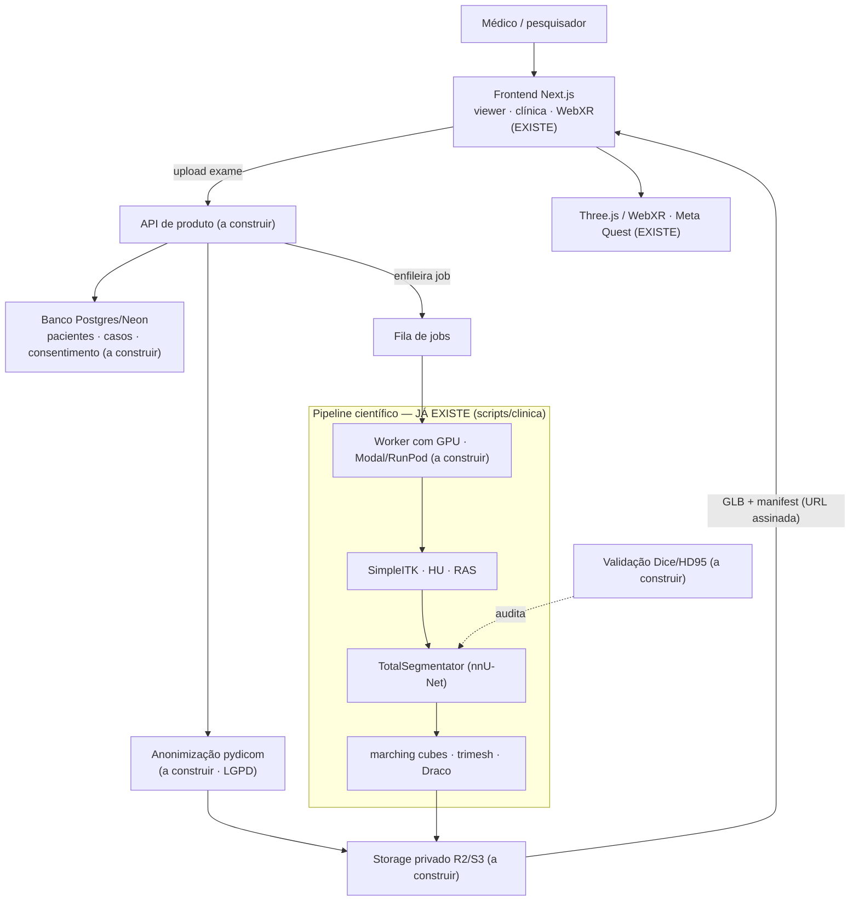

# VRmed — Auditoria técnica: de anatomia 3D para reconstrução 3D de pacientes

> Auditoria **read-only** (nenhum código foi alterado), ancorada na leitura direta de
> `scripts/clinica/*`, `components/{viewer,clinica}/*`, `lib/*`, `app/api/*` e `package.json`.
> Data: 2026-09-03. Evidências no formato `arquivo:linha` conferem no repositório nesta data.

---

## 0. Resumo executivo

**A espinha dorsal médica já existe — o que falta é transformá-la de _script local_ em _produto_.**

A suposição de que o VRmed é "só anatomia 3D educacional" está desatualizada. O pipeline
**DICOM → HU → segmentação por IA (TotalSegmentator) → máscaras → mesh (marching cubes) → GLB → Three.js**
está implementado e roda ponta a ponta em `scripts/clinica/`, com **3 casos de paciente reais**
(anonimizados/públicos) já publicados. A distância até a visão **não está na ciência do pipeline** —
está em **engenharia de produto**: não há backend, banco, GPU no servidor, upload, anonimização, nem
validação de acurácia.

**O que surpreende para o bem 🟢**
- Ingestão real de DICOM/NRRD/NIfTI com HU correto, ordenação por posição e LPS→RAS (`ingestao.py`).
- Segmentação por IA pré-treinada de 100+ estruturas via TotalSegmentator (nnU-Net), só inferência.
- Mesh medida do exame → GLB nomeado, com cor por HU real e decimação controlada.
- Viewer clínico com corte por plano, envelope translúcido e clique-para-identificar — *já em WebXR*.
- Enquadramento clínico-legal ("não substitui laudo") e rastreabilidade embutidos.

**O que bloqueia a visão 🔴**
- **Sem backend/GPU no servidor**: pipeline é CLI local (Windows+CUDA). Um médico não consegue enviar exame.
- **Sem banco de dados**: persistência = `localStorage` + um `.jsonl` efêmero.
- **Sem anonimização (pydicom)**: bloqueador de LGPD para paciente real.
- **Sem validação de acurácia** (Dice/HD95): fidelidade indefensável para uso médico.
- **Sem manifesto de dependências** (requirements/pyproject): ambiente do pipeline irreproduzível a partir do repo.

---

## 1. Arquitetura atual

O VRmed hoje é, na prática, **uma aplicação Next.js de assets 3D estáticos** com um pipeline Python de
autoria que roda *à parte*. Não há um "backend" no sentido clássico.

| Camada | O que é | Evidência |
|---|---|---|
| **Frontend** | Next.js 16.2.6 (App Router, Turbopack), React 19.2.4, TS estrito, Tailwind v4. 3D com Three 0.184 + React Three Fiber 9.6.1 + drei 10.7.7. Estado: Zustand 5 (persist localStorage). | `package.json` |
| **Backend** | Não há servidor dedicado. Apenas 2 rotas serverless do Next: `/api/chat` (proxy de streaming para OpenAI gpt-4o) e `/api/feedback` (grava JSONL). Stateless. | `app/api/*/route.ts` |
| **Banco de dados** | **Nenhum.** Persistência = `zustand→localStorage` no cliente + `feedback.jsonl` em disco (efêmero no Render). | `lib/store.ts`, `lib/feedback-store.ts` |
| **APIs** | Só as 2 rotas acima. Sem endpoint de upload, sem processamento de exame, sem jobs. | grep upload/multipart → 0 |
| **Auth** | HTTP Basic só em `/admin/*` (via `proxy.ts`, comparação não constant-time). Sem usuário final. | `proxy.ts` |
| **Deploy** | Render, auto-deploy do GitHub. Filesystem efêmero. **Sem GPU.** | `CONTEXTO.md:125` |

### Estrutura de pastas (essencial)

| Caminho | Papel |
|---|---|
| `app/` | Rotas: `/` (landing), `/viewer`, `/clinica`, `/compare`, `/quiz`, `/sala`, `/duelo`, `/arena`, `/history`, `/privacidade`, `/admin/*`, `/api/{chat,feedback}` |
| `components/{viewer,clinica,arena,duelo,sala,quiz,compare,landing,ui,xr}/` | UI por modo; `viewer/` e `clinica/` concentram o 3D |
| `lib/` | `model-utils` (carga/normalização/camadas/clipping), `organs` (catálogo 18), `xr-store`, `store`, `openai`, `anatomy-labels` |
| `public/models/**.glb` | 32 GLBs estáticos de prateleira (anatomia genérica) |
| `public/pacientes/` | Saída do pipeline: 3 casos `.glb` + `manifest.json` (copiados à mão) |
| `public/draco/` | Decoder Draco local (~763 KB) — sem CDN |
| `scripts/clinica/ + scripts/*.py` | Pipeline médico Python (roda na `.venv-pipeline`, gitignored) |

### Como os modelos 3D são carregados
Tudo passa por `useGLTF(path, "/draco/")` (drei) apontando para o decoder Draco **local** (sem CDN).
Fluxo: escolha do modelo → `OrganModel` faz `fetch HEAD` para confirmar que o `.glb` existe → monta
`GLBModel` (clona a cena, decodifica Draco no cliente) → `normalizeContent` (centra/escala) →
`prepareModel` (camadas por mesh ou por material) → `detectStructures` (pontos numerados). Opacidade/cor/corte
aplicados por material via Zustand.

### Formatos
**Exclusivamente GLB** (glTF 2.0 binário) com geometria Draco e texturas webp — 32 arquivos, zero
`.gltf/.obj/.stl/.fbx/.ktx2`. Otimização (Draco + webp) é feita *offline* na autoria; **não há otimização
em runtime** nem loader KTX2/meshopt. Nenhum formato médico (DICOM/NIfTI) chega ao frontend.

### WebXR / Meta Quest
Via `@react-three/xr` 6.6.29, só `immersive-vr` (sem AR/passthrough). Entra por `store.enterVR()`, sai
pelo botão 3D `SairDoVR`. Endurecimento real para Quest 2 (perfis de input locais, foveation 0.5, recursos
de realidade mista desligados, dpr 1, sombras off). **Ponto frágil:** há *três* configurações de store XR
divergentes — um singleton endurecido (`lib/xr-store.ts`, usado por Sala/Duelo/Clínica), uma cópia na Arena,
e o *viewer principal* (`Scene.tsx`) criando um store **cru** sem endurecimento. Manipulação por controle
(grab/thumbstick) e mãos (pinça). Sem locomoção. **Sem guarda de 150k triângulos em runtime** — a proibição
de modelos pesados é só convenção documental (pendência #14).

---

## 2. Pipeline de imagem médica

**Sim — o VRmed já recebe e processa exame médico real**, de ponta a ponta, mas como **CLI 100% local**
(Windows + CUDA), não como serviço. Entrada aceita: série **DICOM**, **NRRD** e **NIfTI**.

```mermaid
flowchart LR
  A["Exame<br/>DICOM · NRRD · NIfTI"] --> B["ingestao.py<br/>SimpleITK/GDCM<br/>HU · LPS→RAS · validação"]
  B --> C["ct.nii.gz (HU, int16)"]
  C --> D["segmentacao.py<br/>TotalSegmentator v2<br/>(nnU-Net, inferência)"]
  D --> E["máscaras NIfTI por estrutura"]
  E --> F["malha.py<br/>marching cubes · Taubin<br/>decimação · cor por HU"]
  F --> G["GLB nomeado (trimesh export)"]
  G --> H["gltf-transform draco<br/>(manual, CLI Node)"]
  H --> I["public/pacientes/ + manifest.json<br/>(cópia manual)"]
  I --> J["Three.js / WebXR (ClinicaViewer)"]
```

| Pergunta | Resposta (com evidência) |
|---|---|
| Recebe exame real? | **Sim.** `ingestao.ingerir()` detecta pasta (série DICOM) ou arquivo. `ingestao.py:143` |
| Formato de entrada? | DICOM (`sitk.ImageSeriesReader`/GDCM), NRRD, NIfTI. `ingestao.py:33-74` |
| Pré-processamento? | **Sim.** Rescale→HU, ordenação por `ImagePositionPatient`, validação (HU real, espessura, passo irregular, oblíquo), LPS→RAS. `ingestao.py:47-119` |
| Reconstrução volumétrica? | 🟡 Gera volume HU (`ct.nii.gz`) mas **não** há volume rendering / ray marching (`volume.py` não existe). |
| Segmentação? | **Sim, por IA.** TotalSegmentator v2 (nnU-Net), presets tórax/cardíaco/abdômen, `heartchambers_highres` sob licença. Só inferência. `segmentacao.py:117-128` |
| Geração de mesh? | **Sim.** `marching_cubes` (skimage) + Taubin + `fix_normals` + decimação `fast_simplification`. `malha.py:142-170` |
| Conversão para GLB? | **Sim**, via `trimesh.Scene.export`; Draco depois, manual (`npx gltf-transform`). `tc-para-vrmed.py:214-220` |
| Onde acontece? | Local, na `.venv-pipeline` (Windows/CUDA). Saída copiada **à mão** para `public/pacientes/` + `manifest.json` editado à mão. |

**Sub-fluxo secundário (achados de pulmão):** `achados-pulmao.py` + `pintar-pulmao.py` medem enfisema
(LAA-950) e lesões por *limiar de HU* (não é IA) e pintam a *textura* de um modelo ilustrativo — não
reconstroem malha do paciente. A posição das lesões é *aproximada*, sobre modelo genérico.

---

## 3. IA / Machine Learning

O único componente de deep learning real é o **TotalSegmentator** (embute nnU-Net), só inferência. Não há
treino, nem MONAI/nnU-Net direto, nem VTK/Open3D. `torch` existe apenas como dependência transitiva.

| Tecnologia | Status | Onde / observação |
|---|---|---|
| TotalSegmentator (nnU-Net) | 🟢 presente | Segmentação IA, só inferência. `segmentacao.py:89-91` |
| SimpleITK (+GDCM) | 🟢 presente | Único caminho de leitura DICOM→HU. `ingestao.py:23` |
| scikit-image | 🟢 presente | `marching_cubes`. `malha.py:142` |
| trimesh | 🟢 presente | Mesh, Taubin, export GLB. |
| nibabel / scipy / numpy / Pillow | 🟢 presente | NIfTI, ndimage, arrays, QA. |
| fast_simplification | 🟢 presente | Decimação por orçamento. `malha.py:163` |
| PyTorch / CUDA | 🟡 transitivo | Só via TotalSegmentator; nunca gerenciado pelo projeto (versão frágil). |
| MONAI / MONAI Label | 🔴 ausente | Sem treino/fine-tuning nem anotação assistida. |
| nnU-Net (direto) | 🔴 ausente | Só embutido no TotalSegmentator. |
| VTK / PyVista / Open3D | 🔴 ausente | Sem reparo/booleanas/smoothing robusto de malha. |
| pydicom / dcm2niix | 🔴 ausente | DICOM lido por SimpleITK; **sem anonimização**. |
| TensorFlow / OpenCV | 🔴 ausente | — |
| requirements.txt / pyproject.toml | 🔴 ausente | **Achado crítico:** deps só na `.venv-pipeline` gitignored → ambiente irreproduzível. |

---

## 4. Comparação com o pipeline ideal

Legenda: 🟢 já existe · 🟡 existe parcialmente · 🔴 não existe

| Etapa | Status | Motivo (código real) |
|---|---|---|
| DICOM (entrada) | 🟢 | Série DICOM lida por SimpleITK/GDCM, ordenada por posição, rescale→HU. Também NRRD/NIfTI. |
| Pré-processamento | 🟢 / 🟡 | HU, validação, LPS→RAS. 🟡 reamostragem isotrópica p/ fatia grossa é só *avisada*, não aplicada. |
| Volume 3D | 🟡 | Volume HU existe como `.nii.gz`, mas não há volume rendering interativo (sem `volume.py`/ray marching). |
| Segmentação por IA | 🟢 | TotalSegmentator (nnU-Net), 100+ estruturas. Limite: coração como bloco único sem licença; sem patologias fora do catálogo. |
| Máscaras | 🟢 | Uma máscara NIfTI por estrutura + métricas (volume/bbox/componentes). |
| Reconstrução de mesh | 🟢 / 🟡 | marching cubes + Taubin + fix_normals. 🟡 perde 13–19% de volume/relevo (suavização) — ok educativo, impreciso p/ métrica. |
| Otimização | 🟢 / 🟡 | Decimação por orçamento (fast_simplification) + Draco. 🟡 Draco é passo manual. |
| GLB / GLTF | 🟢 | GLB nomeado (uma malha por estrutura), cor por HU, metros/Y-up. |
| Three.js | 🟢 | ClinicaViewer carrega os GLB, corte por plano, envelope, clique-identifica. |
| Web | 🟡 | Servido, mas casos são *estáticos, commitados e públicos* — sem upload, sem auth, sem backend. |
| WebXR / Meta Quest | 🟢 / 🟡 | Clínica já entra em VR com GLB real. 🟡 sem guarda de 150k tris em runtime; store cru no viewer. |

**Etapas do "produto" que estão 🔴 e não aparecem no diagrama ideal, mas são obrigatórias:** upload web,
fila/worker com GPU, storage de objetos, banco de dados, **anonimização (pydicom)** e **validação de
acurácia (Dice/HD95)**. Nenhuma existe.

---

## 5. Viabilidade de integrar tecnologias

Onde cada tecnologia entraria na arquitetura *real* do VRmed e qual problema resolve — priorizado por
retorno, não por popularidade.

| Tecnologia | Onde entra | Problema que resolve | Veredito |
|---|---|---|---|
| **pydicom** | Início da ingestão, antes de persistir | Anonimização (remover PatientName/ID/datas) e leitura de tags | **agora** (bloqueador LGPD) |
| **dcm2niix** | Alternativa na conversão DICOM→NIfTI | Casos DICOM que o SimpleITK erra (multiframe, mosaic) | talvez (só se aparecer exame que quebre) |
| **TotalSegmentator** | Já é o núcleo da segmentação | Segmentar 100+ estruturas sem treinar | manter |
| **MONAI** | Segundo passo de segmentação, patologias | Treinar/fine-tunar tumores/lesões fora do catálogo | depois (só com caso patológico) |
| **MONAI Label** | Anotação (offline, 3D Slicer) | Criar ground-truth p/ treino/validação | depois (pré-requisito de IA própria) |
| **nnU-Net** | Treino de modelo próprio | Segmentação SOTA de estruturas próprias | não agora (TotalSegmentator já usa por baixo) |
| **3D Slicer** | Fora do app, bancada de pesquisa | QA manual, anotação, sanity-check | agora (apoio, não runtime) |
| **SimpleITK** | Já é a ingestão | DICOM→HU, spacing, orientação | manter |
| **VTK / PyVista** | Pós-processamento de malha | Reparo robusto, smoothing volumétrico, booleanas, decimação que preserva features | talvez (se qualidade da mesh virar gargalo) |
| **Open3D** | Alternativa a VTK | Reconstrução/limpeza de malha | redundante (trimesh+scipy já cobrem) |
| **trimesh** | Já é o motor de mesh/GLB | Mesh, Taubin, export | manter |
| **NiBabel** | Já usada (I/O NIfTI) | Ler/gravar volumes e máscaras | manter |

**Camada web/infra (não está na lista, mas é o que realmente falta):** um *worker com GPU* (Modal/RunPod),
*storage de objetos* (R2/S3), *banco* (Postgres/Neon) e uma *fila de jobs*. É aqui, não em mais bibliotecas
de imagem, que o VRmed vira produto.

---

## 6. Primeiro MVP "Exame → 3D"

**Recomendação técnica:** o menor MVP viável *não* é construir o pipeline — ele já existe. É **colocar o
pipeline atrás de um botão de upload**, com um caso escolhido a dedo.

Caso ideal para o protótipo: **TC de tórax → pulmão direito, pulmão esquerdo, coração** (opcional: aorta).
Motivos: (1) é o preset `torax`/`cardiaco` que o pipeline já roda; (2) 3–4 estruturas grandes = mesh leve,
cabe no orçamento de 150k tris do Quest; (3) contraste ar/tecido do pulmão dá segmentação robusta;
(4) já há 2 casos de tórax publicados como prova.

**Caminho mais curto (semanas, não meses):**
1. **deps** — Congelar o ambiente: `requirements.txt` da `.venv-pipeline` + pin de torch/CUDA.
2. **anonimizar** — Passo `pydicom` que remove PHI logo na entrada (pré-requisito LGPD, mesmo em teste).
3. **empacotar** — Envolver `preparar-caso.py`+`tc-para-vrmed.py` num único entrypoint que já emite GLB + `manifest` (e roda o Draco, hoje manual).
4. **worker GPU** — Rodar esse entrypoint num worker com GPU (ex.: Modal) disparado por fila — *não* no Render.
5. **upload + storage** — Rota de upload → exame em storage privado (R2/S3) → cria job → worker devolve o GLB.
6. **web + XR** — Trocar em `ClinicaApp` a origem "arquivo estático" por "API + URL assinada". **O viewer 3D e o WebXR não mudam** — já consomem GLB por `fetch`.

**4 das 6 etapas do pipeline científico já estão prontas**; o MVP é quase todo *plumbing* de produto
(upload, fila, worker, storage) + os pré-requisitos legais (anonimização + selo honesto de "experimental").

---

## 7. O que NÃO fazer agora

**Overengineering a evitar**
- **Treinar IA própria** (nnU-Net/MONAI) — TotalSegmentator resolve o caso genérico; treino só p/ patologias específicas, com ground-truth que não temos.
- **Volume rendering / ray marching** agora — pesado e não é o gargalo do MVP.
- **Trocar trimesh por VTK/Open3D** — só quando a qualidade da malha for medida e virar problema.
- **AR/passthrough no Quest** — foi desligado de propósito; reabrir só quando "sobrepor ao paciente" for meta.
- **Multi-tenant/contas completo** — o MVP pode ser single-user autenticado simples.

**Manter como está (é bom)**
- Núcleo científico do pipeline (ingestão, segmentação, mesh) — o próprio plano do grupo alerta contra reescrever.
- GLB + Draco local + `useGLTF` — formato e loader certos para web/XR.
- Desacoplamento viewer ↔ origem dos dados (consome GLB por `fetch`): trocar "estático" por "API" é mudança localizada.
- Enquadramento clínico-legal e rastreabilidade.

**Decisões atuais que vão atrapalhar a evolução (rever)**
- **Casos de paciente commitados em `public/pacientes/` e servidos publicamente** — inaceitável para PHI; precisa sair do git e ir para storage privado com acesso controlado, *antes* de qualquer exame real não-público.
- **Sem banco** — não há onde guardar paciente/caso/consentimento/versão de mesh/trilha de auditoria. Provavelmente a primeira coisa a nascer no backend.
- **Persistência efêmera** (`feedback.jsonl` no Render) — some a cada deploy.
- **Três stores XR divergentes** — consolidar em `obterXRStore()` antes de carregar meshes de paciente em VR.
- **`/api/chat` sem rate limit** — expõe custo/abuso da chave OpenAI.
- **Ambiente Python irreproduzível** (sem requirements) — trava CI e qualquer segunda máquina.

---

## 8. Arquitetura futura recomendada

O frontend/viewer/XR e o pipeline científico **ficam**; o que se constrói é a **camada de produto** entre
eles (upload, fila, worker GPU, storage, banco) e os dois pré-requisitos legais.

Azul (EXISTE) = já pronto e sem reescrita · verde (PIPE) = pipeline científico pronto · o resto = camada de
produto a construir.

---

## 9. Roadmap técnico por fases

### FASE 0 — Estado atual `feito`
- **Temos:** App Next+R3F+WebXR; pipeline DICOM→segmentação→mesh→GLB local; 3 casos publicados; clínica com corte/VR.
- **Falta:** tudo que transforma isso em serviço (fases abaixo).

### FASE 1 — Primeiro DICOM reproduzível `dificuldade: baixa`
- **Construir:** `requirements.txt`/pin de torch+CUDA; passo de anonimização pydicom; entrypoint único que já roda o Draco.
- **Tecnologias:** pydicom, pip-tools; o pipeline atual.
- **Depende de:** nada externo. **Risco:** baixo (consolidação).
- **Já temos:** ingestão DICOM completa. **Falta:** anonimização + ambiente reproduzível.

### FASE 2 — Primeira segmentação validada `dificuldade: média`
- **Construir:** `validar-segmentacao.py` (Dice/HD95 vs ground-truth); rótulo honesto de qualidade por caso.
- **Tecnologias:** TotalSegmentator (já), MONAI metrics ou SimpleITK; 3D Slicer para conferir.
- **Depende de:** datasets com ground-truth (TotalSegmentator dataset, TCIA). **Risco:** médio (pode expor limites).
- **Já temos:** segmentação por IA. **Falta:** medir e reportar acurácia.

### FASE 3 — Reconstrução 3D automatizada `dificuldade: baixa`
- **Construir:** Draco como etapa Python (não manual); geração automática do `manifest` com `structures`/`tris`/orçamento VR.
- **Tecnologias:** trimesh (já), gltf-transform como lib. **Risco:** baixo.
- **Já temos:** mesh + GLB + decimação. **Falta:** tirar passos manuais e enriquecer o manifest.

### FASE 4 — Visualização Web como serviço `dificuldade: alta`
- **Construir:** Upload; storage privado (R2/S3); banco (Neon/Postgres) de pacientes/casos/consentimento; fila; worker GPU (Modal). Trocar origem estática por API assinada em `ClinicaApp`.
- **Tecnologias:** Modal/RunPod (GPU), R2/S3, Neon, uma fila.
- **Depende de:** Fase 1 (entrypoint) e Fase 2 (validação). **Risco:** alto (maior salto, greenfield; custo GPU; segurança PHI).
- **Já temos:** viewer desacoplado que consome GLB por fetch. **Falta:** toda a camada backend/infra.

### FASE 5 — WebXR / Meta Quest de paciente `dificuldade: média`
- **Construir:** Guarda de orçamento de triângulos em runtime (#14); consolidar os 3 stores XR em `obterXRStore()`; degradação adaptativa por carga.
- **Tecnologias:** @react-three/xr (já). **Risco:** médio (mesh pesada derruba o Quest sem guarda).
- **Já temos:** Clínica já entra em VR com GLB real. **Falta:** proteção de performance e consolidação do store.

### FASE 6 — Patient-specific / digital twin `dificuldade: alta`
- **Construir:** Vínculo 2D↔3D (slices DICOM ao lado da mesh); volume rendering (3b); medição/anotação; câmaras/coronárias (licença ou submilimétrico).
- **Tecnologias:** niivue/cornerstone (2D), ray marching em three, heartchambers_highres.
- **Risco:** alto (fidelidade, precisão espacial, licença/dados). **Já temos:** corte por plano, envelope, identificação. **Falta:** ida-e-volta 2D↔3D, volume, precisão métrica.

### FASE 7 — IA própria `dificuldade: muito alta`
- **Construir:** Anotação (MONAI Label/3D Slicer), treino (MONAI/nnU-Net) para patologias específicas.
- **Depende de:** dataset anotado próprio; Fases 2 e 6. **Risco:** muito alto (dados, custo de treino, validação clínica).
- **Já temos:** nada além da inferência do TotalSegmentator. **Falta:** todo o ciclo de dados/treino/validação.

### FASE 8 — Produto clínico `dificuldade: extrema`
- **Construir:** Conformidade regulatória (ANVISA/software como dispositivo médico), auditoria, QMS, validação clínica formal.
- **Risco:** extremo (sai de engenharia e entra em regulatório/clínico).
- **Já temos:** enquadramento "educacional, não substitui laudo" (que hoje é justamente o que *mantém* fora desse escopo). **Falta:** essencialmente tudo do lado regulatório.

---

*Fim da auditoria. Gerada por leitura direta do repositório; nenhum arquivo de código foi alterado.*
